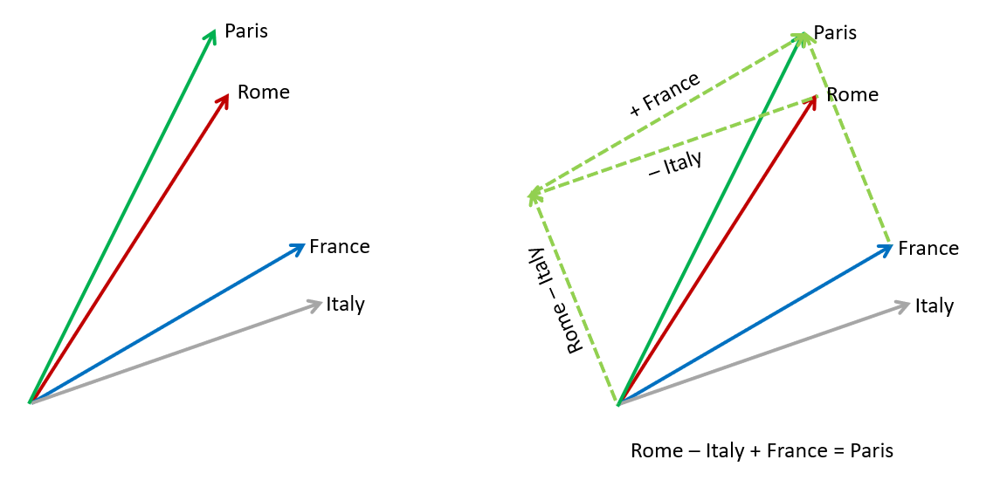

## Arithmetic Operators {#GUID-D8B53EC8-C58C-40F5-8C6A-0EB3FFE610D6}

Addition, subtraction, and multiplication can be applied to vectors dimension-wise in SQL and PL/SQL.

**Addition**

Vector addition is often used in Natural Language Processing (NLP) where words are often represented as vectors that capture their meaning in a numerical format. Vector addition is used to combine these meanings and understand relationships between words, a task also referred to as word analogy.

Given two vectors `A=(a1, a2, a3)` and `B=(b1, b2, b3)`, `C = A + B` is computed as `C = (a1+b1, a2+b2, a3+b3)`. 

**Subtraction**

Vector subtraction can be used in word analogy scenarios but is also useful in the context of facial recognition. Each face can be represented by a vector of facial features (distance between eyes, eye color, and so on). Subtracting one vector from another gives you the main differences between the two faces, giving you the information needed to recognize whether they are similar or not.

Given two vectors `A=(a1, a2, a3)` and `B=(b1, b2, b3)`, `C = A - B` is computed as `C = (a1-b1, a2-b2, a3-b3)`. 

**Multiplication**

Vector multiplication of each corresponding coordinate of two vectors, or element-wise product, is called the Hadamard product. The Hadamard product is often used in neural networks and computer vision.

Given two vectors `A=(a1, a2, a3)` and `B=(b1, b2, b3)`, the Hadamard product `A*B` is computed as `A*B = (a1*b1, a2*b2, a3*b3)`. 

Semantics

Both sides of the operation must evaluate to vectors with matching dimensions and must not be `BINARY` or `SPARSE` vectors. The resulting vector has the same number of dimensions as the operands and the format is determined based on the formats of the inputs. If one side of the operation is not a vector, an attempt is made automatically to convert the value to a vector. If the conversion fails, an error is raised. 

The format used for the result is ranked in the following order: flexible, `FLOAT64`, `FLOAT32`, then `INT8`. As in, if either side of the operation has a flexible format, the result will be flexible, otherwise, if either side has the format `FLOAT64`, the result will be `FLOAT64`, and so on. 

Consider two vectors with the following values:
```
    v1 = [1, 2, 3]
    v2 = [10, 20, 30]
```
    

Using arithmetic operators on `v1` and `v2` would, for example, result in the following: 

  * `v1 + v2` is `[11, 22, 33]`
  * `v1 - v2` is `[-9, -18, -27]`
  * `v1 * v2` is `[10, 40, 90]`
  * `v1 + NULL` is `NULL`


If either side of the arithmetic operation is `NULL`, the result is `NULL`. In the case of dimension overflow, an error is raised. For example, adding `VECTOR('[1, 127]', 2, INT8)` to `VECTOR('[1, 1]', 2, INT8)` results in an error because `127+1=128`, which overflows the `INT8` format. 

The use of division operators on vectors is not supported.

Examples

**Word Analogy**

Using word embeddings, suppose you want to find the relationship between "Rome" and "Paris". You can take the vector for "Rome", subtract the vector for "Italy", and then add the vector for "France". This results in a new vector that approximates the meaning of the word "Paris". The calculation should be "Rome - Italy + France = Paris" using an ideal embedding model.

  


  


  


**Basic Vector Arithmetic**
```
    SELECT VECTOR('[5, 10, 15]') - VECTOR('[2, 4, 6]');
    
    VECTOR('[5,10,15]')-VECTOR('[2,4,6]')
    ------------------------------------------------------------
    [3.0E+000,6.0E+000,9.0E+000]
    
    
    SELECT VECTOR('[1, 2, 3]', 3, FLOAT64) + VECTOR('[4, 5, 6]', 3, FLOAT32) * '[2, 2, 2]';
    
    VECTOR('[1,2,3]',3,FLOAT64)+VECTOR('[4,5,6]',3,FLOAT32)*'[2,2,2]'
    --------------------------------------------------------------------------------
    [9.0E+000,1.2E+001,1.5E+001]
```
```
    DECLARE
    v1 VECTOR := VECTOR('[10, 20, 30]', 3, INT8);
    v2 VECTOR := VECTOR('[6, 4, 2]', 3, INT8);
    BEGIN
    DBMS_OUTPUT.PUT_LINE(TO_CHAR(v1 + v2));
    DBMS_OUTPUT.PUT_LINE(TO_CHAR(v1 - v2));
    DBMS_OUTPUT.PUT_LINE(TO_CHAR(v1 * v2));
    END;
    /
```
    

Result:
```
    [16,24,32]
    [4,16,28]
    [60,80,60]
```
    

**Parent topic:** [Constructors, Converters, Descriptors, and Arithmetic Operators](constructors-converters-descriptors-and-arithmetic-operators.md)
