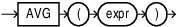
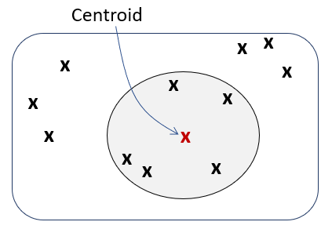

## AVG {#GUID-269C9AE6-71E5-47BD-95CD-E20F9EF9A393}

The `AVG` function takes a vector expression as input and returns the average as a vector with format `FLOAT64`. 

Syntax

  


  


  


Purpose

`AVG` is mainly used to create an overall representation (as in a centroid) for a vector set. In applications like Natural Language Processing (NLP), you can compute the average of several vectors to create a single centroid or overall representation. For example, to represent a sentence, you might average the word embeddings of each word in the sentence. This can be used for tasks like text classification, document similarity, or clustering. 

  


  


  


The result of `AVG` with a vector expression is the equivalent of consecutively performing vector addition operations on all non-`NULL` inputs and then dividing by the total number of non-`NULL` inputs. The returned vector has the same number of dimensions as the input and has the format `FLOAT64`. When the expression has a flexible number of dimensions, all inputs must have the same number of dimensions within each aggregate group. 

The `AVG` function with vector expressions as input can be used as a single set aggregate or in the `GROUP BY` clause. Using `ROLLUP` is also supported. The `AVG` function accepts vector expressions as input for aggregate operations but cannot currently be applied to analytic operations. 

`NULL` vectors are ignored and are not counted when calculating the average vector. If all inputs within an aggregate group are `NULL`, the result is `NULL` for that group. If the result overflows the `FLOAT64` maximum value, an error is raised, regardless of the format of the input vector type. 

With vector inputs, using `DISTINCT`, `CUBE`, and `GROUPING SETS` is not supported. Also, `BINARY` and `SPARSE` vectors cannot be supplied as input. 

For the full definition and implementation of the `AVG` function, see [*Oracle Database SQL Language Reference*](https://docs.oracle.com/pls/topic/lookup?ctx=en/database/oracle/oracle-database/23/vecse&id=SQLRF-GUID-B64BCBF1-DAA0-4D88-9821-2C4D3FDE5E4A). 
```
    CREATE TABLE avg_t (v VECTOR, k1 NUMBER, k2 VARCHAR2(100));
    INSERT INTO avg_t VALUES ('[2, 4, 6]', 2, 'even');
    INSERT INTO avg_t VALUES ('[8, 10, 12]', 2, 'even');
    INSERT INTO avg_t VALUES ('[1, 3, 5]', 3, 'odd');
    INSERT INTO avg_t VALUES ('[7, 9, 11]', 3, 'odd');
    
    
    SELECT AVG(v) v_avg FROM avg_t;
    
    V_AVG
    ---------------------------------------------------
    [4.5E+000,6.5E+000,8.5E+000]
    
    
    SELECT AVG(v) v_avg, k1 FROM avg_t GROUP BY k1;
    
    V_AVG                                    K1
    ---------------------------------------  ----------
    [5.0E+000,7.0E+000,9.0E+000]             2
    [4.0E+000,6.0E+000,8.0E+000]             3
    
    
    SELECT AVG(v) v_avg FROM avg_t GROUP BY ROLLUP(k1, k2);
    
    V_AVG
    ---------------------------------------------------
    [5.0E+000,7.0E+000,9.0E+000]
    [5.0E+000,7.0E+000,9.0E+000]
    [4.0E+000,6.0E+000,8.0E+000]
    [4.0E+000,6.0E+000,8.0E+000]
    [4.5E+000,6.5E+000,8.5E+000]
```
    

**Parent topic:** [Aggregate Functions](aggregate-functions.md)
