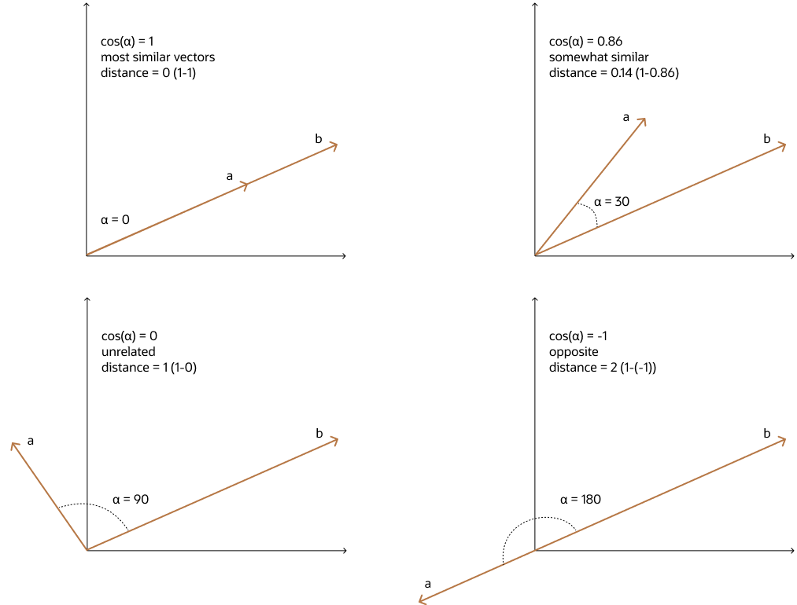

## Cosine Similarity {#GUID-FFF09EC7-29D3-49C1-9F85-815832BC4B72}

One of the most widely used similarity metric, especially in natural language processing (NLP), is cosine similarity, which measures the cosine of the angle between two vectors.

The smaller the angle, the more similar are the two vectors. Cosine similarity measures the similarity in the direction or angle of the vectors, ignoring differences in their size (also called *magnitude*). The smaller the angle, the bigger is its cosine. So the cosine distance and the cosine similarity have an inverse relationship. While cosine distance measures how different two vectors are, cosine similarity measures how similar two vectors are. 

  

  

  

**Parent topic:** [Vector Distance Metrics](vector-distance-metrics.md)
