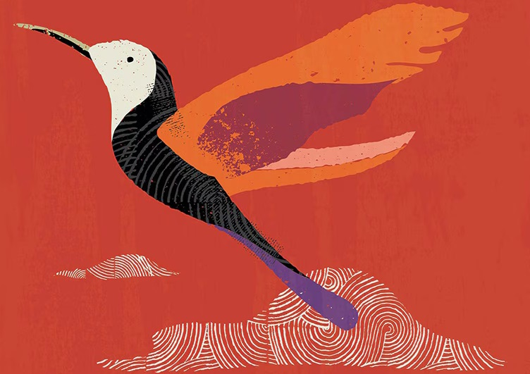

## Describe Images Using the Local REST Provider Ollama {#GUID-3EA2A7E8-1340-4D13-B905-F7565BD2B8A9}

Perform an image-to-text transformation by supplying an image along with a text question as the prompt by accessing open LLMs, using the local host REST endpoint provider Ollama.

Ollama is a free and open-source command-line interface tool that allows you to run open LLMs (such as Llama 3, Llava, Phi 3, Mistral, or Gemma 2) locally and privately on your Linux, Windows, or macOS systems. You can access Ollama as a service using SQL and PL/SQL commands.

Here, you can use the `UTL_TO_GENERATE_TEXT` function from either the `DBMS_VECTOR` or the `DBMS_VECTOR_CHAIN` package, depending on your use case. 

> **note:** WARNING: 

Certain features of the database may allow you to access services offered separately by third-parties, for example, through the use of JSON specifications that facilitate your access to REST APIs. 

Your use of these features is solely at your own risk, and you are solely responsible for complying with any terms and conditions related to use of any such third-party services. Notwithstanding any other terms and conditions related to the third-party services, your use of such database features constitutes your acceptance of that risk and express exclusion of Oracle's responsibility or liability for any damages resulting from such access.

To describe the contents of an image, by prompting with the following image of a bird and the text question "`Describe this image?`", by calling a local LLM using Ollama: 

  


  1. Connect to Oracle Database as a local user.
    1. Log in to SQL*Plus as the `SYS` user, connecting as `SYSDBA`:
```
        conn sys/password as sysdba
```
```
        CREATE TABLESPACE tbs1
        DATAFILE 'tbs5.dbf' SIZE 20G AUTOEXTEND ON
        EXTENT MANAGEMENT LOCAL
        SEGMENT SPACE MANAGEMENT AUTO;
```
```
        SET ECHO ON
        SET FEEDBACK 1
        SET NUMWIDTH 10
        SET LINESIZE 80
        SET TRIMSPOOL ON
        SET TAB OFF
        SET PAGESIZE 10000
        SET LONG 10000
```
        

    2. Create a local user (`docuser`) and grant necessary privileges:
```
        DROP USER docuser cascade;
```
```
        CREATE USER docuser identified by docuser DEFAULT TABLESPACE tbs1 quota unlimited on tbs1;
```
```
        GRANT DB_DEVELOPER_ROLE, create credential to docuser;
```
        

    3. Connect as the local user (`docuser`):
```
        CONN docuser/password
```
        

  2. Install Ollama and run a model locally.
    1. Download and run the Ollama application from <https://ollama.com/download>.

You can either install Ollama as a service that runs in the background or as a standalone binary with a manual install. For detailed installation-specific steps, see Quick Start in the [Ollama Documentation](https://github.com/ollama/ollama/tree/main/docs). 

**Note the following**: 

       * The Ollama server needs to be able to connect to the internet so that it can download the models. If you require a proxy server to access the internet, remember to set the appropriate environment variables before running the Ollama server. For example, to set for Linux: 
```
            -- set a proxy if you require one
            
            export https_proxy=:
            export http_proxy=:
            export no_proxy=localhost,127.0.0.1,.example.com
            export ftp_proxy=:
```
            

       * If you are running Ollama and the database on different machines, then on the database machine, you must change the `URL` to refer to the host name or IP address that is running Ollama instead of the local host. 

       * You may need to change your firewall settings on the machine that is running Ollama to allow the port through.

    2. If running Ollama as a standalone binary from a manual install, then start the server:
```
        ollama serve
```
        

    3. Run a model using the `ollama run *``*` command.

For example, to call the llava model:
```
        ollama run llava
```
        

For detailed information on this step, see [Ollama Readme](https://github.com/ollama/ollama/blob/main/README.md#quickstart). 

    4. Verify that Ollama is running locally by using a cURL command.

For example:
```
        -- generate text
        
        curl -X POST http://localhost:11434/api/generate -d '{
        "model" : "llava",
        "prompt": "Why is the sky blue?",
        "stream": false }'
```
        

  3. Set the HTTP proxy server, if configured.
```
    EXEC UTL_HTTP.SET_PROXY(':');
```
    

  4. Grant connect privilege to `docuser` for allowing connection to the host, using the `DBMS_NETWORK_ACL_ADMIN` procedure.

This example uses `*` to allow any host. However, you can explicitly specify the host that you want to connect to. 
```
    BEGIN
    DBMS_NETWORK_ACL_ADMIN.APPEND_HOST_ACE(
    host => '*',
    ace => xs$ace_type(privilege_list => xs$name_list('connect'),
    principal_name => 'docuser',
    principal_type => xs_acl.ptype_db));
    END;
    /
```
    

  5. Create a local directory (`DEMO_DIR`) to store your image file:
```
    create or replace directory DEMO_DIR as '/my_local_dir/';
    
    create or replace function load_blob_from_file(directoryname varchar2, filename varchar2)
    return blob
    is
    filecontent blob := null;
    src_file bfile := bfilename(directoryname, filename);
    offset number := 1;
    begin
    dbms_lob.createtemporary(filecontent, true, dbms_lob.session);
    dbms_lob.fileopen(src_file, dbms_lob.file_readonly);
    dbms_lob.loadblobfromfile(filecontent, src_file,
    dbms_lob.getlength(src_file), offset, offset);
    dbms_lob.fileclose(src_file);
    return filecontent;
    end;
    /
```
    

Upload the image file (for example, `bird.jpg`) to the directory. 

  6. Call `UTL_TO_GENERATE_TEXT`.

The Ollama service has a REST API endpoint for generating text. Specify the URL and other configuration parameters in a JSON object.
```
    var input clob;
    var media_data blob;
    var media_type clob;
    var gent_ollama_params clob;
    
    :input := 'Describe this image';
    :media_data := load_blob_from_file('DEMO_DIR', 'bird.jpg');
    :media_type := 'image/jpeg';
    :gent_ollama_params := '{
    "provider": "ollama",
    "host"    : "local",
    "url"     : "http://localhost:11434/api/generate",
    "model"   : "llava"
    }';
    
    select dbms_vector_chain.utl_to_generate_text(:input, :media_data, :media_type, json(:gent_ollama_params)) from dual;
```
    

You can replace `url` and `model` with your own values, as required. 

> **note:** For a complete list of all supported REST endpoint URLs, see [Supported Third-Party Provider Operations and Endpoints](supported-third-party-provider-operations-and-endpoints.md#GUID-BE3EE403-CD10-4708-A15F-EFB1FA69DF09). 

A generated text response to your question may appear as:
```
    This is an image of a stylized, artistic depiction of a hummingbird in
    mid-flight, set against a vibrant red background. The bird is illustrated with a
    mix of striking colors and details - its head and belly are shown in white, with
    a black patterned detailing that resembles stripes or scales. Its long, slender
    beak is depicted in a darker color, extending forwards. The hummingbird's wings
    and tail are rendered in eye-catching shades of orange, purple, and red, with
    texture that suggests a rough, perhaps brush-like stroke.
    
    The background features abstract shapes resembling clouds or wind currents in a white line
    pattern, which adds a sense of motion or air dynamics around the bird. The
    overall use of vivid colors and dynamic patterns gives the image an energetic
    and modern feel.
```
    


**Related Topics**

  * [UTL_TO_GENERATE_TEXT](utl_to_generate_text-dbms_vector_chain.md#GUID-017C9002-194C-48E5-B59B-EF5C60BC8405)
  * [DBMS_VECTOR](dbms_vector-vecse.md#GUID-829230F9-BD1E-41F9-BAAB-5D3C3E52FC12)
  * [DBMS_VECTOR_CHAIN](dbms_vector_chain-vecse.md#GUID-A09FF69E-FCCB-4EDA-B7E4-B02A11359504)


**Parent topic:** [Describe Image Content](describe-image-content.md)
