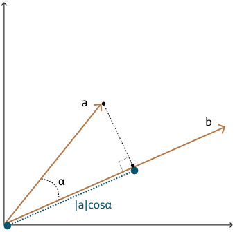

## Dot Product Similarity {#GUID-1BA7C147-041E-4073-A211-4D61287036AF}

The dot product similarity of two vectors can be viewed as multiplying the size of each vector by the cosine of their angle. The corresponding geometrical interpretation of this definition is equivalent to multiplying the size of one of the vectors by the size of the projection of the second vector onto the first one, or vice versa.

As illustrated in the following diagram, you project one vector on the other and multiply the resulting vector sizes.

Incidentally, this is equivalent to the sum of the products of each vector's coordinate. Often, you do not have access to the cosine of the two vector's angle, hence this calculation is easier.

Larger dot product values imply that the vectors are more similar, while smaller values imply that they are less similar. Compared to using Euclidean distance, using the dot product similarity is especially useful for high-dimensional vectors.

Note that normalizing vectors and using the dot product similarity is equivalent to using cosine similarity. There are cases where dot product similarity is faster to evaluate than cosine similarity, and conversely where cosine similarity is faster than dot product similarity. A normalized vector is created by dividing each dimension by the norm (or length) of the vector, such that the norm of the normalized vector is equal to 1.

  

  

  

**Parent topic:** [Vector Distance Metrics](vector-distance-metrics.md)
