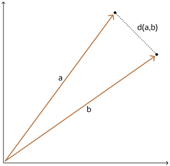

## Euclidean and Euclidean Squared Distances {#GUID-BA22C69B-CC35-4CA4-A845-C9098D254511}

Euclidean distance reflects the distance between each of the vectors' coordinates being compared—basically the straight-line distance between two vectors. This is calculated using the Pythagorean theorem applied to the vector's coordinates `(SQRT(SUM((xi-yi)2)))`. 

This metric is sensitive to both the vector's size and it's direction.

With Euclidean distances, comparing squared distances is equivalent to comparing distances. So, when ordering is more important than the distance values themselves, the Squared Euclidean distance is very useful as it is faster to calculate than the Euclidean distance (avoiding the square-root calculation).

  

  

  

**Parent topic:** [Vector Distance Metrics](vector-distance-metrics.md)
