## Explore Chunking Techniques and Examples {#GUID-BFDE8B0A-6302-472C-AD8B-1BEB9AA2CB87}

Review these examples of all the supported chunking parameters. These examples can provide an idea on what are good and bad chunking techniques, and thus help you define a strategy when chunking your data.

Here, you can see how the following sample text of five lines is split when you apply various chunking parameters to it:

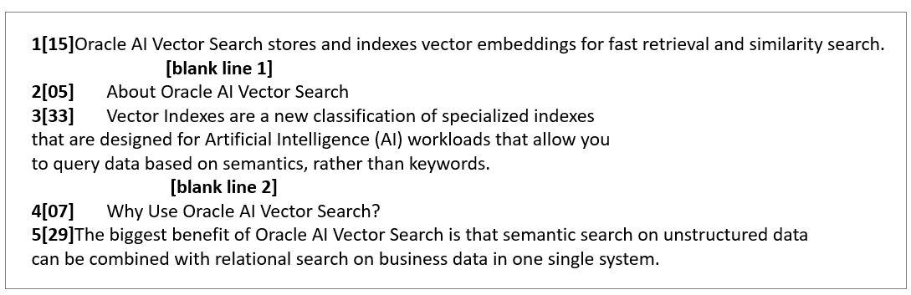  


Note the following:

  * The lines are numbered as a reference for the explanations and include the word count in square brackets (for example, `**1[15]**`). The blank lines are also noted. 
  * The start and end boundaries of chunks are represented with colored markers.
  * To perform examples with the `BY VOCABULARY` mode, you must create custom vocabulary beforehand (for example, `DOC_VOCAB`). See [Create and Use Custom Vocabulary](create-and-use-custom-vocabulary.md#GUID-B6527DDC-8EF0-479E-8965-6C2459E7827A). 


Example 4-1 BY chars MAX 200 OVERLAP 0 SPLIT BY none

This example shows the simplest form of chunking, where you split the text by a fixed number of characters (including the end-of-line characters), at whatever point that occurs in the text. 

The text from the first chunk is split at an absolute maximum character of `200`, which divides the word `indexes` between the first two chunks. Similarly, you can see the word `Oracle` splitting between second and third chunks. 

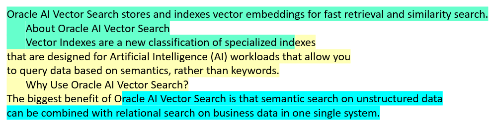  


Syntax:
```
    SELECT C.*
    FROM documentation_tab D, VECTOR_CHUNKS(D.text BY chars MAX 200 OVERLAP 0
    SPLIT BY none LANGUAGE american NORMALIZE none) C;
```
    

Output:
```
    CHUNK_OFFSET CHUNK_LENGTH CHUNK_TEXT
    -------------------------------------------------------------------------
    1	     200          Oracle AI Vector Search stores and indexes vector embeddings for fast retrieval and similarity search.
    
    About Oracle AI Vector Search
    Vector Indexes are a new classification of specialized ind
    
    201	     200          exes that are designed for Artificial Intelligence (AI) workloads that allow you to query data based on semantics, rather than keywords.
    
    Why Use Oracle AI Vector Search?
    The biggest benefit of O
    
    401	     146          racle AI Vector Search is that semantic search on unstructured data can be combined with relational search on business data in one single system.
```
    

Example 4-2 BY chars MAX 200 OVERLAP 0 SPLIT BY newline

In this example, the text is split into four chunks at new lines, if possible, within the maximum limit of `200` characters. 

The text from the first chunk is split after the second line because the third line would exceed the maximum. The third line fits within the maximum perfectly. The fourth and fifth line would also exceed the maximum, so it produces two chunks.

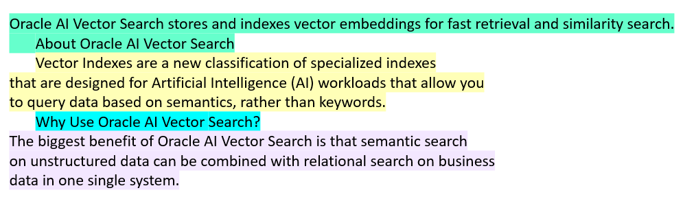  


Syntax:
```
    SELECT C.*
    FROM documentation_tab D, VECTOR_CHUNKS(D.text BY chars MAX 200 OVERLAP 0
    SPLIT BY newline LANGUAGE american NORMALIZE none) C;
```
    

Output:
```
    CHUNK_OFFSET CHUNK_LENGTH CHUNK_TEXT
    --------------------------------------------------------------------------------------------------
    1	      138         Oracle AI Vector Search stores and indexes vector embeddings for fast retrieval and similarity search.
    
    About Oracle AI Vector Search
    
    143	      196         Vector Indexes are a new classification of specialized indexes that are designed for Artificial Intelligence (AI) workloads that allow you to query data based on semantics, rather than keywords.
    
    343	      33          Why Use Oracle AI Vector Search?
    
    377	      170         The biggest benefit of Oracle AI Vector Search is that semantic search on unstructured data can be combined with relational search on business data in one single system.
```
    

Example 4-3 BY chars MAX 200 OVERLAP 0 SPLIT BY recursively

In this example, the text is split into five chunks recursively using blank lines, newlines and then spaces, if possible, within the maximum of `200` characters. 

The first chunk is split after the first blank line because including the text after the second blank line would exceed the maximum. The second passage exceeds the maximum on its own, so it is broken into two chunks at the new lines. Similarly, the third section is also broken into two chunks at the new lines.

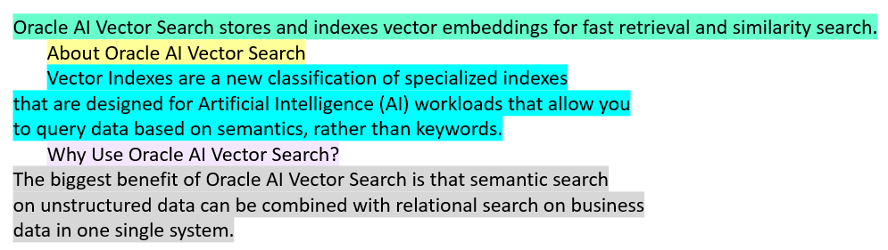  


Syntax:
```
    SELECT C.*
    FROM documentation_tab D, VECTOR_CHUNKS(D.text BY chars MAX 200 OVERLAP 0
    SPLIT BY recursively LANGUAGE american NORMALIZE none) C;
```
    

Output:
```
    CHUNK_OFFSET CHUNK_LENGTH CHUNK_TEXT
    --------------------------------------------------------------------------------------------------
    1            104          Oracle AI Vector Search stores and indexes vector embeddings for fast retrieval and similarity search.
    
    109	     30           About Oracle AI Vector Search
    
    143	     196          Vector Indexes are a new classification of specialized indexes that are designed for Artificial Intelligence (AI) workloads that allow you to query data based on semantics, rather than keywords.
    
    343	     33           Why Use Oracle AI Vector Search?
    
    377	     170          The biggest benefit of Oracle AI Vector Search is that semantic search on unstructured data can be combined with relational search on business data in one single system.
```
    

Example 4-4 BY words MAX 40 OVERLAP 0 SPLIT BY none

In this example, the text is split into three chunks at an absolute maximum word of `40`, the third line after `wordloads` and the fifth line after `with`. 

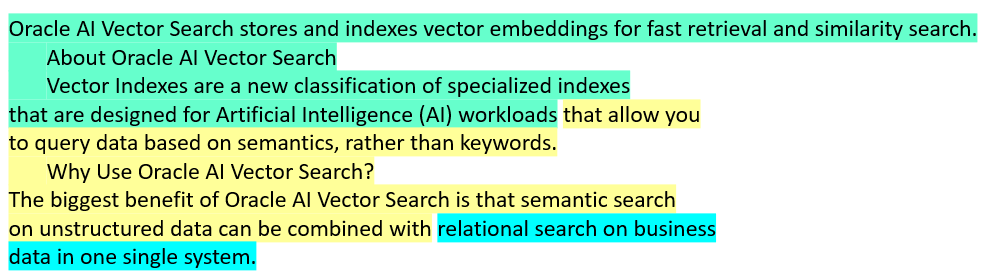  


Syntax:
```
    SELECT C.*
    FROM documentation_tab D, VECTOR_CHUNKS(D.text BY words MAX 40 OVERLAP 0
    SPLIT BY none LANGUAGE american NORMALIZE none) C;
```
    

Output:
```
    CHUNK_OFFSET CHUNK_LENGTH CHUNK_TEXT
    --------------------------------------------------------------------------------------------------
    1	     266          Oracle AI Vector Search stores and indexes vector embeddings for fast retrieval and similarity search.
    
    About Oracle AI Vector Search
    Vector Indexes are a new classification of specialized indexes that are designed for Artificial
    Intelligence (AI) workloads
    
    267	     223          that allow you to query data based on semantics, rather than keywords.
    
    Why Use Oracle AI Vector Search?
    The biggest benefit of Oracle AI Vector Search is that semantic search on unstructured data can be combined with
    
    
    490	     57           relational search on business data in one single system.
```
    

Example 4-5 BY words MAX 40 OVERLAP 0 SPLIT BY newline 

In this example, the text is split into chunks at new lines, if possible, within the maximum of `40` words. 

The first chunk (of 21 words) is split after the second line, as the third line would exceed the maximum number of words (21+33 words). The third and fourth lines fit within the maximum. The fifth line is 29 words, so fits in the last chunk.

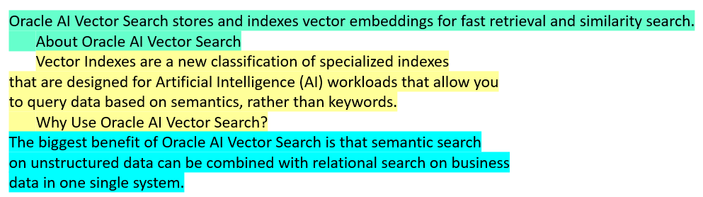  


Syntax:
```
    SELECT C.*
    FROM documentation_tab D, VECTOR_CHUNKS(D.text BY words MAX 40 OVERLAP 0
    SPLIT BY newline LANGUAGE american NORMALIZE none) C;
```
    

Output:
```
    CHUNK_OFFSET CHUNK_LENGTH CHUNK_TEXT
    --------------------------------------------------------------------------------------------------
    1	     138          Oracle AI Vector Search stores and indexes vector embeddings for fast retrieval and similarity search.
    
    About Oracle AI Vector Search
    
    143	     233          Vector Indexes are a new classification of specialized indexes that are designed for Artificial Intelligence (AI) workloads that allow you to query data based on semantics, rather than keywords.
    
    Why Use Oracle AI Vector Search?
    
    377          170          The biggest benefit of Oracle AI Vector Search is that semantic search on unstructured data can be combined with relational search on business data in one single system.
```
    

Example 4-6 BY words MAX 40 OVERLAP 0 SPLIT BY recursively

In this example, the chunks are split by words recursively using blank lines, newlines, and spaces. 

The text after the second blank line exceeds the maximum words, so the first chunk ends at the first blank line. The second chunk (of 38 words) ends at the next blank line. The final chunk (of 35 words) consists of the rest of the input.

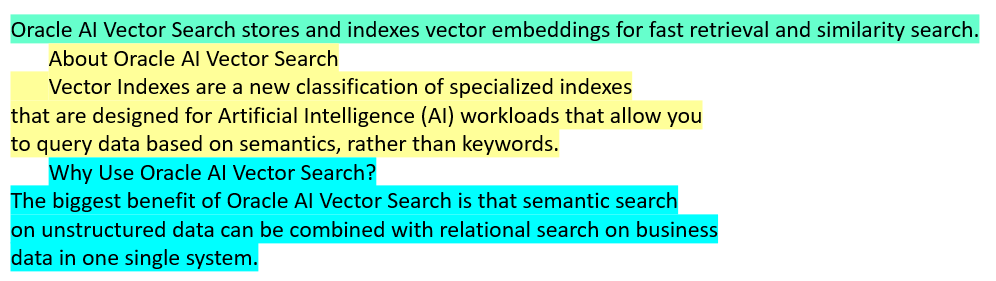  


Syntax:
```
    SELECT C.*
    FROM documentation_tab D, VECTOR_CHUNKS(D.text BY words MAX 40 OVERLAP 0
    SPLIT BY recursively LANGUAGE american NORMALIZE none) C;
```
    

Output:
```
    CHUNK_OFFSET CHUNK_LENGTH CHUNK_TEXT
    --------------------------------------------------------------------------------------------------
    1	     104          Oracle AI Vector Search stores and indexes vector embeddings for fast retrieval and similarity search.
    
    109	     230          About Oracle AI Vector Search
    Vector Indexes are a new classification of specialized indexes that are designed for Artificial
    Intelligence (AI) workloads that allow you to query data based on semantics, rather than keywords.
    
    343	     204          Why Use Oracle AI Vector Search?
    The biggest benefit of Oracle AI Vector Search is that semantic search on unstructured data can be
    combined with relational search on business data in one single system.
```
    

Example 4-7 BY vocabulary MAX 40 OVERLAP 0 SPLIT BY none

In this example, the text is split into four chunks at an absolute maximum vocabulary token of 40, which contrasts with the three chunks produced in [Example 4-4](explore-chunking-techniques-and-examples.md#GUID-BFDE8B0A-6302-472C-AD8B-1BEB9AA2CB87__GUID-A87E00B0-211B-4A8F-BFEB-011F18CA7BAF). This is because vocabulary tokens include pieces of words, so the chunk text is generally smaller than simple word splitting. 

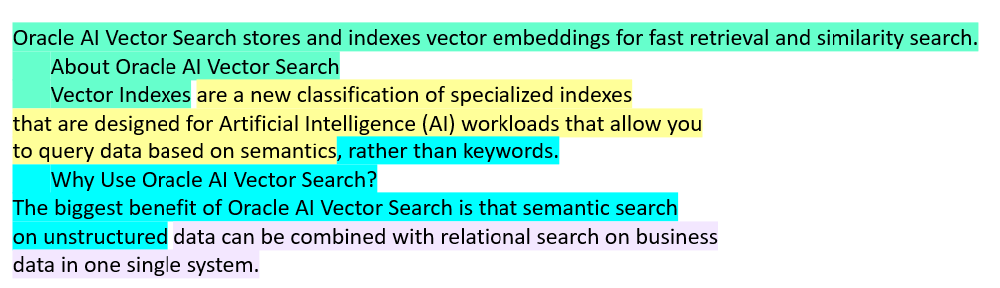  


Syntax:
```
    SELECT C.*
    FROM documentation_tab D, VECTOR_CHUNKS(D.text BY vocabulary doc_vocab MAX 40 OVERLAP 0
    SPLIT BY none LANGUAGE american NORMALIZE none) C;
```
    

Output:
```
    CHUNK_OFFSET CHUNK_LENGTH CHUNK_TEXT
    --------------------------------------------------------------------------------------------------
    1	     157          Oracle AI Vector Search stores and indexes vector embeddings for fast retrieval and similarity search.
    
    About Oracle AI Vector Search
    Vector Indexes
    158	     156          are a new classification of specialized indexes that are designed for Artificial Intelligence (AI) workloads that allow you to query data based on semantics
    
    314          150          , rather than keywords.
    
    Why Use Oracle AI Vector Search?
    The biggest benefit of Oracle AI Vector Search is that semantic search on unstructured
    
    464	     83           data can be combined with relational search on business data in one single system.
```
    

Example 4-8 BY vocabulary MAX 40 OVERLAP 0 SPLIT BY newline

In this example, the text is split into five chunks with newlines, using an absolute maximum vocabulary token of 40, which contrasts with [Example 4-5](explore-chunking-techniques-and-examples.md#GUID-BFDE8B0A-6302-472C-AD8B-1BEB9AA2CB87__GUID-B466EAF9-8FE5-4B98-88FB-747F117F477A). 

Vocabulary tokens include pieces of words, so the chunk text is generally smaller than simple word splitting. This example produces five chunks rather than three in [Example 4-5](explore-chunking-techniques-and-examples.md#GUID-BFDE8B0A-6302-472C-AD8B-1BEB9AA2CB87__GUID-B466EAF9-8FE5-4B98-88FB-747F117F477A), with the middle passage split into two, and the final word unable to fit into the fourth chunk. 

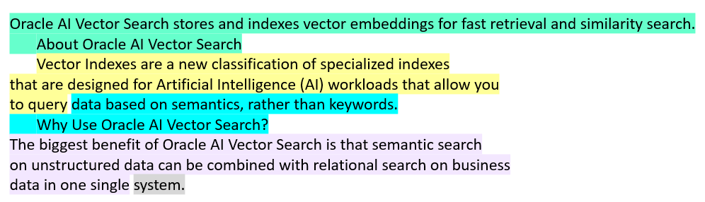  


Syntax:
```
    SELECT C.*
    FROM documentation_tab D, VECTOR_CHUNKS(D.text BY vocabulary doc_vocab MAX 40 OVERLAP 0
    SPLIT BY newline LANGUAGE american NORMALIZE none) C;
```
    

Output:
```
    CHUNK_OFFSET CHUNK_LENGTH CHUNK_TEXT
    --------------------------------------------------------------------------------------------------
    1	     138          Oracle AI Vector Search stores and indexes vector embeddings for fast retrieval and similarity search.
    
    About Oracle AI Vector Search
    
    143	     148          Vector Indexes are a new classification of specialized indexes that are designed for Artificial Intelligence (AI) workloads that allow you to query
    
    291	     85           data based on semantics, rather than keywords.
    
    Why Use Oracle AI Vector Search?
    
    377	     162          The biggest benefit of Oracle AI Vector Search is that semantic search on unstructured data can be combined with relational search on business data in one single
    
    539	     8            system.
```
    

Example 4-9 BY vocabulary MAX 40 OVERLAP 0 SPLIT BY recursively

In this example, the text is split into seven chunks recursively using blank lines, new lines, and spaces and an absolute maximum vocabulary token of 40, which contrasts with the three chunks produced in [Example 4-6](explore-chunking-techniques-and-examples.md#GUID-BFDE8B0A-6302-472C-AD8B-1BEB9AA2CB87__GUID-C32C8D64-4205-42ED-8714-BF1AE9FD1D80). 

Vocabulary tokens include pieces of words, so the chunk text is generally smaller than simple word splitting. This example produces seven chunks with the middle passage split into three and the final passage split into three. 

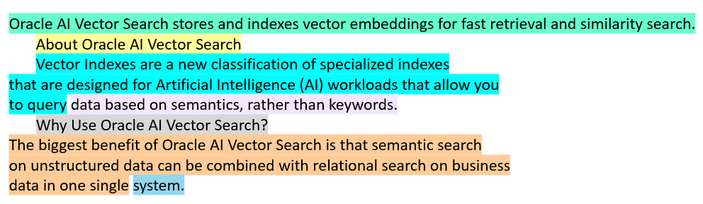  


Syntax:
```
    SELECT C.*
    FROM documentation_tab D, VECTOR_CHUNKS(D.text BY vocabulary doc_vocab MAX 40 OVERLAP 0
    SPLIT BY recursively LANGUAGE american NORMALIZE none) C;
```
    

Output:
```
    CHUNK_OFFSET CHUNK_LENGTH CHUNK_TEXT
    --------------------------------------------------------------------------------------------------
    1	     104          Oracle AI Vector Search stores and indexes vector embeddings for fast retrieval and similarity search.
    
    109	     30           About Oracle AI Vector Search
    
    143	     148          Vector Indexes are a new classification of specialized indexes that are designed for Artificial Intelligence (AI) workloads that allow you to query
    
    291	     48           data based on semantics, rather than keywords.
    
    343	     33           Why Use Oracle AI Vector Search?
    
    377	     162          The biggest benefit of Oracle AI Vector Search is that semantic search on unstructured data can be combined with relational search on business data in one single
    
    539	     8            system.
```
    

Example 4-10 BY words MAX 40 OVERLAP 5 SPLIT BY none

This example is similar to [Example 4-4](explore-chunking-techniques-and-examples.md#GUID-BFDE8B0A-6302-472C-AD8B-1BEB9AA2CB87__GUID-A87E00B0-211B-4A8F-BFEB-011F18CA7BAF), except that an overlap of `5` is used here. 

The first chunk ends at the maximum 40 words (after `workloads`). The second chunk overlaps with the last 5 words including parentheses of the first chunk, and ends after `unstructured`. The overlapping words are underlined below. The third chunk overlaps with the last 5 words, which are also underlined. 

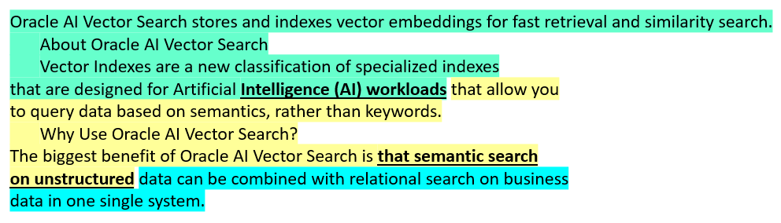  


Syntax:
```
    SELECT C.*
    FROM documentation_tab D, VECTOR_CHUNKS(D.text BY words MAX 40 OVERLAP 5
    SPLIT BY none LANGUAGE american NORMALIZE none) C;
```
    

Output:
```
    CHUNK_OFFSET CHUNK_LENGTH CHUNK_TEXT
    -------------------------------------------------------------------------------------------------
    1	     266         Oracle AI Vector Search stores and indexes vector embeddings for fast retrieval and similarity search.
    
    About Oracle AI Vector Search
    Vector Indexes are a new classification of specialized indexes that are designed for Artificial Intelligence (AI) workloads
    
    239	     225         Intelligence (AI) workloads that allow you to query data based on semantics, rather than keywords.
    
    Why Use Oracle AI Vector Search?
    The biggest benefit of Oracle AI Vector Search is that semantic search on unstructured
    
    427	     120         that semantic search on unstructured data can be combined with relational search on business data in one single system.
```
    

Example 4-11 BY words MAX 40 OVERLAP 5 SPLIT BY newline

This example is similar to [Example 4-5](explore-chunking-techniques-and-examples.md#GUID-BFDE8B0A-6302-472C-AD8B-1BEB9AA2CB87__GUID-B466EAF9-8FE5-4B98-88FB-747F117F477A), except that an overlap of `5` is used here. The overlapping portion of a chunk must obey the same split condition, in this case must begin on a new line. 

The first chunk ends at the second line, as the third line would exceed the maximum 40 words. The second chunk starts with the second line of 5 words of the first chunk (underlined below) and ends at the third line. The third chunk has no overlap because the preceding line exceeds the maximum of 5.

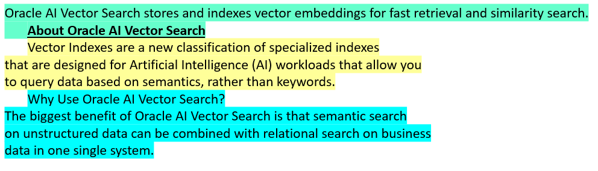  


Syntax:
```
    SELECT C.*
    FROM documentation_tab D, VECTOR_CHUNKS(D.text BY words MAX 40 OVERLAP 5
    SPLIT BY newline LANGUAGE american NORMALIZE none) C;
```
    

Output:
```
    CHUNK_OFFSET CHUNK_LENGTH CHUNK_TEXT
    ---------------------------------------------------------------------------------------------------
    1	     138          Oracle AI Vector Search stores and indexes vector embeddings for fast retrieval and similarity search.
    
    About Oracle AI Vector Search
    
    109	     230          About Oracle AI Vector Search
    Vector Indexes are a new classification of specialized indexes that are designed for Artificial
    Intelligence (AI) workloads that allow you to query data based on semantics, rather than keywords.
    
    343	     204          Why Use Oracle AI Vector Search?
    The biggest benefit of Oracle AI Vector Search is that semantic search on unstructured data can be
    combined with relational search on business data in one single system.
```
    

Example 4-12 BY words MAX 40 OVERLAP 5 SPLIT BY recursively

This example is similar to [Example 4-6](explore-chunking-techniques-and-examples.md#GUID-BFDE8B0A-6302-472C-AD8B-1BEB9AA2CB87__GUID-C32C8D64-4205-42ED-8714-BF1AE9FD1D80), except that an overlap of `5` is used here. The overlapping portion of a chunk must obey the same split condition, in this case must begin at either a blank line, new line, or space. 

The text after the second blank line exceeds the maximum words, so the first chunk ends at the first blank line. The second chunk overlaps with 5 words (beginning on a space; underlined below) and includes the second line, but excludes the third line of 33 words. The third chunk overlaps 5 words and ends on the second blank line. The fourth chunk consumes the rest of the input.

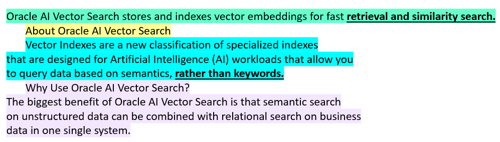  


Syntax:
```
    SELECT C.*
    FROM documentation_tab D, VECTOR_CHUNKS(D.text BY words MAX 40 OVERLAP 5
    SPLIT BY recursively LANGUAGE american NORMALIZE none) C;
```
    

Output:
```
    CHUNK_OFFSET CHUNK_LENGTH CHUNK_TEXT
    --------------------------------------------------------------------------------------------------
    1	     104         Oracle AI Vector Search stores and indexes vector embeddings for fast retrieval and similarity search.
    
    71           68          retrieval and similarity search.
    
    About Oracle AI Vector Search
    
    109	     230         About Oracle AI Vector Search
    Vector Indexes are a new classification of specialized indexes that are designed for Artificial
    Intelligence (AI) workloads that allow you to query data based on semantics, rather than keywords.
    
    316          231         rather than keywords.
    
    Why Use Oracle AI Vector Search?
    The biggest benefit of Oracle AI Vector Search is that semantic search on unstructured data can be
    combined with relational search on business data in one single system.
```
    

Example 4-13 BY chars MAX 200 OVERLAP 0 SPLIT BY none NORMALIZE none

This example is the same as the first one ([Example 4-1](explore-chunking-techniques-and-examples.md#GUID-BFDE8B0A-6302-472C-AD8B-1BEB9AA2CB87__GUID-B9B2D553-AEA4-48C5-A4E2-B889B59CF53E)), to contrast with the next example ([Example 4-14](explore-chunking-techniques-and-examples.md#GUID-BFDE8B0A-6302-472C-AD8B-1BEB9AA2CB87__GUID-474059EF-2955-435A-A994-65BDDB19F394)) with normalization. 

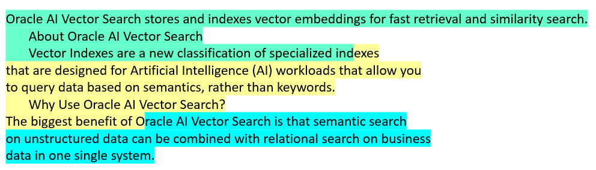  


Syntax:
```
    SELECT C.*
    FROM documentation_tab D, VECTOR_CHUNKS(D.text BY chars MAX 200 OVERLAP 0
    SPLIT BY none LANGUAGE american NORMALIZE none) C;
```
    

Output:
```
    CHUNK_OFFSET CHUNK_LENGTH CHUNK_TEXT
    --------------------------------------------------------------------------------------------------
    1	     200          Oracle AI Vector Search stores and indexes vector embeddings for fast retrieval and similarity search.
    
    About Oracle AI Vector Search
    Vector Indexes are a new classification of specialized ind
    
    201         200           exes that are designed for Artificial Intelligence (AI) workloads that allow you to query data based
    on semantics, rather than keywords.
    
    Why Use Oracle AI Vector Search?
    The biggest benefit of O
    
    401         146           racle AI Vector Search is that semantic search on unstructured data can be combined with relational
    search on business data in one single system.
```
    

Example 4-14 BY chars MAX 200 OVERLAP 0 SPLIT BY none NORMALIZE whitespace

This example enables `whitespace` normalization, which collapses redundant white space to produce more content within a chunk maximum. 

The first chunk extends 8 more characters due to the two indented lines of 4 spaces each (marked with underscores `_` below). The second chunk extends 4 more characters due to the one indented line of 4 total spaces. The third chunk has the remaining input. 

This example shows that the chunk length (normally in bytes) can differ from the chunk text's size. The `CHUNK_OFFSET` and `CHUNK_LENGTH` represent the original source location of the chunk. 

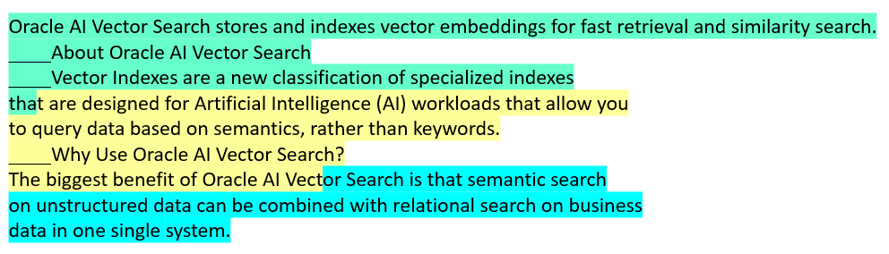  


Syntax:
```
    SELECT C.*
    FROM documentation_tab D, VECTOR_CHUNKS(D.text BY chars MAX 200 OVERLAP 0
    SPLIT BY none LANGUAGE american NORMALIZE whitespace) C;
```
    

Output:
```
    CHUNK_OFFSET CHUNK_LENGTH CHUNK_TEXT
    --------------------------------------------------------------------------------------------------
    1	     208          Oracle AI Vector Search stores and indexes vector embeddings for fast retrieval and similarity search.
    
    About Oracle AI Vector Search
    Vector Indexes are a new classification of specialized indexes tha
    
    209	     205          t are designed for Artificial Intelligence (AI) workloads that allow you to query data based on sema
    ntics, rather than keywords.
    
    Why Use Oracle AI Vector Search?
    The biggest benefit of Oracle AI Vect
    
    414          133          or Search is that semantic search on unstructured data can be combined with relational search on business data in one single system.
```
    

Example 4-15 BY words MAX 40 OVERLAP 0 SPLIT BY sentence LANGUAGE American

This example uses end-of-sentence splitting which uses language-specific data and heuristics (such as sentence punctuations, contextual rules, or common abbreviations) to determine likely sentence boundaries. Three chunks are produced, each ending at the periods.

You can use this technique to keep your text intact for chunks that contain many split sentences. Otherwise, the text may lose semantic context and may not be useful for queries that target specific information.

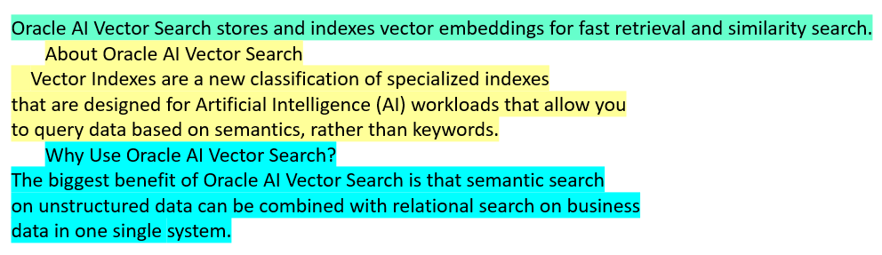  


Syntax:
```
    SELECT C.*
    FROM documentation_tab D, VECTOR_CHUNKS(D.text BY words MAX 40 OVERLAP 0
    SPLIT BY sentence LANGUAGE american NORMALIZE NONE) C;
```
    

Output:
```
    CHUNK_OFFSET CHUNK_LENGTH CHUNK_TEXT
    --------------------------------------------------------------------------------------------------
    1            102          Oracle AI Vector Search stores and indexes vector embeddings for fast retrieval and similarity search.
    
    109          228          About Oracle AI Vector Search
    Vector Indexes are a new classification of specialized indexes that are designed for Artificial
    Intelligence (AI) workloads that allow you to query data based on semantics, rather than keywords.
    
    343	     203          Why Use Oracle AI Vector Search?
    The biggest benefit of Oracle AI Vector Search is that semantic search on unstructured data can be
    combined with relational search on business data in one single system.
```
    

Example 4-16 BY words MAX 40 OVERLAP 0 SPLIT BY sentence LANGUAGE Simplified Chinese

In continuation with the preceding example, this example uses a Simplified Chinese text as the input to specify language-specific sentence chunking. 

The output contains four chunks, each ending at the periods:

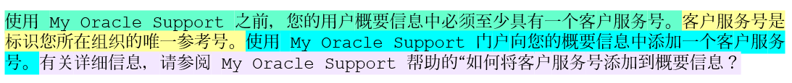  


For the purpose of clarity, in this example, `documentation_tab` is a `CLOB` inserted with the following `ChineseDoc.txt` document:
```
    使用 My Oracle Support 之前，您的用户概要信息中必须至少具有一个客户服务号。客户服务号是
    标识您所在组织的唯一参考号。使用 My Oracle Support 门户向您的概要信息中添加一个客户服务
    号。有关详细信息，请参阅 My Oracle Support 帮助的“如何将客户服务号添加到概要信息？
```
    

Perform the chunking operation as follows:
```
    -- create a relational table
    
    DROP TABLE IF EXISTS documentation_tab;
    CREATE TABLE documentation_tab (
    id   NUMBER,
    text CLOB);
    
    -- create a local directory and store the document into the table
    
    CREATE OR REPLACE DIRECTORY VEC_DUMP AS '/my_local_dir/';
    CREATE OR REPLACE PROCEDURE my_clob_from_file(
    p_dir in varchar2,
    p_file in varchar2,
    p_id in number
    ) AS
    dest_loc CLOB;
    v_bfile bfile := null;
    v_lang_context number := dbms_lob.default_lang_ctx;
    v_dest_offset integer := 1;
    v_src_offset integer := 1;
    v_warning number;
    BEGIN
    insert into documentation_tab values(p_id,empty_clob()) returning text
    into dest_loc;
    
    v_bfile := BFileName(p_dir, p_file);
    
    dbms_lob.open(v_bfile, dbms_lob.lob_readonly);
    dbms_lob.loadClobFromFile(
    dest_loc,
    v_bfile,
    dbms_lob.lobmaxsize,
    v_dest_offset,
    v_src_offset,
    873,
    v_lang_context,
    v_warning);
    dbms_lob.close(v_bfile);
    END my_clob_from_file;
    /
    
    show errors;
    
    -- transform clob into chunks
    
    exec my_clob_from_file('VEC_DUMP', 'ChineseDoc.txt', 1);
    
    SELECT rownum as id, C.chunk_offset pos, C.chunk_length as siz,
    REPLACE(SUBSTR(C.chunk_text,1,15),CHR(10),'_') as beg,
    '...' as rng,
    REPLACE(SUBSTR(C.chunk_text,-15),CHR(10),'_') as end
    FROM documentation_tab D, VECTOR_CHUNKS(to_char(D.text) BY words
    MAX 40
    OVERLAP 0
    SPLIT BY sentence
    LANGUAGE "simplified chinese"
    NORMALIZE none) C;
```
    

Output:
```
    ID   POS  SIZ  BEG                          RNG END
    ---- ---- ---- ---------------------------  --- ------------------------
    1    1   103  使用 My Oracle Su             ... 中必须至少具有一个客户服务号。
    2  104    60  客户服务号是标识您所在组织的唯    ... 是标识您所在组织的唯一参考号。
    3  164    85  使用 My Oracle Su             ... 概要信息中添加一个客户服务号。
    4  249   109  有关详细信息，请参阅 My O       ... 何将客户服务号添加到概要信息？
```
    

**Related Topics**

  * [VECTOR_CHUNKS](vector_chunks.md#GUID-5927E2FA-6419-4744-A7CB-3E62DBB027AD)
  * [UTL_TO_CHUNKS](utl_to_chunks-dbms_vector_chain.md#GUID-4E145629-7098-4C7C-804F-FC85D1F24240)


**Parent topic:** [Configure Chunking Parameters](configure-chunking-parameters.md)
