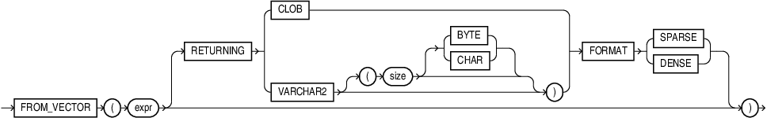

## FROM_VECTOR {#GUID-DA483A01-340D-4D7C-BD07-7ECFB830B595}

`FROM_VECTOR` takes a vector as input and returns a string of type `VARCHAR2` or `CLOB` as output. 

Syntax

  


  


  


Purpose

`FROM_VECTOR` optionally takes a `RETURNING` clause to specify the data type of the returned value. 

If `VARCHAR2` is specified without size, the size of the returned value size is 32767. 

You can optionally specify the storage format of the input vector in the `FORMAT` clause, using the tokens `SPARSE` or `DENSE`. 

There is no support to convert to `CHAR`, `NCHAR`, and `NVARCHAR2`. 

`FROM_VECTOR` is synonymous with `VECTOR_SERIALIZE`. 

Parameters

*expr* must evaluate to a vector. The function returns NULL if *expr* is NULL. 

Examples
```
    SELECT FROM_VECTOR(TO_VECTOR('[1, 2, 3]') );
    
    
    FROM_VECTOR(TO_VECTOR('[1,2,3]'))
    
    –---------------------------------------------------------------
    [1.0E+000,2.0E+000,3.0E+000]
    
    1 row selected.
```
```
    SELECT FROM_VECTOR(TO_VECTOR('[1.1, 2.2, 3.3]', 3, FLOAT32) );
    
    
    FROM_VECTOR(TO_VECTOR('[1.1,2.2,3.3]',3,FLOAT32))
    ------------------------------------------------------------------
    
    [1.10000002E+000,2.20000005E+000,3.29999995E+000]
    
    1 row selected.
```
```
    SELECT FROM_VECTOR( TO_VECTOR('[1.1, 2.2, 3.3]', 3, FLOAT32) RETURNING VARCHAR2(1000));
    
    
    FROM_VECTOR(TO_VECTOR('[1.1,2.2,3.3]',3,FLOAT32)RETURNINGVARCHAR2(1000))
    --------------------------------------------------------------------------------
    
    [1.10000002E+000,2.20000005E+000,3.29999995E+000]
    
    1 row selected.
```
```
    SELECT FROM_VECTOR(TO_VECTOR('[1.1, 2.2, 3.3]', 3, FLOAT32) RETURNING CLOB );
    
    
    FROM_VECTOR(TO_VECTOR('[1.1,2.2,3.3]',3,FLOAT32)RETURNINGCLOB)
    
    --------------------------------------------------------------------------------
    
    [1.10000002E+000,2.20000005E+000,3.29999995E+000]
    
    1 row selected.
```
    

> **note:** 

  * Applications using Oracle Client 23ai libraries or Thin mode drivers can fetch vector data directly, as shown in the following example:
```
    SELECT dataVec FROM vecTab;
```
    

  * For applications using Oracle Client 23ai libraries prior to 23ai connected to Oracle Database 23ai, use the `FROM_VECTOR` to fetch vector data, as shown by the following example: 
```
    SELECT FROM_VECTOR(dataVec) FROM vecTab;
```
    


**Parent topic:** [Vector Serializers](vector-serializers.md)
