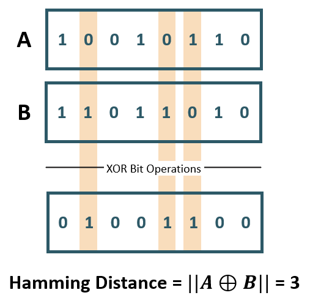

## Hamming Distance {#GUID-EBA30C96-B909-44E6-8561-CDB34D24601F}

The Hamming distance between two vectors represents the number of dimensions where they differ.

For example, when using binary vectors, the Hamming distance between two vectors is the number of bits you must change to change one vector into the other. To compute the Hamming distance between two vectors *A* and *B*, you need to: 

  * Compare the position of each bit in the sequence. You do this by using an `exclusive or` (also called the XOR bit operation) between *A* and *B*. This operation outputs 1 if the bits in the sequence do not match, and 0 otherwise. 
  * Count the number of '1's in the resulting vector, the outcome of which is called the Hamming weight or norm of that vector.

It's important to note that the bit strings need to be of equal length for the comparison to make sense. The Hamming metric is mainly used with binary vectors for error detection over networks.

  

  

  

**Parent topic:** [Vector Distance Metrics](vector-distance-metrics.md)
