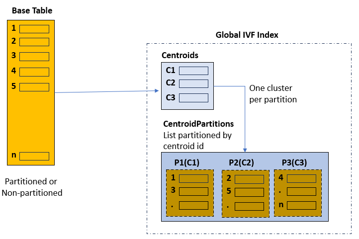
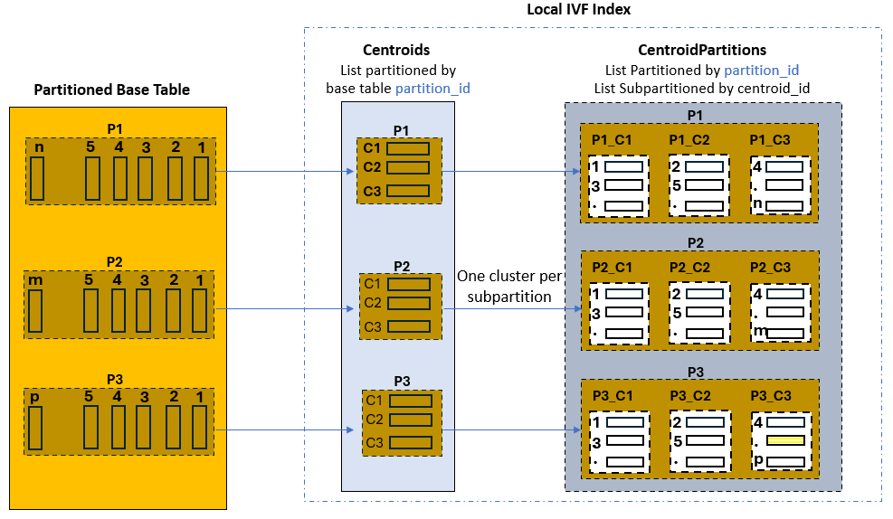
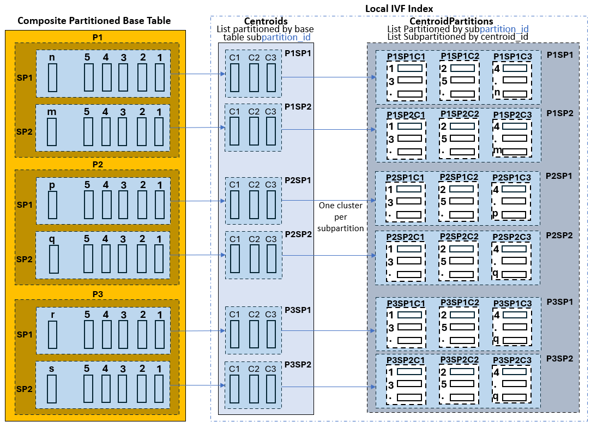

## Inverted File Flat Vector Indexes Partitioning Schemes {#GUID-98797C70-269E-42E9-B24B-1E3C461D5932}

Inverted File Flat vector indexes support both global and local indexes on partitioned tables. By default, IVF indexes are globally partitioned by centroid. 

A **global IVF index** is composed of two tables: 

  * One called `VECTOR$*``*_IVF_IDX$*``*$IVF_FLAT_CENTROIDS`, containing the list of identified centroid vectors and associated ids. 

  * The second called `VECTOR$*``*_IVF_IDX$*``*$IVF_FLAT_CENTROID_PARTITIONS`, which is list-partitioned on the centroid ids. Each partition contains the base table vectors closely related (cluster) to the corresponding centroid id for that partition. 


This is illustrated by the following diagram:

  


This structure is used to accelerate searches in the index by identifying first the centroid that is the closest to your query vector, and then use the corresponding centroid id to prune unnecessary partitions.

However, if the base table is partitioned on some relational data and your query is filtering on the base table partition key, then global IVF indexes are not optimal because they are completely independent of the base table partition key. For example, if you search the top-10 houses in California similar to a vectorized picture, the picture itself has most probably no relationship with the state of California. While your query benefits from the fact that your base table is partitioned by state, so you can search only the partition corresponding to California, the query still must look at pictures that may not be in California. 

To further accelerate such type of queries, you have the possibility to create a **local IVF index**. The term **local** for an index refers to a one-to-one relationship between the base table partitions or subpartitions and the index partitions. The local IVF index creation and DML operations on the base tables with IVF indexes could be accelerated if **Vector Pool** is enabled. **Vector Pool** is a new memory area stored in the SGA. For more information related to **Vector Pool** , read this topic: [Size the Vector Pool](size-vector-pool.md#GUID-1815E227-56C9-4E62-977F-0FDA282C9D83). 

This is illustrated by the following graphic, where the base table has three partitions. The created local IVF index is still constituted by two internal tables: 

  * One called `VECTOR$*``*_IVF_IDX$*``*$IVF_FLAT_CENTROIDS`, which is list-partitioned by base table partition ids, and is thus equi-partioned with the base table. Each partition containing the list of corresponding identified centroid vectors and associated ids. 

  * The second called `VECTOR$*``*_IVF_IDX$*``*$IVF_FLAT_CENTROID_PARTITIONS`, which is list-partitioned by base table partition id and list-subpartitioned by centroid id. This table is also equi-partitioned with the base table, and each subpartition contains the base table vectors closely related (cluster) to the corresponding centroid id for that subpartition. 


  


Coming back to our initial example where you search the top-10 houses in California similar to a vectorized picture; your query benefits from partition pruning on the base table and Centroids table (California) as they are both partitioned by state. In addition, and once the closest centroid is identified in that partition, the query simply needs to scan the corresponding centroid cluster subpartition in the Centroid Partitions table without having to scan other centroid subpartitions. 

Another possibility is for the base table to be composite partitioned. Here is a graphical representation corresponding to that case. The Centroids table is list-partitioned according to base table subpartitions. Each partition in the Centroids table containing all centroid vectors found in the corresponding base table subpartition. The Centroid Partitions table is list-partitioned by base table subpartition id, and is further subpartitioned by centroid id: 

  


> **note:** 

You can create local IVF indexes only on a partitioned base table. 

Local IVF indexes inherit all system catalog tables and views used by regular local indexes. A flag (`idx_spare2`) in the `vecsys.vector$index` table indicates if an index is a local or global vector index. 

Using local IVF indexes brings additional advantages: 

  * Simplified partition management operations (PMOP):

For example, dropping a table partition just involves dropping the corresponding index partition. 

  * Flexible Indexing schemes:

For example, marking certain index partitions `UNUSABLE` to avoid indexing certain table partitions through partial indexing. 


> **note:** 

If you want your user queries to use full potential of local IVF indexes, by taking the benefit of partition pruning, then user queries must satisfy the following conditions: 

  * The base table is [sub]partitioned by a single column.

  * Conditions are a form of `[sub]partitition_key CMP` constant, where `CMP` can be: 

`=, >, >=, <, <=, IN`

  * The `partition_key` condition is `AND`ed with other non-partition conditions. 


Partition Management Operations (PMOP) and IVF Indexes

These are the PMOP possibilities and restrictions for local IVF indexes:

  * `ALTER TABLE TRUNCATE [sub]partition *``*`

`ALTER TABLE DROP [sub]partition *``*`

These operations are supported with all partition schemes: `RANGE`, `HASH`, `LIST`. However, all corresponding IVF index partitions are marked as `UNUSABLE` after the operation. 

  * `ALTER TABLE ADD [sub]partition *``*`

If the base table is partitioned by `RANGE` or `LIST`, then the operation is supported. However, all corresponding IVF indexes are marked as `UNUSABLE` after the operation. If the table is partitioned by `HASH`, then the operation fails if there are any local IVF indexes on the base table. 

  * All other PMOP operations on the base table are not supported, such as `ALTER TABLE SPLIT/MERGE/MOVE/EXCHANGE/COALESCE`. 

These `ALTER TABLE` statements will fail if there are any local IVF indexes on the table being altered. 

  * `ALTER INDEX` on local IVF indexes is not supported. 


Experiment with LOCAL IVF Vector Indexes

You can start experimenting with `LOCAL` IVF indexes using the following code. This is not a scenario but merely a series of SQL commands to help you get started on your own testing scenarios. 

  1. **Create the base table using the partition scheme of your choice:**

*RANGEpartitioning:*
```
    DROP TABLE sales_data PURGE;
    
    
    CREATE TABLE sales_data
    (
    product_id NUMBER,
    customer_id NUMBER,
    sale_date DATE,
    amount_sold NUMBER,
    vec vector(8),
    region VARCHAR2(20)
    )
    PARTITION BY RANGE (product_id)
    (
    PARTITION sales_1 VALUES LESS THAN (100),
    PARTITION sales_2 VALUES LESS THAN (200),
    PARTITION sales_3 VALUES LESS THAN (300),
    PARTITION sales_4 VALUES LESS THAN (400),
    PARTITION sales_5 VALUES LESS THAN (500),
    PARTITION sales_6 VALUES LESS THAN (600),
    PARTITION sales_7 VALUES LESS THAN (700),
    PARTITION sales_8 VALUES LESS THAN (800),
    PARTITION sales_9 VALUES LESS THAN (900),
    PARTITION sales_10 VALUES LESS THAN (1000),
    PARTITION sales_default VALUES LESS THAN (1000000)
    );
```
    

*LISTpartitioning:*
```
    DROP TABLE sales_data PURGE;
    
    CREATE TABLE sales_data
    (
    product_id   NUMBER,
    customer_id  NUMBER,
    sale_date    DATE,
    amount_sold  NUMBER,
    vec          VECTOR(8),
    region       VARCHAR2(20)
    )
    PARTITION BY LIST (region)
    (
    PARTITION RegionA_Partition VALUES ('RegionA1','RegionA2','RegionA3','RegionA4','RegionA5'),
    PARTITION RegionB_Partition VALUES ('RegionB1','RegionB2','RegionB3','RegionB4','RegionB5'),
    PARTITION RegionC_Partition VALUES ('RegionC1','RegionC2','RegionC3','RegionC4','RegionC5'),
    PARTITION RegionD_Partition VALUES ('RegionD1','RegionD2','RegionD3','RegionD4','RegionD5'),
    PARTITION RegionE_Partition VALUES ('RegionE1','RegionE2','RegionE3','RegionE4','RegionE5'),
    PARTITION RegionF_Partition VALUES ('RegionF1','RegionF2','RegionF3','RegionF4','RegionF5'),
    PARTITION RegionG_Partition VALUES ('RegionG1','RegionG2','RegionG3','RegionG4','RegionG5'),
    PARTITION RegionH_Partition VALUES ('RegionH1','RegionH2','RegionH3','RegionH4','RegionH5'),
    PARTITION RegionI_Partition VALUES ('RegionI1','RegionI2','RegionI3','RegionI4','RegionI5'),
    PARTITION RegionJ_Partition VALUES ('RegionJ1','RegionJ2','RegionJ3','RegionJ4','RegionJ5'),
    PARTITION Other_Region_Partition VALUES (DEFAULT)
    );
```
    

*HASHpartitioning:*
```
    DROP TABLE sales_data PURGE;
    
    CREATE TABLE sales_data
    (
    product_id   NUMBER,
    customer_id  NUMBER,
    sale_date    DATE,
    amount_sold  NUMBER,
    vec          VECTOR(8),
    region       VARCHAR2(20)
    )
    PARTITION BY HASH (product_id)
    PARTITIONS 10;
```
    

  2. **Use this procedure to randomly insert data into the SALES_DATA table:**
```
    CREATE OR REPLACE PROCEDURE insert_sales_data(numRows IN INTEGER, maxProductId IN INTEGER) AS
    TYPE vec_array IS VARRAY(8) OF NUMBER;
    BEGIN
    DBMS_RANDOM.INITIALIZE(100);
    FOR i IN 1..numRows LOOP
    INSERT INTO sales_data (product_id, customer_id, sale_date, amount_sold, vec, region)
    VALUES (round(DBMS_RANDOM.VALUE(1, MaxProductId)),    -- Random product_id between 1 and 1000
    round(DBMS_RANDOM.VALUE(1, 10000)),   -- Random customer_id between 1 and 10000
    (DATE '2024-05-10' - DBMS_RANDOM.VALUE(1, 1460)), -- Random sale_date within the last 4 years
    DBMS_RANDOM.VALUE(10, 10000),  -- Random amount_sold between 10 and 1000
    '[' ||
    to_char(DBMS_RANDOM.VALUE(0, 1000)) || ',' ||
    to_char(DBMS_RANDOM.VALUE(0, 1000)) || ',' ||
    to_char(DBMS_RANDOM.VALUE(0, 1000)) || ',' ||
    to_char(DBMS_RANDOM.VALUE(0, 1000)) || ',' ||
    to_char(DBMS_RANDOM.VALUE(0, 1000)) || ',' ||
    to_char(DBMS_RANDOM.VALUE(0, 1000)) || ',' ||
    to_char(DBMS_RANDOM.VALUE(0, 1000)) || ',' ||
    to_char(DBMS_RANDOM.VALUE(0, 1000)) ||
    ']',
    CASE MOD(i, 10)
    WHEN 0 THEN 'RegionA' || MOD(i,5)
    WHEN 1 THEN 'RegionB' || MOD(i,5)
    WHEN 2 THEN 'RegionC' || MOD(i,5)
    WHEN 3 THEN 'RegionD' || MOD(i,5)
    WHEN 4 THEN 'RegionE' || MOD(i,5)
    WHEN 5 THEN 'RegionF' || MOD(i,5)
    WHEN 6 THEN 'RegionG' || MOD(i,5)
    WHEN 7 THEN 'RegionH' || MOD(i,5)
    WHEN 8 THEN 'RegionI' || MOD(i,5)
    ELSE        'RegionJ' || MOD(i,5)
    END);
    
    IF MOD(i, 10000) = 0 THEN
    COMMIT;
    END IF;
    END LOOP;
    COMMIT;
    END insert_sales_data;
    /
    
    EXEC insert_sales_data(20000, 501);
```
    

  3. **Create a LOCAL IVF index on the VEC column of the SALES_DATA table:**
```
    CREATE VECTOR INDEX vidxivf ON sales_data(vec)
    ORGANIZATION NEIGHBOR PARTITIONS
    WITH TARGET ACCURACY 95
    DISTANCE EUCLIDEAN PARAMETERS(TYPE IVF, NEIGHBOR PARTITION 20) LOCAL;
```
    

  4. **Check all index partitions state before and after running PMOP commands:**
```
    SELECT INDEX_NAME, PARTITION_NAME, STATUS
    FROM USER_IND_PARTITIONS
    WHERE index_name LIKE upper('vidxivf')
    ORDER BY 1, 2;
```
    

  5. **Test the following ALTER TABLE commands to see what is supported and what is not:**

*If the table isRANGEpartitioned:*
```
    ALTER TABLE sales_data ADD PARTITION sales_1000000 VALUES LESS THAN (2000000);
    
    ALTER TABLE sales_data
    SPLIT PARTITION sales_2
    AT (150)
    INTO (
    PARTITION sales_21,
    PARTITION sales_22
    );
    
    ALTER TABLE sales_data DROP PARTITION sales_3;
```
    

*If the table isLISTpartitioned:*
```
    ALTER TABLE sales_data
    SPLIT PARTITION RegionE_Partition VALUES ('RegionE1', 'RegionE2', 'RegionE3')
    INTO
    ( PARTITION RegionE1_Partition,
    PARTITION RegionE2_Partition
    );
    
    ALTER TABLE sales_data DROP PARTITION RegionB_Partition;
```
    

*If the table isHASHpartitioned:*
```
    ALTER TABLE sales_data ADD PARTITION;
    
    SELECT partition_name FROM user_tab_partitions WHERE table_name='SALES_DATA';
    
    ALTER TABLE sales_data COALESCE PARTITION;
```
    


**Parent topic:** [About Neighbor Partition Vector Index](neighbor-partition-vector-indexes.md)
