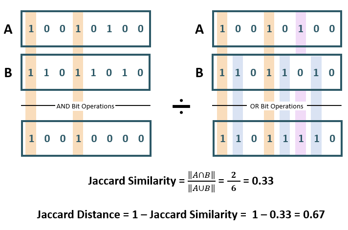

## Jaccard Similarity {#GUID-9220C77A-0AE1-4E87-838A-3D1F01F9341F}

The Jaccard similarity is used to determine the share of significant (non-zero) dimensions (bit's position) common between two `BINARY` vectors. 

The Jaccard similarity is only applicable to `BINARY` vectors and only the non-zero bits of each vector are considered. 

The Jaccard similarity between vectors *A* and *B* is the calculation of the Hamming weight (norm, or the number of '1's in the resulting vector) of the result of an `AND` bit operation between *A* and *B*, divided by the Hamming weight of the result of an `OR` bit operation between *A* and *B*. 

As shown in the included diagram of vectors *A* and *B*: 

  * The `AND` bit operation outputs a 1 if the bits in the sequence match a 1, and 0 otherwise. 
  * The `OR` bit operation outputs a 1 if at least one of the bits in the sequence matches a 1, and 0 otherwise. 

The result of the calculation is from 0 to 1, where results approaching 1 are more similar. A result of 0 means that the two vectors share no non-zero attributes while a result of 1 indicates the two vectors share identical sets of non-zero attributes. In the included diagram, the two vectors share 33% of the significant attributes.

While the Jaccard similarity indicates how similar two vectors are, the Jaccard distance indicates the *dissimilarity* between the vectors. The Jaccard distance can be found by subtracting the Jaccard similarity from 1. For example, two vectors with a Jaccard similarity of *0.25* have a Jaccard distance of *0.75*. When determining distance, the meaning of the result is opposite to that of a similarity calculation. A result of 0 indicates that the two vectors are identical while a result of 1 indicates the vectors are completely disjoint, sharing no common elements. 

  

  

  

**Parent topic:** [Vector Distance Metrics](vector-distance-metrics.md)
