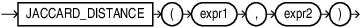

## JACCARD_DISTANCE {#GUID-1C14A1FF-BE3C-4B21-8FC0-B05F5995F41A}

`JACCARD_DISTANCE` is a shorthand version of the `VECTOR_DISTANCE` function that calculates the jaccard distance between two vectors. It takes two `BINARY` vectors as input and returns the distance between them as a `BINARY_DOUBLE`. 

Syntax

  

  

  

Parameters

  * *expr1* and *expr2* must evaluate to `BINARY` vectors and have the same number of dimensions. If either expression is not a `BINARY` vector, an error is raised. 

  * `JACCARD_DISTANCE` returns NULL if either *expr1* or *expr2* is NULL. 

**Parent topic:** [Vector Distance Functions and Operators](vector-distance-functions-and-operators.md)
