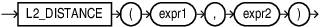

## L2_DISTANCE {#GUID-2FD8BC27-7614-471F-A4F5-3ED52130A05A}

`L2_DISTANCE` is a shorthand version of the `VECTOR_DISTANCE` function that calculates the Euclidean distance between two vectors. It takes two vectors as input and returns the distance between them as a `BINARY_DOUBLE`. 

Syntax

  

  

  

Parameters

  * *expr1* and *expr2* must evaluate to vectors that have the same format and number of dimensions. 

  * `L2_DISTANCE` returns NULL, if either *expr1* or *expr2* is NULL. 

**Parent topic:** [Vector Distance Functions and Operators](vector-distance-functions-and-operators.md)
