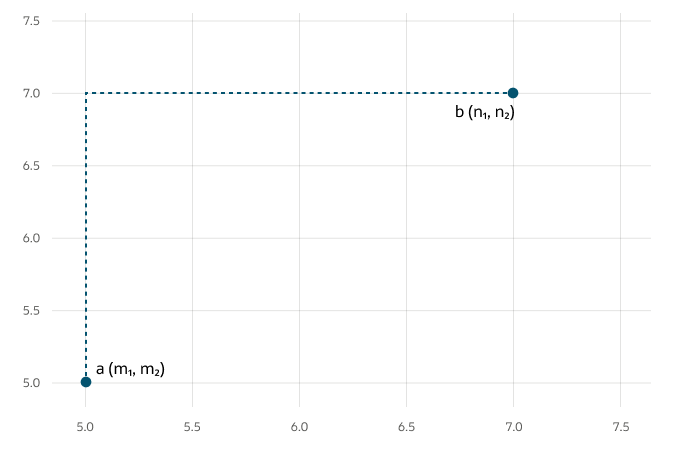

## Manhattan Distance {#GUID-5965084E-E8E5-4EEB-A86E-025B7ED8DC02}

This metric is calculated by summing the distance between the dimensions of the two vectors that you want to compare.

Imagine yourself in the streets of Manhattan trying to go from point A to point B. A straight line is not possible.

This metric is most useful for vectors describing objects on a uniform grid, such as city blocks, power grids, or a chessboard. It can be useful for higher dimensional vector spaces too. Compared to the Euclidean metric, the Manhattan metric is faster for calculations and you can use it advantageously for higher dimensional vector spaces.

  

  

  

**Parent topic:** [Vector Distance Metrics](vector-distance-metrics.md)
