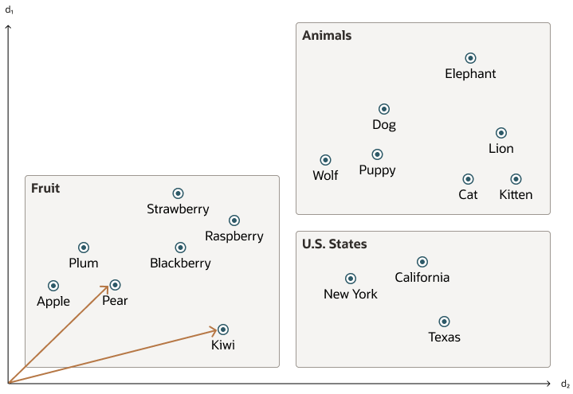
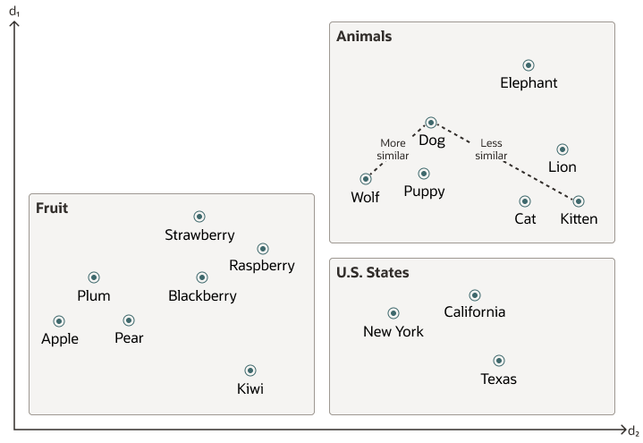
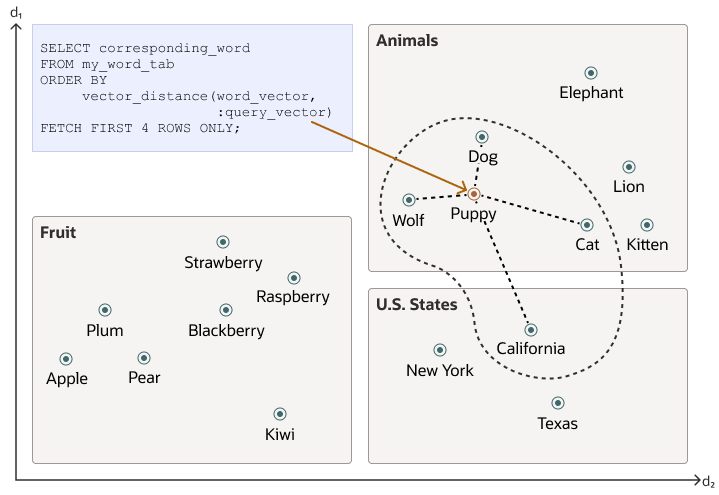
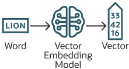

## Overview of Oracle AI Vector Search {#GUID-746EAA47-9ADA-4A77-82BB-64E8EF5309BE}

Oracle AI Vector Search is designed for Artificial Intelligence (AI) workloads and allows you to query data based on semantics, rather than keywords.

VECTOR Data Type

The `VECTOR` data type is introduced with the release of Oracle Database 23ai, providing the foundation to store vector embeddings alongside business data in the database. Using embedding models, you can transform unstructured data into vector embeddings that can then be used for semantic queries on business data. In order to use the `VECTOR` data type and its related features, the `COMPATIBLE` initialization parameter must be set to 23.4.0 or higher. For more information about the parameter and how to change it, see [*Oracle Database Upgrade Guide*](https://docs.oracle.com/pls/topic/lookup?ctx=en/database/oracle/oracle-database/23/vecse&id=UPGRD-GUID-4711E0D1-9FCF-4F35-85B5-52EBB437C00E). 

See the following basic example of using the `VECTOR` data type in a table definition: 
```
    CREATE TABLE docs (doc_id INT, doc_text CLOB, doc_vector **VECTOR**);
```
    

For more information about the `VECTOR` data type and how to use vectors in tables, see [Create Tables Using the VECTOR Data Type](https://docs.oracle.com/pls/topic/lookup?ctx=en/database/oracle/oracle-database/23/vecse&id=VECSE-GUID-E05AC257-CBD6-4B0C-A29F-0116EF02EA3A). 

Due to the numerical nature of the `VECTOR` data type, you can use it as an input to the machine learning algorithms such as classification, anomaly, regression, clustering and feature extraction. More details on using `VECTOR` data type in machine learning could be found in [Vector Data Type Support](https://docs.oracle.com/pls/topic/lookup?ctx=en/database/oracle/oracle-database/23/vecse&id=DMPRG-GUID-AC1CDD37-0DFE-4EBF-A5E0-94F1234279B9). 

> **note:** Support for `VECTOR` data type machine learning is available in all versions starting 23.7, but not in earlier versions. 

Vector Embeddings

If you've ever used applications such as voice assistants, chatbots, language translators, recommendation systems, anomaly detection, or video search and recognition, you've implicitly used vector embeddings features.

Oracle AI Vector Search stores vector embeddings, which are mathematical vector representations of data points. These vector embeddings describe the semantic meaning behind content such as words, documents, audio tracks, or images. As an example, while doing text based searches, vector search is often considered better than keyword search as vector search is based on the meaning and context behind the words and not the actual words themselves. This vector representation translates semantic similarity of objects, as perceived by humans, into proximity in a mathematical vector space. This vector space usually has multihundreds, if not thousands, of dimensions. Put differently, vector embeddings are a way of representing almost any kind of data, such as text, images, videos, users, or music as points in a multidimensional space where the locations of those points in space, and proximity to others, are semantically meaningful.

This simplified diagram illustrates a vector space where words are encoded as 2-dimensional vectors.

  


  


  


Similarity Search

Searching semantic similarity in a data set is now equivalent to searching nearest neighbors in a vector space instead of using traditional keyword searches using query predicates. As illustrated in the following diagram, the distance between *dog* and *wolf* in this vector space is shorter than the distance between *dog* and *kitten*. In this space, a dog is more similar to a wolf than it is to a kitten. See [Perform Exact Similarity Search](https://docs.oracle.com/pls/topic/lookup?ctx=en/database/oracle/oracle-database/23/vecse&id=VECSE-GUID-CCCF06F5-AD46-466D-99B2-4609B84C2B69) for more information. 

  


  


  


Vector data tends to be unevenly distributed and clustered into groups that are semantically related. Doing a similarity search based on a given query vector is equivalent to retrieving the K-nearest vectors to your query vector in your vector space. Basically, you need to find an ordered list of vectors by ranking them, where the first row in the list is the closest or most similar vector to the query vector, the second row in the list is the second closest vector to the query vector, and so on. When doing a similarity search, the relative order of distances is what really matters rather than the actual distance.

Using the preceding vector space, here is an illustration of a semantic search where your query vector is the one corresponding to the word *Puppy* and you want to identify the four closest words: 

  


  


  


Similarity searches tend to get data from one or more clusters depending on the value of the query vector and the fetch size.

Approximate searches using *vector indexes* can limit the searches to specific clusters, whereas exact searches visit vectors across all clusters. See [Use Vector Indexes](https://docs.oracle.com/pls/topic/lookup?ctx=en/database/oracle/oracle-database/23/vecse&id=VECSE-GUID-8AF956F3-D951-4968-9B79-A6E180E87456) for more information. 

Vector Embedding Models

One way of creating such vector embeddings could be to use someone's domain expertise to quantify a predefined set of features or dimensions such as shape, texture, color, sentiment, and many others, depending on the object type with which you're dealing. However, the efficiency of this method depends on the use case and is not always cost effective.

Instead, vector embeddings are created via neural networks. Most modern vector embeddings use a transformer model, as illustrated by the following diagram, but convolutional neural networks can also be used.

Figure 2-1 Vector Embedding Model

  


  
[Description of "Figure 2-1 Vector Embedding Model"](img_text/basic_transform.md)

  


Depending on the type of your data, you can use different pretrained, open-source models to create vector embeddings. For example:

  * For textual data, sentence transformers transform words, sentences, or paragraphs into vector embeddings.
  * For visual data, you can use Residual Network (ResNet) to generate vector embeddings.
  * For audio data, you can use the visual spectrogram representation of the audio data to fall back into the visual data case.


Each model also determines the number of dimensions for your vectors. For example:

  * Cohere's embedding model embed-english-v3.0 has 1024 dimensions.
  * OpenAI's embedding model text-embedding-3-large has 3072 dimensions.
  * Hugging Face's embedding model all-MiniLM-L6-v2 has 384 dimensions


Of course, you can always create your own model that is trained with your own data set.

Import Embedding Models into Oracle Database

Although you can generate vector embeddings outside the Oracle Database using pretrained open-source embeddings models or your own embeddings models, you also have the option to import those models directly into the Oracle Database if they are compatible with the Open Neural Network Exchange (ONNX) standard. Oracle Database implements an ONNX runtime directly within the database. This allows you to generate vector embeddings directly within the Oracle Database using SQL. See [Generate Vector Embeddings](generate-vector-embeddings-node.md#GUID-A788574C-F88D-4E5E-B220-A40FA8CBB174) for more information. 

**Parent topic:** [Overview](overview-node.md)
