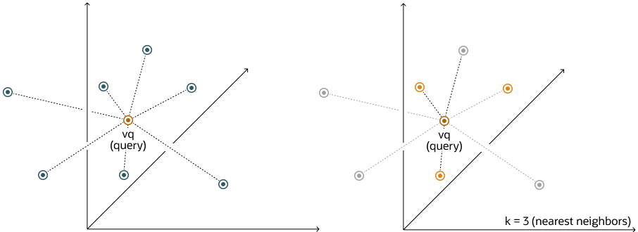

## Perform Exact Similarity Search {#GUID-CCCF06F5-AD46-466D-99B2-4609B84C2B69}

A similarity search looks for the relative order of vectors compared to a query vector. Naturally, the comparison is done using a particular distance metric but what is important is the result set of your top closest vectors, not the distance between them.

As an example, and given a certain query vector, you can calculate its distance to all other vectors in your data set. This type of search, also called flat search, or exact search, produces the most accurate results with perfect search quality. However, this comes at the cost of significant search times. This is illustrated by the following diagrams:

Figure 8-1 Exact Search

  


  
[Description of "Figure 8-1 Exact Search"](img_text/flat-index.md)

  


With an exact search, you compare the query vector `vq` against every other vector in your space by calculating its distance to each vector. After calculating all of these distances, the search returns the nearest `k` of those as the nearest matches. This is called a k-nearest neighbors (kNN) search. 

For example, the Euclidean similarity search involves retrieving the top-k nearest vectors in your space relative to the Euclidean distance metric and a query vector. Here's an example that retrieves the top 10 vectors from the `vector_tab` table that are the nearest to `query_vector` using the following exact similarity search query: 
```
    SELECT docID
    FROM vector_tab
    ORDER BY VECTOR_DISTANCE( embedding, :query_vector, EUCLIDEAN )
    FETCH EXACT FIRST 10 ROWS ONLY;
```
    

In this example, `docID` and `embedding` are columns defined in the `vector_tab` table and `embedding` has the `VECTOR` data type. 

In the case of Euclidean distances, comparing squared distances is equivalent to comparing distances. So, when ordering is more important than the distance values themselves, the Euclidean Squared distance is very useful as it is faster to calculate than the Euclidean distance (avoiding the square-root calculation). Consequently, it is simpler and faster to rewrite the query like this:
```
    SELECT docID
    FROM vector_tab
    ORDER BY VECTOR_DISTANCE( embedding, :query_vector, EUCLIDEAN_SQUARED)
    FETCH FIRST 10 ROWS ONLY;
```
    

> **note:** The `EXACT` keyword is optional. If omitted while connected to an ADB-S instance, an approximate search using a vector index is attempted if one exists. For more information, see [Perform Approximate Similarity Search Using Vector Indexes](https://docs.oracle.com/pls/topic/lookup?ctx=en/database/oracle/oracle-database/23/vecse&id=VECSE-GUID-D8432ADA-38B0-4E5F-975F-E86977CA8488). 

> **note:** Ensure that you use the distance function that was used to train your embedding model. 

> **note:** See Also: 

[*Oracle Database SQL Language Reference*](https://docs.oracle.com/pls/topic/lookup?ctx=en/database/oracle/oracle-database/23/vecse&id=SQLRF-GUID-CFA006CA-6FF1-4972-821E-6996142A51C6) for the full syntax of the `ROW_LIMITING_CLAUSE`

**Parent topic:** [Query Data With Similarity and Hybrid Searches](query-data-similarity-and-hybrid-searches.md)
