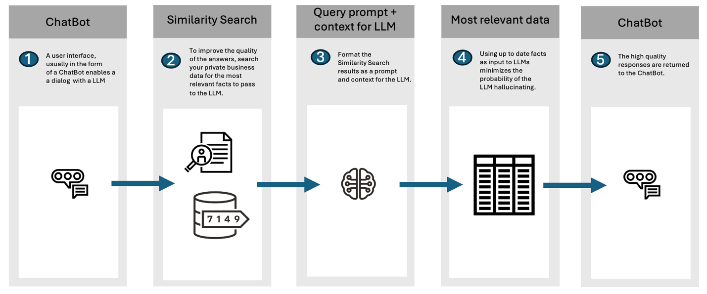

## About Retrieval Augmented Generation {#GUID-5C0AF503-C6E4-492B-A451-5E02A9F66C38}

Oracle AI Vector Search supports Enterprise Retrieval Augmented Generation (RAG) to enable sophisticated queries that can combine vectors with relational data, graph data, spatial data, and JSON collections.

**Retrieval Augmented Generation** is an approach developed to address the limitations of LLMs. RAG combines the strengths of pretrained language models with the ability to retrieve recent and accurate information from a dataset or database in real-time during the generation of responses. 

By communicating with LLMs through the implementation of RAG, the knowledge of LLMs is increased with business data found through AI Vector Search.

The primary problem with LLMs, such as GPT (Generative Pretrained Transformer), is that they generate responses based solely on the patterns and data they were trained on up to the point of their last update. This means that they inherently lack the ability to access or incorporate new, real-time information after their training is cut off, potentially limiting their responses to outdated or incomplete information. LLMs do not know about your private company data. Consequently, LLMs can make up answers (hallucinate) when they do not have enough relevant and up-to-date facts.

By providing your LLM with up-to-date facts from your company, you can minimize the probability that an LLM will hallucinate.

Figure 9-1 Example RAG Workflow

  

  
[Description of "Figure 9-1 Example RAG Workflow"](img_text/chatbot_llm_workflow.md)

  

Here is how RAG improves upon the issues with traditional LLMs:

  * **Access to External and Private Information:** RAG can pull in data from external and private sources during its response generation process. This allows it to provide answers that are up-to-date and grounded in the latest available information, which is crucial for queries requiring current knowledge or specific details not included in its original training data. 
  * **Factually More Accurate and Detailed Responses:** While traditional LLMs are trained on older data, RAG incorporates real-time retrieved information, meaning that generated responses are not only contextually rich but also factually more up-to-date and accurate as time goes on. This is particularly beneficial for queries that require precision and detail, such as scientific facts, historical data, or specific statistics. 
  * **Reduced Hallucination:** LLMs can sometimes "hallucinate" information, as in generate plausible but false or unverified content. RAG mitigates this by grounding responses in retrieved documents, thereby enhancing the reliability of the information provided. 

Oracle AI Vector Search enables RAG within Oracle Database using the `DBMS_VECTOR_CHAIN` PL/SQL package. Alternatively, you can implement RAG externally by using popular frameworks such as LangChain. 

LangChain is a popular open source framework that encapsulates popular LLMs, vector databases, document stores, and embedding models. `DBMS_VECTOR_CHAIN` is a PL/SQL package that provides the ability to create RAG solutions, all within the database. With `DBMS_VECTOR_CHAIN`, your data never needs to leave the security of Oracle Database. 

> **note:** See Also: 

  * [*Oracle Database PL/SQL Packages and Types Reference*](https://docs.oracle.com/pls/topic/lookup?ctx=en/database/oracle/oracle-database/23/vecse&id=ARPLS-GUID-A5B4C9B9-4F94-44E5-817E-FF1A08180C4B) for details about the `DBMS_VECTOR_CHAIN` package 

**Parent topic:** [Use Retrieval Augmented Generation to Complement LLMs](use-retrieval-augmented-generation-complement-llms.md)
