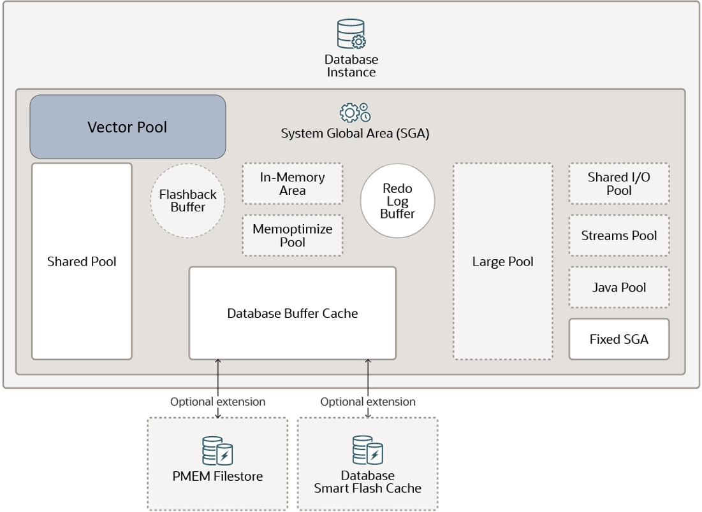

## Size the Vector Pool {#GUID-1815E227-56C9-4E62-977F-0FDA282C9D83}

To allow vector index creation, you must enable a new memory area stored in the SGA called the **Vector Pool**. 

The Vector Pool is a memory allocated in SGA to store Hierarchical Navigable Small World (HNSW) vector indexes and all associated metadata. It is also used to speed up Inverted File Flat (IVF) index creation as well as DML operations on base tables with IVF indexes.

> **note:** IVF centroid vectors are stored in the shared pool if they don't fit in the vector pool. 

Enabling a Vector Pool is illustrated in the following diagram:

Figure 6-1 Vector Pool

  


  
[Description of "Figure 6-1 Vector Pool"](img_text/vector_pool.md)

  


To size the Vector Pool in an on-premises environment, use the VECTOR_MEMORY_SIZE initialization parameter. You can dynamically modify this parameter at the following levels: 

  * At the CDB level VECTOR_MEMORY_SIZE specifies the current size of the Vector Pool. Reducing the parameter value will fail if there is current vector usage. 
  * At the PDB level VECTOR_MEMORY_SIZE specifies the maximum Vector Pool usage allowed by a PDB. Reducing the parameter value will be allowed even if current vector usage exceeds the new quota. 


You can change the value of a parameter in a parameter file in the following ways:

  * By editing an initialization parameter file. In most cases, the new value takes effect the next time you start an instance of the database.
  * By issuing an `ALTER SYSTEM SET ... SCOPE=SPFILE` statement to update a server parameter file. 
  * By issuing an `ALTER SYSTEM RESET` statement to clear an initialization parameter value and set it back to its default value. 


Here is an example of how to change the value for `VECTOR_MEMORY_SIZE` at the PDB level if you are using an SPFILE: 
```
    SQL> show con_name
    CON_NAME
    ------------------------------
    MYPDB1
    
    SQL> show user
    USER is "SYS"
    
    SQL> show parameter vector_memory_size
    NAME               TYPE        VALUE
    ------------------ ----------- -----
    vector_memory_size big integer 500M
    
    SQL> SELECT ISPDB_MODIFIABLE
    2  FROM   V$SYSTEM_PARAMETER
    3* WHERE  NAME='vector_memory_size';
    
    ISPDB_MODIFIABLE
    ___________________
    TRUE
    
    SQL> ALTER SYSTEM SET vector_memory_size=1G SCOPE=BOTH;
    
    System altered.
    
    SQL> show parameter vector_memory_size
    
    NAME                TYPE        VALUE
    ------------------- ----------- -------
    vector_memory_size  big integer 1G
    SQL>
```
    

For more information about changing initialization parameter values, see [Managing Initialization Parameters Using a Server Parameter File](https://docs.oracle.com/pls/topic/lookup?ctx=en/database/oracle/oracle-database/23/vecse&id=MULTI-GUID-7302C60F-E96E-4202-AC81-25A6C93EEFA3). 

You can query the `V$VECTOR_MEMORY_POOL` view to monitor the Vector Pool. 

> **note:** To roughly determine the memory size needed to store an HNSW index, use the following formula: *1.3 * number of vectors * number of dimensions * size of your vector dimension type* (for example, a `FLOAT32` is equivalent to `BINARY_FLOAT` and is 4 bytes in size). 

> **note:** See Also: 

  * [Vector Memory Pool Views](vector-memory-pool-views.md#GUID-4A5CCD79-4E1E-4E53-93AD-C940C3DFD687)


Vector Pool Size with Autonomous Database Serverless Services

When using Autonomous Database Serverless services (ADB-S), you cannot explicitly set any SGA-related memory parameters. This includes direct modification of the Vector Pool size.

With ADB-S, the Vector Pool can dynamically grow and shrink:

  * An increase to the Vector Pool size is automatically triggered by HNSW index creation and when reopening a PDB containing HNSW indexes.
  * A reduction to the Vector Pool size is automatically triggered by an HNSW index drop, PDB close, and CPU reduction.


> **note:** 

Vector Pool size is limited to a maximum of 70% of the PDB SGA size. The SGA size can be retrieved by using the following query:
```
    SELECT value FROM V$PARAMETER WHERE name='sga_target';
```
    

> **note:** 

Changing instance configuration can cause a previously created HNSW index to be evicted due to insufficient Vector Pool memory. For example, this could be the case if one instance with 15 OCPUs is split into two instances, each with 8 OCPUs.

You can check how much memory is allocated to the Vector Pool after HNSW index creation using a `SELECT` statement similar to the following: 
```
    SELECT sum(alloc_bytes) FROM V$VECTOR_MEMORY_POOL;
```
    

> **note:** 

Until an HNSW index is created, `V$VECTOR_MEMORY_POOL` shows `0` in the `ALLOC_BYTES` column. 

**Parent topic:** [Create Vector Indexes and Hybrid Vector Indexes](create-vector-indexes-and-hybrid-vector-indexes.md)
