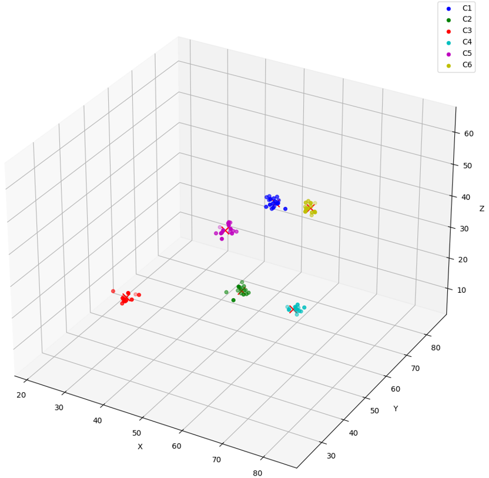

## SQL Quick Start Using a FLOAT32 Vector Generator {#GUID-1AA9AA2B-F3A6-481B-9EE3-8B08A4CE200D}

A PL/SQL program that creates a vector generator is included along with example queries and results, providing a simple way to get started with Oracle AI Vector Search without a vector embedding model.

The generator is a PL/SQL program that allows you to randomly generate vectors with a specified number of dimensions and clusters. Each dimension value is generated using specified minimum and maximum possible values. The output of the generation process is the population of a table called `genvec` that you can then use, for example, to experiment with similarity searches. 

The following instructions assume you already have access to a database account with sufficient privileges (minimally the `DB_DEVELOPER_ROLE` role). 

> **note:** Do not use the vector generator on production databases. The program is made available for testing and demo purposes. 

  1.   

  2. Create the `genvec` table.
```
    DROP TABLE genvec PURGE;
    
    CREATE TABLE genvec (
    id number,           -- id of the generated vector
    v VECTOR,            -- generated vector
    name VARCHAR2(500),  -- name for the generated vector: C1 to Cn are centroids, Cx_y is vector number y in cluster number x
    nv VECTOR,           -- normalized version of the generated vector
    ly number            -- random number you can use to filter out rows in addition to similarity search on vectors
    );
```
    

  3. Create the package `vector_gen_pkg` and its associated package body.

Here you create the vector generator package:
```
    CREATE OR REPLACE PACKAGE vector_gen_pkg AS
    
    TYPE t_vectors IS TABLE OF vector INDEX BY PLS_INTEGER;
    
    FUNCTION get_coordinate(
    input_string CLOB,
    i PLS_INTEGER
    ) RETURN NUMBER;
    
    PROCEDURE generate_vectors(
    num_vectors IN PLS_INTEGER,  -- Number of vectors to generate
    dimensions IN PLS_INTEGER,   -- Number of dimensions of each vector
    num_clusters IN PLS_INTEGER, -- Number of clusters to create
    cluster_spread IN NUMBER,    -- Relative closeness of each vector in each cluster (using standard deviation)
    min_value IN NUMBER,         -- Minimum value for a vector coordinate
    max_value IN NUMBER          -- Maximum value for a vector coordinate
    );
    
    END vector_gen_pkg;
    /
```
    

And the package body:
```
    CREATE OR REPLACE PACKAGE BODY vector_gen_pkg AS
    
    -------------------------------------------
    -------------------------------------------
    ---- V E C T O R    G E N E R A T O R -----
    -------------------------------------------
    -------------------------------------------
    -- Version 1.0                    ---------
    -------------------------------------------
    -------------------------------------------
    ---- DO NOT USE ON PRODUCTION DATABASES ---
    ---- ONLY FOR TESTING AND DEMO PURPOSES ---
    -------------------------------------------
    
    
    FUNCTION **get_coordinate**(
    input_string CLOB,
    i PLS_INTEGER
    ) RETURN NUMBER IS
    start_pos NUMBER;
    end_pos NUMBER;
    comma_pos NUMBER;
    coord VARCHAR2(100);
    comma_count NUMBER := 0;
    commas NUMBER;
    working_string CLOB;
    BEGIN
    -- Remove leading and trailing brackets
    working_string := input_string;
    working_string := TRIM(BOTH '[]' FROM working_string);
    commas := LENGTH(working_string) - LENGTH(REPLACE(working_string, ',', ''));
    
    -- Initialize positions
    start_pos := 1;
    end_pos := INSTR(working_string, ',', start_pos);
    
    IF i<=0 OR i>commas+1 THEN RETURN NULL;
    END IF;
    
    -- Loop through the string to find the i-th coordinate
    LOOP
    IF comma_count + 1 = i THEN
    IF end_pos = 0 THEN
    -- If there's no more comma, the coordinate is the rest of the string
    coord := SUBSTR(working_string, start_pos);
    ELSE
    coord := SUBSTR(working_string, start_pos, end_pos - start_pos);
    END IF;
    RETURN coord;
    END IF;
    
    -- Move to the next coordinate
    comma_count := comma_count + 1;
    start_pos := end_pos + 1;
    end_pos := INSTR(working_string, ',', start_pos);
    
    -- Exit loop if no more coordinates
    EXIT WHEN start_pos > LENGTH(working_string);
    END LOOP;
    
    -- If the function hasn't returned yet, the index was out of bounds
    RETURN NULL;
    
    END;
    
    
    
    PROCEDURE **generate_random_vector**(
    dimensions IN PLS_INTEGER,
    min_value IN NUMBER,
    max_value IN NUMBER,
    vec OUT vector
    ) IS
    e CLOB;
    BEGIN
    e := '[';
    FOR i IN 1..dimensions-1 LOOP
    e := e || DBMS_RANDOM.VALUE(min_value, max_value) ||',';
    END LOOP;
    e := e || DBMS_RANDOM.VALUE(min_value, max_value) ||']';
    vec := VECTOR(e);
    END generate_random_vector;
    
    
    
    PROCEDURE **generate_clustered_vector**(
    centroid IN vector,
    cluster_spread IN NUMBER,
    vec OUT vector
    ) IS
    e CLOB;
    d number;
    BEGIN
    d := VECTOR_DIMENSION_COUNT(centroid);
    e := '[';
    FOR i IN 1 .. d-1 LOOP
    e := e || (get_coordinate(to_clob(centroid),i) + (DBMS_RANDOM.NORMAL * cluster_spread)) ||',';
    END LOOP;
    e := e || (get_coordinate(to_clob(centroid),VECTOR_DIMENSION_COUNT(centroid)) + (DBMS_RANDOM.NORMAL * cluster_spread)) || ']';
    vec := VECTOR(e);
    END generate_clustered_vector;
    
    
    
    FUNCTION **normalize_vector**(vec IN vector) RETURN vector IS
    e CLOB;
    v CLOB;
    n number;
    d number;
    BEGIN
    n := VECTOR_NORM(vec);
    v := to_clob(vec);
    d := VECTOR_DIMENSION_COUNT(vec);
    e := '[';
    FOR i IN 1 .. d-1 LOOP
    e := e || (get_coordinate(v,i)/n) ||',';
    END LOOP;
    e := e || (get_coordinate(v,d)/n) || ']';
    RETURN VECTOR(e);
    END normalize_vector;
    
    
    
    PROCEDURE **generate_vectors**(
    num_vectors IN PLS_INTEGER,  -- Must be 1 or above
    dimensions IN PLS_INTEGER,   -- Must be above 1 but less than 500
    num_clusters IN PLS_INTEGER, -- Must be 1 or above
    cluster_spread IN NUMBER,    -- Must be grather than 0
    min_value IN NUMBER,
    max_value IN NUMBER
    ) IS
    centroids t_vectors;
    vectors_per_cluster PLS_INTEGER;
    remaining_vectors PLS_INTEGER;
    vec vector;
    idx PLS_INTEGER := 1;
    max_id NUMBER;
    working_vector VECTOR;
    
    BEGIN
    IF (num_vectors) <=0 OR (num_clusters < 1) OR (num_vectors < num_clusters) OR (dimensions <= 0) OR (dimensions > 500) OR (cluster_spread <= 0) OR (min_value >= max_value) THEN RETURN;
    END IF;
    
    SELECT MAX(id) INTO max_id FROM genvec;
    IF max_id IS NULL THEN max_id := 0;
    END IF;
    
    -- Generate cluster centroids
    FOR i IN 1..num_clusters LOOP
    
    generate_random_vector(dimensions, min_value, max_value, centroids(i));
    working_vector := normalize_vector(centroids(i));
    INSERT INTO genvec VALUES (max_id + idx, centroids(i), 'C'||i, working_vector, DBMS_RANDOM.VALUE(3,600000000));
    idx := idx + 1;
    
    END LOOP;
    
    -- Calculate vectors per cluster
    vectors_per_cluster := TRUNC(num_vectors / num_clusters);
    remaining_vectors := num_vectors MOD num_clusters;
    
    -- Generate vectors for each cluster
    IF vectors_per_cluster > 1 THEN
    FOR i IN 1..num_clusters LOOP
    FOR j IN 1..(vectors_per_cluster - 1) LOOP
    generate_clustered_vector(centroids(i), cluster_spread, vec);
    working_vector := normalize_vector(vec);
    INSERT INTO genvec VALUES (max_id + idx, vec, 'C'||i||'-'||j, working_vector, DBMS_RANDOM.VALUE(3,600000000));
    idx := idx + 1;
    END LOOP;
    END LOOP;
    END IF;
    
    -- Handle remaining vectors: all associated with cluster 1
    IF remaining_vectors > 0 THEN
    FOR j IN 1..remaining_vectors LOOP
    generate_clustered_vector(centroids(1), cluster_spread, vec);
    working_vector := normalize_vector(vec);
    INSERT INTO genvec VALUES (max_id + idx, vec, 'C1-'||idx, working_vector, DBMS_RANDOM.VALUE(3,600000000));
    idx := idx + 1;
    END LOOP;
    END IF;
    COMMIT;
    END generate_vectors;
    
    END vector_gen_pkg;
    /
```
    

  4. After you have your vector generator set up, you can run this and the following steps to understand how to use it.

Run the `generate_vectors` procedure of the `vector_gen_pkg` package with sample values: 
```
    BEGIN
    vector_gen_pkg.generate_vectors(
    num_vectors => 100,   -- Number of vectors to generate. Must be 1 or above
    dimensions => 3,      -- Number of dimensions of each vector. Must be above 1 but less than 500
    num_clusters => 6,    -- Number of clusters to create. Must be 1 or above
    cluster_spread => 1,  -- Relative closeness of each vector in each cluster (using standard deviation). Must be grather than 0
    min_value => 0,       -- Minimum value for a vector coordinate
    max_value => 100      -- Maximum value for a vector coordinate. Min value must be smaller than max value
    );
    END;
    /
```
    

  5. Run a `SELECT` statement to view the newly generated vectors.
```
    SELECT name, v FROM genvec;
```
    

Example output:
```
    NAME    V
    _______ ____________________________________________________
    C1      [6.35792809E+001,5.28954163E+001,5.16500435E+001]
    C2      [5.67991257E+001,5.00640755E+001,2.3642437E+001]
    C3      [2.42510891E+001,5.36970367E+001,6.88145638E+000]
    C4      [8.13146515E+001,2.88190498E+001,4.09245186E+001]
    C5      [6.70646744E+001,2.53395119E+001,6.14522667E+001]
    C6      [5.60192604E+001,8.31662598E+001,2.93592377E+001]
    C1-1    [6.4469986E+001,5.25044632E+001,5.22250557E+001]
    C1-2    [6.31295433E+001,5.21443062E+001,5.02242126E+001]
    C1-3    [6.25154915E+001,5.25730362E+001,5.2617794E+001]
    C1-4    [6.3491375E+001,5.21440697E+001,5.06722069E+001]
    C1-5    [6.21516266E+001,5.32161064E+001,5.23233032E+001]
    C1-6    [6.2913269E+001,5.16970291E+001,5.16683655E+001]
    C1-7    [6.22267456E+001,5.40408363E+001,5.0272541E+001]
    C1-8    [6.1414093E+001,5.28870888E+001,5.27458E+001]
    
    NAME     V
    ________ ____________________________________________________
    C1-9     [6.29652252E+001,5.32767754E+001,5.27030106E+001]
    C1-10    [6.35940704E+001,5.27265244E+001,5.23180656E+001]
    C1-11    [6.34133224E+001,5.39401283E+001,5.29368248E+001]
    C1-12    [6.18856697E+001,5.31113129E+001,5.18861504E+001]
    C1-13    [6.32378883E+001,5.30308647E+001,5.04571724E+001]
    C1-14    [6.18148689E+001,5.33705482E+001,5.29123802E+001]
    C1-15    [6.43224258E+001,5.23124084E+001,5.21299057E+001]
    C2-1     [5.59053535E+001,5.20054626E+001,2.28595486E+001]
    C2-2     [5.71644516E+001,5.13243408E+001,2.31167526E+001]
    C2-3     [5.66626244E+001,5.00615959E+001,2.27138176E+001]
    C2-4     [5.73383865E+001,5.04509125E+001,2.36539135E+001]
    C2-5     [5.6621357E+001,5.01576767E+001,2.38867531E+001]
    C2-6     [5.59768562E+001,5.17590942E+001,2.49088764E+001]
    C2-7     [5.64437904E+001,4.71531525E+001,2.23245487E+001]
    
    NAME     V
    ________ ____________________________________________________
    C2-8     [5.81449051E+001,5.09049644E+001,2.29072056E+001]
    C2-9     [5.37190132E+001,4.87386665E+001,2.28188381E+001]
    C2-10    [5.77416382E+001,4.93461685E+001,2.32014389E+001]
    C2-11    [5.68353958E+001,5.11093979E+001,2.43693123E+001]
    C2-12    [5.79631157E+001,5.0297657E+001,2.28039799E+001]
    C2-13    [5.57930183E+001,5.11965866E+001,2.35887661E+001]
    C2-14    [5.57345848E+001,5.03228951E+001,2.30780907E+001]
    C2-15    [5.69435997E+001,4.8590435E+001,2.58747597E+001]
    C3-1     [2.40239315E+001,5.2352993E+001,5.63517284E+000]
    C3-2     [2.39717846E+001,5.30635986E+001,5.86633539E+000]
    C3-3     [2.70314407E+001,5.48788643E+001,7.96345377E+000]
    C3-4     [2.39875908E+001,5.39634552E+001,5.87654877E+000]
    C3-5     [2.47772026E+001,5.2187336E+001,6.83652115E+000]
    C3-6     [2.32920208E+001,5.41494293E+001,6.40737772E+000]
    
    NAME     V
    ________ ____________________________________________________
    C3-7     [2.46129742E+001,5.32308769E+001,6.29999685E+000]
    C3-8     [2.51000671E+001,5.33271561E+001,8.86797047E+000]
    C3-9     [2.4337059E+001,5.26281281E+001,6.9616766E+000]
    C3-10    [2.39770508E+001,5.42386856E+001,5.63018417E+000]
    C3-11    [2.59837551E+001,5.34013176E+001,6.97773361E+000]
    C3-12    [2.40400314E+001,5.25649719E+001,7.2636981E+000]
    C3-13    [2.13184013E+001,5.28633308E+001,8.3834734E+000]
    C3-14    [2.50075855E+001,5.21548729E+001,6.88196087E+000]
    C3-15    [2.53695087E+001,5.60495186E+001,6.76059389E+000]
    C4-1     [8.28819885E+001,2.95163822E+001,4.03809738E+001]
    C4-2     [8.18269348E+001,2.95735188E+001,3.99435768E+001]
    C4-3     [8.2709259E+001,2.90755043E+001,4.07345886E+001]
    C4-4     [8.18622665E+001,2.88013916E+001,4.1822567E+001]
    C4-5     [7.99165421E+001,2.89941139E+001,4.09653854E+001]
    
    NAME     V
    ________ ____________________________________________________
    C4-6     [8.12936707E+001,2.98655643E+001,4.00380211E+001]
    C4-7     [8.21705704E+001,2.90163479E+001,3.94858704E+001]
    C4-8     [8.20081329E+001,2.89751148E+001,4.1045887E+001]
    C4-9     [8.25486298E+001,2.84143009E+001,4.15654945E+001]
    C4-10    [8.22034149E+001,2.92223415E+001,4.20033302E+001]
    C4-11    [8.2048996E+001,2.98751106E+001,4.09612732E+001]
    C4-12    [8.09316025E+001,2.7799057E+001,4.12611198E+001]
    C4-13    [8.04624023E+001,2.88711109E+001,4.07331085E+001]
    C4-14    [8.13773575E+001,2.97510109E+001,4.09169846E+001]
    C4-15    [8.35310364E+001,2.971031E+001,4.16878052E+001]
    C5-1     [6.87114258E+001,2.53504581E+001,6.11055298E+001]
    C5-2     [6.73569031E+001,2.35163498E+001,6.01617432E+001]
    C5-3     [6.78224869E+001,2.61236534E+001,6.0729248E+001]
    C5-4     [6.76432266E+001,2.56426888E+001,6.35400085E+001]
    
    NAME     V
    ________ ____________________________________________________
    C5-5     [6.75377045E+001,2.60873699E+001,6.35584145E+001]
    C5-6     [6.84944687E+001,2.51576214E+001,6.24934502E+001]
    C5-7     [6.79246216E+001,2.53722992E+001,6.32098122E+001]
    C5-8     [6.84075165E+001,2.63778133E+001,6.10950584E+001]
    C5-9     [6.73214798E+001,2.70551453E+001,6.27835197E+001]
    C5-10    [6.50006485E+001,2.67408028E+001,6.07828026E+001]
    C5-11    [6.68869705E+001,2.3982399E+001,6.13440819E+001]
    C5-12    [6.55524521E+001,2.42231808E+001,6.07235756E+001]
    C5-13    [6.72140808E+001,2.42842178E+001,6.21546478E+001]
    C5-14    [6.89587936E+001,2.67715569E+001,6.08621559E+001]
    C5-15    [6.68405685E+001,2.44039059E+001,6.12652893E+001]
    C6-1     [5.4925251E+001,8.28179474E+001,3.0869236E+001]
    C6-2     [5.52922363E+001,8.23375549E+001,2.94804363E+001]
    C6-3     [5.60466652E+001,8.18454132E+001,2.99774895E+001]
    
    NAME     V
    ________ ____________________________________________________
    C6-4     [5.74460373E+001,8.26830368E+001,2.86887722E+001]
    C6-5     [5.57439041E+001,8.14622726E+001,2.94924259E+001]
    C6-6     [5.4913372E+001,8.48766251E+001,2.92711105E+001]
    C6-7     [5.66876144E+001,8.25907898E+001,2.84199276E+001]
    C6-8     [5.6253479E+001,8.3280838E+001,2.69524212E+001]
    C6-9     [5.50792351E+001,8.37676392E+001,3.08755417E+001]
    C6-10    [5.57719955E+001,8.11036758E+001,2.92569256E+001]
    C6-11    [5.60834808E+001,8.3103096E+001,3.09748001E+001]
    C6-12    [5.58962059E+001,8.3612648E+001,2.95026093E+001]
    C6-13    [5.73348083E+001,8.26950226E+001,2.88242455E+001]
    C6-14    [5.45099411E+001,8.33315659E+001,2.90559101E+001]
    C6-15    [5.57930641E+001,8.5720871E+001,2.92863998E+001]
    C1-97    [6.3716671E+001,5.41518326E+001,5.18371048E+001]
    C1-98    [6.58774261E+001,5.32223206E+001,5.05089798E+001]
    
    NAME      V
    _________ ____________________________________________________
    C1-99     [6.31867676E+001,5.25712204E+001,5.16621819E+001]
    C1-100    [6.20503845E+001,5.15550919E+001,5.08155479E+001]
    
    100 rows selected.
```
    

To visualize the resulting vectors in space, consider the following graph:

Figure 3-1 Vector Clusters

  


  
[Description of "Figure 3-1 Vector Clusters"](img_text/vector_clusters.md)

  


  6. Run a similarity search on the generated vectors in the `genvec` table.

First define a variable called `cluster_number` to be used to form the name of the vector in the query. 
```
    DEFINE cluster_number = '&clusterid'
```
    

You will be prompted to enter a value for `clusterid`. In this example, we use `5`: 
```
    Enter value for clusterid: 5
```
    

Run the following query to perform a similarity search on the generated vectors:
```
    SELECT name
    FROM genvec
    ORDER BY VECTOR_DISTANCE(v,(SELECT v FROM genvec WHERE name='C'||'&cluster_number'),EUCLIDEAN)
    FETCH EXACT FIRST 20 ROWS ONLY;
```
    

Example output:
```
    NAME
    ________
    C5
    C5-15
    C5-13
    C5-3
    C5-11
    C5-1
    C5-8
    C5-6
    C5-7
    C5-12
    C5-9
    C5-4
    C5-2
    C5-5
    
    NAME
    ________
    C5-14
    C5-10
    C4-5
    C4-12
    C4-4
    C4-13
    
    20 rows selected.
```
    

  7. Here is another example of running a similarity search on the generated vectors, this time using the Cosine distance metric.
```
    SELECT name
    FROM genvec
    ORDER BY VECTOR_DISTANCE(v,(SELECT v FROM genvec WHERE name='C'||'&cluster_number'),COSINE)
    FETCH EXACT FIRST 20 ROWS ONLY;
```
    

Example output:
```
    NAME
    ________
    C5
    C5-6
    C5-12
    C5-15
    C5-7
    C5-4
    C5-5
    C5-13
    C5-11
    C5-3
    C5-1
    C5-8
    C5-9
    C5-2
    
    NAME
    ________
    C5-14
    C5-10
    C4-5
    C4-4
    C4-10
    C4-12
    
    20 rows selected.
```
    

  8. Create a variable called `query_vector` and then use `SELECT INTO` to store a vector value in the variable.
```
    VARIABLE query_vector CLOB
    
    BEGIN
    SELECT v INTO :query_vector
    FROM genvec
    WHERE name='C'||'&cluster_number';
    END;
    /
    
    PRINT query_vector;
```
    

Example output:
```
    QUERY_VECTOR
    --------------------------------------------------------------------
    [6.70646744E+001,2.53395119E+001,6.14522667E+001]
```
    

  9. Create an explain plan for a similarity search using the query vector created in the previous step.
```
    EXPLAIN PLAN FOR
    SELECT name
    FROM genvec
    ORDER BY VECTOR_DISTANCE(v, :query_vector, EUCLIDEAN)
    FETCH EXACT FIRST 20 ROWS ONLY;
    
    SELECT plan_table_output
    FROM table(dbms_xplan.display('plan_table',null,'all'));
```
    

Example output:
```
    PLAN_TABLE_OUTPUT
    _____________________________________________________________________________________
    Plan hash value: 1549136425
    
    ----------------------------------------------------------------------------------
    | Id  | Operation               | Name   | Rows  | Bytes | Cost (%CPU)| Time     |
    ----------------------------------------------------------------------------------
    |   0 | SELECT STATEMENT        |        |    20 |  5040 |     4  (25)| 00:00:01 |
    |*  1 |  COUNT STOPKEY          |        |       |       |            |          |
    |   2 |   VIEW                  |        |   100 | 25200 |     4  (25)| 00:00:01 |
    |*  3 |    SORT ORDER BY STOPKEY|        |   100 | 25800 |     4  (25)| 00:00:01 |
    |   4 |     TABLE ACCESS FULL   | GENVEC |   100 | 25800 |     3   (0)| 00:00:01 |
    ----------------------------------------------------------------------------------
    
    Query Block Name / Object Alias (identified by operation id):
    -------------------------------------------------------------
    
    PLAN_TABLE_OUTPUT
    ______________________________________________________________
    
    1 - SEL$2
    2 - SEL$1 / "from$_subquery$_002"@"SEL$2"
    3 - SEL$1
    4 - SEL$1 / "GENVEC"@"SEL$1"
    
    Predicate Information (identified by operation id):
    ---------------------------------------------------
    
    1 - filter(ROWNUM<=20)
    3 - filter(ROWNUM<=20)
    
    Column Projection Information (identified by operation id):
    -----------------------------------------------------------
    
    PLAN_TABLE_OUTPUT
    __________________________________________________________________________
    
    1 - "from$_subquery$_002"."NAME"[VARCHAR2,500]
    2 - "from$_subquery$_002"."NAME"[VARCHAR2,500]
    3 - (#keys=1) VECTOR_DISTANCE("V" /*+ LOB_BY_VALUE */ ,
    VECTOR(:QUERY_VECTOR, *, * /*+  USEBLOBPCW_QVCGMD */ ),
    EUCLIDEAN)[BINARY_DOUBLE,8], "NAME"[VARCHAR2,500]
    4 - "NAME"[VARCHAR2,500], VECTOR_DISTANCE("V" /*+ LOB_BY_VALUE */ ,
    VECTOR(:QUERY_VECTOR, *, * /*+  USEBLOBPCW_QVCGMD */ ),
    EUCLIDEAN)[BINARY_DOUBLE,8]
    
    Note
    -----
    - dynamic statistics used: dynamic sampling (level=2)
    
    41 rows selected.
```
    

  10. Create an Hierarchical Navigable Small World (HNSW) index.
```
    CREATE VECTOR INDEX genvec_hnsw_idx ON genvec(v)
    ORGANIZATION INMEMORY NEIGHBOR GRAPH
    DISTANCE EUCLIDEAN
    WITH TARGET ACCURACY 95;
    
    SELECT INDEX_NAME, INDEX_TYPE, INDEX_SUBTYPE FROM USER_INDEXES;
```
    

Example output:
```
    INDEX_NAME                  INDEX_TYPE    INDEX_SUBTYPE
    ___________________________ _____________ _______________________________
    DM$CEDOC_MODEL              NORMAL
    SYS_IL0000073592C00002$$    LOB
    GENVEC_HNSW_IDX             VECTOR        INMEMORY_NEIGHBOR_GRAPH_HNSW
    SYS_C008694                 NORMAL
    
    4 rows selected.
```
    

  11. Query information about the HNSW index from the `VECSYS.VECTOR$INDEX` view.
```
    SELECT JSON_SERIALIZE(IDX_PARAMS RETURNING VARCHAR2 PRETTY)
    FROM VECSYS.VECTOR$INDEX
    WHERE IDX_NAME = 'GENVEC_HNSW_IDX';
```
    

Example output:
```
    JSON_SERIALIZE(IDX_PARAMSRETURNINGVARCHAR2PRETTY)
    ______________________________________________________________________________________________________________________________________________________________________________________________________________________________________________________
    {
    "type" : "HNSW",
    "num_neighbors" : 32,
    "efConstruction" : 300,
    "distance" : "EUCLIDEAN",
    "accuracy" : 95,
    "vector_type" : "FLOAT32",
    "vector_dimension" : 3,
    "degree_of_parallelism" : 1,
    "pdb_id" : 3,
    "indexed_col" : "V"
    }
```
    

For information about the columns of the `VECSYS.VECTOR$INDEX` view, see [VECSYS.VECTOR$INDEX](vecsys-vectorindex.md#GUID-FA5183EA-3C60-470D-9C91-8215BE4FF138). 

  12. With the HNSW index created, create another explain plan for a similarity search on the `genvec` table.
```
    EXPLAIN PLAN FOR
    SELECT name
    FROM genvec
    ORDER BY VECTOR_DISTANCE(v, :query_vector, EUCLIDEAN)
    FETCH APPROX FIRST 20 rows only;
    
    SELECT plan_table_output
    FROM table(dbms_xplan.display('plan_table',null,'all'));
```
    

Example output:
```
    PLAN_TABLE_OUTPUT
    _____________________________________________________________________________________________________________
    Plan hash value: 1202819565
    
    ----------------------------------------------------------------------------------------------------------
    | Id  | Operation                      | Name            | Rows  | Bytes |TempSpc| Cost (%CPU)| Time     |
    ----------------------------------------------------------------------------------------------------------
    |   0 | SELECT STATEMENT               |                 |    20 |  5040 |       |   165   (2)| 00:00:01 |
    |*  1 |  COUNT STOPKEY                 |                 |       |       |       |            |          |
    |   2 |   VIEW                         |                 |   100 | 25200 |       |   165   (2)| 00:00:01 |
    |*  3 |    SORT ORDER BY STOPKEY       |                 |   100 |   425K|   808K|   165   (2)| 00:00:01 |
    |   4 |     TABLE ACCESS BY INDEX ROWID| GENVEC          |   100 |   425K|       |     1   (0)| 00:00:01 |
    |   5 |      **VECTOR INDEX HNSW SCAN**    | GENVEC_HNSW_IDX |   100 |   425K|       |     1   (0)| 00:00:01 |
    ----------------------------------------------------------------------------------------------------------
    
    Query Block Name / Object Alias (identified by operation id):
    
    PLAN_TABLE_OUTPUT
    ________________________________________________________________
    -------------------------------------------------------------
    
    1 - SEL$2
    2 - SEL$1 / "from$_subquery$_002"@"SEL$2"
    3 - SEL$1
    4 - SEL$1 / "GENVEC"@"SEL$1"
    5 - SEL$1 / "GENVEC"@"SEL$1"
    
    Predicate Information (identified by operation id):
    ---------------------------------------------------
    
    1 - filter(ROWNUM<=20)
    3 - filter(ROWNUM<=20)
    
    
    PLAN_TABLE_OUTPUT
    _____________________________________________________________________________________________________
    Column Projection Information (identified by operation id):
    -----------------------------------------------------------
    
    1 - "from$_subquery$_002"."NAME"[VARCHAR2,500]
    2 - "from$_subquery$_002"."NAME"[VARCHAR2,500]
    3 - (#keys=1) VECTOR_DISTANCE("V" /*+ LOB_BY_VALUE */ , VECTOR(:QUERY_VECTOR, *, * /*+
    USEBLOBPCW_QVCGMD */ ), EUCLIDEAN)[8], "NAME"[VARCHAR2,500]
    4 - "NAME"[VARCHAR2,500], VECTOR_DISTANCE("V" /*+ LOB_BY_VALUE */ , VECTOR(:QUERY_VECTOR, *, *
    /*+  USEBLOBPCW_QVCGMD */ ), EUCLIDEAN)[8]
    5 - "GENVEC".ROWID[ROWID,10], VECTOR_DISTANCE("V" /*+ LOB_BY_VALUE */ , VECTOR(:QUERY_VECTOR,
    *, * /*+  USEBLOBPCW_QVCGMD */ ), EUCLIDEAN)[8]
    
    Note
    -----
    
    PLAN_TABLE_OUTPUT
    ___________________________________________________________
    - dynamic statistics used: dynamic sampling (level=2)
    
    43 rows selected.
```
    

As you can see, the explain plan now includes information about the HNSW index.

  13. Again perform a similarity search on the vectors in the `genvec` table. Note that it is possible for query results to vary based on the indexing technique used. The results included in this scenario are simply an example.
```
    SELECT name
    FROM genvec
    ORDER BY vector_distance(v, :query_vector, EUCLIDEAN)
    FETCH APPROX FIRST 20 ROWS ONLY;
```
    

Example output:
```
    NAME
    ________
    C5
    C5-15
    C5-13
    C5-3
    C5-11
    C5-1
    C5-8
    C5-6
    C5-7
    C5-12
    C5-9
    C5-4
    C5-2
    C5-5
    
    NAME
    ________
    C5-14
    C5-10
    C4-5
    C4-12
    C4-4
    C4-13
    
    20 rows selected.
```
    

  14. Drop the HNSW index and create an Inverted File Flat (IVF) vector index.
```
    DROP INDEX genvec_hnsw_idx;
    
    CREATE VECTOR INDEX genvec_ivf_idx ON genvec(v)
    ORGANIZATION NEIGHBOR PARTITIONS
    DISTANCE EUCLIDEAN
    WITH TARGET ACCURACY 95;
    
    SELECT JSON_SERIALIZE(IDX_PARAMS RETURNING VARCHAR2 PRETTY)
    FROM VECSYS.VECTOR$INDEX WHERE IDX_NAME = 'GENVEC_IVF_IDX';
```
    

Example output:
```
    JSON_SERIALIZE(IDX_PARAMSRETURNINGVARCHAR2PRETTY)
    ________________________________________________________________________________________________________________________________________________________________________________________________________________________________________________________________________________________________________________________________
    {
    "target_centroids" : 40,
    "pdb_id" : 3,
    "vector_type" : "FLOAT32",
    "type" : "IVF_FLAT",
    "vector_dimension" : 3,
    "distance" : "EUCLIDEAN",
    "indexed_col" : "V",
    "min_vectors_per_partition" : 10,
    "degree_of_parallelism" : 1,
    "accuracy" : 95,
    "num_centroids" : 24,
    "samples_per_partition" : 256
    }
```
    

  15. Again create an explain plan, which now includes information about the newly created IVF index.
```
    EXPLAIN PLAN FOR
    SELECT name
    FROM genvec
    ORDER BY VECTOR_DISTANCE(v, :query_vector, EUCLIDEAN)
    FETCH APPROX FIRST 20 ROWS ONLY;
    
    SELECT plan_table_output
    FROM table(dbms_xplan.display('plan_table',null,'all'));
```
    

Example output:
```
    PLAN_TABLE_OUTPUT
    __________________________________________________________________________________________________________________________________________________________________________
    Plan hash value: 2965029064
    
    -----------------------------------------------------------------------------------------------------------------------------------------------------------------------
    | Id  | Operation                          | Name                                                             | Rows  | Bytes | Cost (%CPU)| Time     | Pstart| Pstop |
    -----------------------------------------------------------------------------------------------------------------------------------------------------------------------
    |   0 | SELECT STATEMENT                   |                                                                  |     5 |  1260 |    29  (14)| 00:00:01 |       |       |
    |   1 |  VIEW                              |                                                                  |     5 |  1260 |    29  (14)| 00:00:01 |       |       |
    |   2 |   SORT ORDER BY                    |                                                                  |     5 | 21910 |    29  (14)| 00:00:01 |       |       |
    |*  3 |    HASH JOIN                       |                                                                  |     5 | 21910 |    28  (11)| 00:00:01 |       |       |
    |   4 |     VIEW                           | VW_IVPSR_11E7D7DE                                                |    20 |   320 |    24   (9)| 00:00:01 |       |       |
    |*  5 |      COUNT STOPKEY                 |                                                                  |       |       |            |          |       |       |
    |   6 |       VIEW                         | VW_IVPSJ_578B79F1                                                |    25 |   450 |    24   (9)| 00:00:01 |       |       |
    |*  7 |        SORT ORDER BY STOPKEY       |                                                                  |    25 |   550 |    24   (9)| 00:00:01 |       |       |
    |*  8 |         HASH JOIN                  |                                                                  |    25 |   550 |    23   (5)| 00:00:01 |       |       |
    
    PLAN_TABLE_OUTPUT
    __________________________________________________________________________________________________________________________________________________________________________
    |   9 |          PART JOIN FILTER CREATE   | :BF0000                                                          |     6 |    18 |     4  (25)| 00:00:01 |       |       |
    |  10 |           VIEW                     | VW_IVCR_B5B87E67                                                 |     6 |    18 |     4  (25)| 00:00:01 |       |       |
    |* 11 |            COUNT STOPKEY           |                                                                  |       |       |            |          |       |       |
    |  12 |             VIEW                   | VW_IVCN_9A1D2119                                                 |    24 |   312 |     4  (25)| 00:00:01 |       |       |
    |* 13 |              SORT ORDER BY STOPKEY |                                                                  |    24 |   216 |     4  (25)| 00:00:01 |       |       |
    |  14 |               TABLE ACCESS FULL    | VECTOR$GENVEC_IVF_IDX$87355_87370_0$IVF_FLAT_CENTROIDS           |    24 |   216 |     3   (0)| 00:00:01 |       |       |
    |  15 |          PARTITION LIST JOIN-FILTER|                                                                  |   100 |  1900 |     3   (0)| 00:00:01 |:BF0000|:BF0000|
    |  16 |           TABLE ACCESS FULL        | VECTOR$GENVEC_IVF_IDX$87355_87370_0$IVF_FLAT_CENTROID_PARTITIONS |   100 |  1900 |     3   (0)| 00:00:01 |:BF0000|:BF0000|
    |  17 |     TABLE ACCESS FULL              | GENVEC                                                           |   100 |   426K|     3   (0)| 00:00:01 |       |       |
    -----------------------------------------------------------------------------------------------------------------------------------------------------------------------
    
    Query Block Name / Object Alias (identified by operation id):
    -------------------------------------------------------------
    
    
    PLAN_TABLE_OUTPUT
    ___________________________________________________________
    1 - SEL$94C0F189 / "from$_subquery$_002"@"SEL$2"
    2 - SEL$94C0F189
    4 - SEL$E731354C / "VW_IVPSR_11E7D7DE"@"SEL$1"
    5 - SEL$E731354C
    6 - SEL$0C00A749 / "VW_IVPSJ_578B79F1"@"SEL$E731354C"
    7 - SEL$0C00A749
    10 - SEL$700CE8F1 / "VW_IVCR_B5B87E67"@"SEL$0C00A749"
    11 - SEL$700CE8F1
    12 - SEL$E5326247 / "VW_IVCN_9A1D2119"@"SEL$700CE8F1"
    13 - SEL$E5326247
    14 - SEL$E5326247 / "VTIX_CENTRD"@"SEL$E5326247"
    16 - SEL$0C00A749 / "VTIX_CNPART"@"SEL$0C00A749"
    17 - SEL$94C0F189 / "GENVEC"@"SEL$1"
    
    
    PLAN_TABLE_OUTPUT
    ______________________________________________________________________________
    Predicate Information (identified by operation id):
    ---------------------------------------------------
    
    3 - access("GENVEC".ROWID="VW_IVPSR_11E7D7DE"."BASE_TABLE_ROWID")
    5 - filter(ROWNUM<=20)
    7 - filter(ROWNUM<=20)
    8 - access("VW_IVCR_B5B87E67"."CENTROID_ID"="VTIX_CNPART"."CENTROID_ID")
    11 - filter(ROWNUM<=6)
    13 - filter(ROWNUM<=6)
    
    Column Projection Information (identified by operation id):
    -----------------------------------------------------------
    
    1 - "from$_subquery$_002"."NAME"[VARCHAR2,500]
    
    PLAN_TABLE_OUTPUT
    __________________________________________________________________________________________________________________________________________________________________
    2 - (#keys=1) "VEC_DIST"[BINARY_DOUBLE,8], "GENVEC"."NAME"[VARCHAR2,500]
    3 - (#keys=1) "GENVEC"."NAME"[VARCHAR2,500], "VEC_DIST"[BINARY_DOUBLE,8], "GENVEC"."NAME"[VARCHAR2,500]
    4 - "BASE_TABLE_ROWID"[ROWID,10], "VEC_DIST"[BINARY_DOUBLE,8]
    5 - "VW_IVPSJ_578B79F1"."BASE_TABLE_ROWID"[ROWID,10], "VW_IVPSJ_578B79F1"."VEC_DIST"[BINARY_DOUBLE,8]
    6 - "VW_IVPSJ_578B79F1"."BASE_TABLE_ROWID"[ROWID,10], "VW_IVPSJ_578B79F1"."VEC_DIST"[BINARY_DOUBLE,8]
    7 - (#keys=1) VECTOR_DISTANCE("VTIX_CNPART"."DATA_VECTOR" /*+ LOB_BY_VALUE */ , VECTOR(:QUERY_VECTOR, *, * /*+  USEBLOBPCW_QVCGMD */ ),
    EUCLIDEAN)[BINARY_DOUBLE,8], "VTIX_CNPART"."BASE_TABLE_ROWID"[ROWID,10]
    8 - (#keys=1) "VTIX_CNPART"."BASE_TABLE_ROWID"[ROWID,10], VECTOR_DISTANCE("VTIX_CNPART"."DATA_VECTOR" /*+ LOB_BY_VALUE */ , VECTOR(:QUERY_VECTOR, *, * /*+
    USEBLOBPCW_QVCGMD */ ), EUCLIDEAN)[BINARY_DOUBLE,8]
    9 - "VW_IVCR_B5B87E67"."CENTROID_ID"[NUMBER,22], "VW_IVCR_B5B87E67"."CENTROID_ID"[NUMBER,22]
    10 - "CENTROID_ID"[NUMBER,22]
    11 - "VW_IVCN_9A1D2119"."CENTROID_ID"[NUMBER,22]
    12 - "VW_IVCN_9A1D2119"."CENTROID_ID"[NUMBER,22]
    13 - (#keys=1) VECTOR_DISTANCE("VECTOR$GENVEC_IVF_IDX$87355_87370_0$IVF_FLAT_CENTROIDS"."CENTROID_VECTOR" /*+ LOB_BY_VALUE */ , VECTOR(:QUERY_VECTOR, *, *
    
    PLAN_TABLE_OUTPUT
    _________________________________________________________________________________________________________________________________________________________________
    /*+  USEBLOBPCW_QVCGMD */ ), EUCLIDEAN)[BINARY_DOUBLE,8], "VTIX_CENTRD"."CENTROID_ID"[NUMBER,22]
    14 - "VTIX_CENTRD"."CENTROID_ID"[NUMBER,22], VECTOR_DISTANCE("VECTOR$GENVEC_IVF_IDX$87355_87370_0$IVF_FLAT_CENTROIDS"."CENTROID_VECTOR" /*+ LOB_BY_VALUE */
    , VECTOR(:QUERY_VECTOR, *, * /*+  USEBLOBPCW_QVCGMD */ ), EUCLIDEAN)[BINARY_DOUBLE,8]
    15 - "VTIX_CNPART"."BASE_TABLE_ROWID"[ROWID,10], "VTIX_CNPART"."CENTROID_ID"[NUMBER,22], VECTOR_DISTANCE("VTIX_CNPART"."DATA_VECTOR" /*+ LOB_BY_VALUE */ ,
    VECTOR(:QUERY_VECTOR, *, * /*+  USEBLOBPCW_QVCGMD */ ), EUCLIDEAN)[BINARY_DOUBLE,8]
    16 - "VTIX_CNPART"."BASE_TABLE_ROWID"[ROWID,10], "VTIX_CNPART"."CENTROID_ID"[NUMBER,22], VECTOR_DISTANCE("VTIX_CNPART"."DATA_VECTOR" /*+ LOB_BY_VALUE */ ,
    VECTOR(:QUERY_VECTOR, *, * /*+  USEBLOBPCW_QVCGMD */ ), EUCLIDEAN)[BINARY_DOUBLE,8]
    17 - "GENVEC".ROWID[ROWID,10], "GENVEC"."NAME"[VARCHAR2,500]
    
    Note
    -----
    - dynamic statistics used: dynamic sampling (level=2)
    - this is an adaptive plan
    
    83 rows selected.
```
    

  16. Finally, run the similarity search once again.
```
    SELECT name
    FROM genvec
    ORDER BY VECTOR_DISTANCE(v, :query_vector, EUCLIDEAN)
    FETCH APPROX FIRST 20 ROWS ONLY;
```
    

Example output:
```
    NAME
    ________
    C5
    C5-15
    C5-13
    C5-3
    C5-11
    C5-1
    C5-8
    C5-6
    C5-7
    C5-12
    C5-9
    C5-4
    C5-2
    C5-5
    
    NAME
    ________
    C5-14
    C5-10
    C4-5
    C4-12
    C4-4
    C4-13
    
    20 rows selected.
```
    


**Parent topic:** [Get Started](get-started-node.md)
