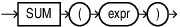
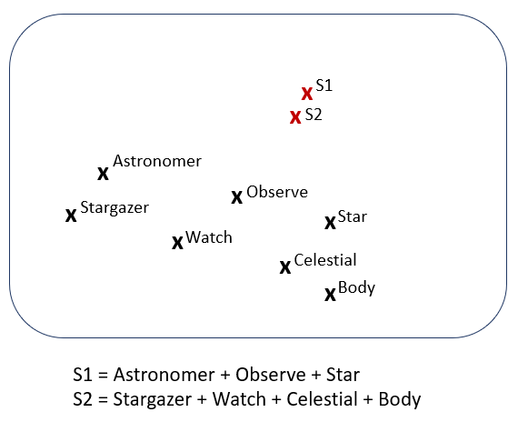

## SUM {#GUID-25B4B3AE-E5E3-451C-8EDF-269C39B0BC91}

The `SUM` function takes a vector expression as input and returns the sum as a vector with format `FLOAT64`. 

Syntax

  


  


  


Purpose

`SUM` is mainly used, in Natural Language Processing (NLP), to compute a representation of a sentence or a document. It is common to sum the word embeddings of all words. The resulting vector represents the entire text, allowing models to work with sentences instead of just words. 

The following diagram illustrates the vector representation, in a 2D space, of word embeddings. If you take S1, "The astronomer observed the stars", and S2, "The stargazer watched the celestial bodies", you can observe that the corresponding vector sum of each constituting word of each sentence (S1 and S2 in the diagram) are very close, for example, in terms of cosine similarity. This means that the two sentences are very similar in meaning.

  


  


  


The result of `SUM` with a vector expression is the equivalent of consecutively performing vector addition operations on all non-`NULL` inputs. The returned vector has the same number of dimensions as the input and has the format `FLOAT64`. When the expression has a flexible number of dimensions, all inputs must have the same number of dimensions within each aggregate group. 

The `SUM` function with vector expressions as input can be used as a single set aggregate or in the `GROUP BY` clause. Using `ROLLUP` is also supported. The `SUM` function accepts vector expressions as input for aggregate operations but cannot currently be applied to analytic operations. 

`NULL` vectors are ignored and are not counted when calculating the sum vector. If all inputs within an aggregate group are `NULL`, the result is `NULL` for that group. If the result overflows the `FLOAT64` maximum value, an error is raised, regardless of the format of the input vector type. 

With vector inputs, using `DISTINCT`, `CUBE`, and `GROUPING SETS` is not supported. Also, `BINARY` and `SPARSE` vectors cannot be supplied as input. 

For the full definition and implementation of the `SUM` function, see [*Oracle Database SQL Language Reference*](https://docs.oracle.com/pls/topic/lookup?ctx=en/database/oracle/oracle-database/23/vecse&id=SQLRF-GUID-5610BE2C-CFE5-446F-A1F7-B924B5663220). 
```
    CREATE TABLE sum_t (v VECTOR, k1 NUMBER, k2 VARCHAR2(100));
    INSERT INTO sum_t VALUES ('[2, 4, 6]', 2, 'even');
    INSERT INTO sum_t VALUES ('[8, 10, 12]', 2, 'even');
    INSERT INTO sum_t VALUES ('[1, 3, 5]', 3, 'odd');
    INSERT INTO sum_t VALUES ('[7, 9, 11]', 3, 'odd');
    
    
    SELECT SUM(v) v_sum FROM sum_t;
    
    V_SUM
    ---------------------------------------------------
    [1.8E+001,2.6E+001,3.4E+001]
    
    
    SELECT SUM(v) v_sum, k1 FROM sum_t GROUP BY k1;
    
    V_SUM                                    K1
    ---------------------------------------  ----------
    [1.0E+001,1.4E+001,1.8E+001]             2
    [8.0E+000,1.2E+001,1.6E+001]             3
    
    
    SELECT SUM(v) v_sum FROM sum_t GROUP BY ROLLUP(k1, k2);
    
    V_SUM
    ---------------------------------------------------
    [1.0E+001,1.4E+001,1.8E+001]
    [1.0E+001,1.4E+001,1.8E+001]
    [8.0E+000,1.2E+001,1.6E+001]
    [8.0E+000,1.2E+001,1.6E+001]
    [1.8E+001,2.6E+001,3.4E+001]
```
```
    CREATE TABLE sum_diff_dim_t (v VECTOR, k1 NUMBER, k2 VARCHAR2(100));
    INSERT INTO sum_diff_dim_t VALUES ('[2, 4, 6]', 2, 'even');
    INSERT INTO sum_diff_dim_t VALUES ('[8, 10, 12]', 2, 'even');
    INSERT INTO sum_diff_dim_t VALUES ('[1, 3, 5, 7]', 3, 'odd');
    INSERT INTO sum_diff_dim_t VALUES ('[9, 11, 13, 15]', 3, 'odd');
    
    
    SELECT SUM(v) v_sum, k2 FROM sum_diff_dim_t GROUP BY k2;
    
    V_SUM                                    K2
    ---------------------------------------  ----------
    [1.0E+001,1.4E+001,1.8E+001]             even
    [1.0E+001,1.4E+001,1.8E+001,2.2E+001]    odd
    
    
    SELECT SUM(v) v_sum FROM sum_diff_dim_t;
    
    ERROR:
    ORA-51808: SUM(vector) requires all vectors to have the same dimension count.
    Encountered (3, 4).
```
    

**Parent topic:** [Aggregate Functions](aggregate-functions.md)
