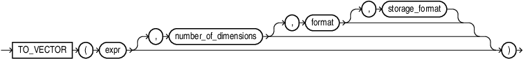

## TO_VECTOR {#GUID-674F2B03-90D7-4686-B026-1A96C0F0DC37}

`TO_VECTOR` is a constructor that takes a string of type `VARCHAR2`, `CLOB`, `BLOB`, or `JSON` as input, converts it to a vector, and returns a vector as output. `TO_VECTOR` also takes another vector as input, adjusts its format, and returns the adjusted vector as output. `TO_VECTOR` is synonymous with `VECTOR`. 

Syntax

  


  


  


Parameters

  * *expr* must evaluate to one of: 

    * A string (of character types or `CLOB`) that represents a vector. 
    * A `VECTOR`. 
    * A `BLOB`. The `BLOB` must represent the vector's binary bytes. 
    * A JSON array. All elements in the array must be numeric.

If *expr* is NULL, the result is NULL. 

The string representation of the vector must be in the form of an array of non-null numbers enclosed with a bracket and separated by commas, such as `[1, 3.4, -05.60, 3e+4]`. `TO_VECTOR` converts a valid string representation of a vector to a vector in the format specified. If no format is specified the default format is used. 

  * *number_of_dimensions* must be a numeric value that describes the number of dimensions of the vector to construct. The number of dimensions may also be specified as an asterisk (*), in which case the dimension is determined by *expr*. 

  * *format* must be one of the following tokens: `INT8`, `FLOAT32`, `FLOAT64`, `BINARY`, or *`. This is the target internal storage format of the vector. If `*  is used, the format will be `FLOAT32`. 

Note that this behavior is different from declaring a vector column. When you declare a column of type `VECTOR(3, *)`, then all inserted vectors will be stored as is without a change in format. 

  * *storage_format* must be one of the following tokens: `DENSE`, `SPARSE`, or *`. If no storage format is specified or if `*  is used, the following will be observed depending on the input type: 
    * Textual input: the storage format will default to `DENSE`. 
    * JSON input: the storage format will default to `DENSE`. 
    * `VECTOR` input: there is no default and the storage format is not changed. 
    * `BLOB` input: there is no default and the storage format is not changed. 


Examples
```
    SELECT TO_VECTOR('[34.6, 77.8]');
    
    TO_VECTOR('[34.6,77.8]')
    ---------------------------------------------------------
    [3.45999985E+001,7.78000031E+001]
    
    
    
    SELECT TO_VECTOR('[34.6, 77.8]', 2, FLOAT32);
    
    TO_VECTOR('[34.6,77.8]',2,FLOAT32)
    ---------------------------------------------------------
    [3.45999985E+001,7.78000031E+001]
    
    
    
    SELECT TO_VECTOR('[34.6, 77.8, -89.34]', 3, FLOAT32);
    
    TO_VECTOR('[34.6,77.8,-89.34]',3,FLOAT32)
    -----------------------------------------------------------
    [3.45999985E+001,7.78000031E+001,-8.93399963E+001]
    
    
    
    SELECT TO_VECTOR('[34.6, 77.8, -89.34]', 3, FLOAT32, DENSE);
    
    TO_VECTOR('[34.6,77.8,-89.34]',3,FLOAT32,DENSE)
    ---------------------------------------------------------------------
    [3.45999985E+001,7.78000031E+001,-8.93399963E+001]
```
    

> **note:** 

  * For applications using Oracle Client libraries prior to 23ai connected to Oracle Database 23ai, use the `TO_VECTOR` function to insert vector data. For example: 
```
    INSERT INTO vecTab VALUES(TO_VECTOR('[1.1, 2.9, 3.14]'));
```
    

  * Applications using Oracle Client 23ai libraries or Thin mode drivers can insert vector data directly as a string or a `CLOB`. For example: 
```
    INSERT INTO vecTab VALUES ('[1.1, 2.9, 3.14]');
```
    


**Parent topic:** [Vector Constructors](vector-constructors.md)
