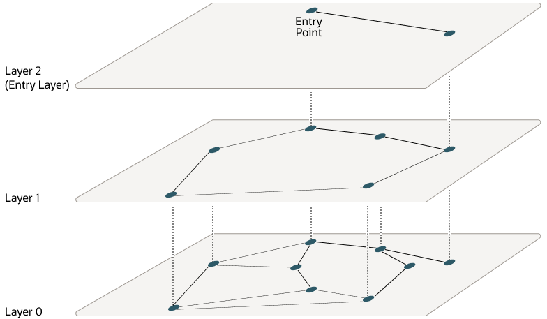

## Understand Hierarchical Navigable Small World Indexes {#GUID-23E74FFC-B6A5-4374-9813-F2634AC43410}

Use these examples to understand how to create HNSW indexes for vector approximate similarity searches.

With Navigable Small World (NSW), the idea is to build a proximity graph where each vector in the graph connects to several others based on three characteristics:

  * The distance between vectors
  * The maximum number of closest vector candidates considered at each step of the search during insertion `(EFCONSTRUCTION)`
  * Within the maximum number of connections (`NEIGHBORS`) permitted per vector 

If the combination of the above two thresholds is too high, then you may end up with a densely connected graph, which can slow down the search process. On the other hand, if the combination of those thresholds is too low, then the graph may become too sparse and/or disconnected, which makes it challenging to find a path between certain vectors during the search.

Navigable Small World (NSW) graph traversal for vector search begins with a predefined entry point in the graph, accessing a cluster of closely related vectors. The search algorithm employs two key lists: Candidates, a dynamically updated list of vectors that we encounter while traversing the graph, and Results, which contains the vectors closest to the query vector found thus far. As the search progresses, the algorithm navigates through the graph, continually refining the Candidates by exploring and evaluating vectors that might be closer than those in the Results. The process concludes once there are no vectors in the Candidates closer than the farthest in the Results, indicating a local minimum has been reached and the closest vectors to the query vector have been identified.

This is illustrated in the following graphic:

Figure 6-2 Navigable Small World Graph

  

  
[Description of "Figure 6-2 Navigable Small World Graph"](img_text/navigable-small-world-graph.md)

  

The described method demonstrates robust performance up to a certain scale of vector insertion into the graph. Beyond this threshold, the Hierarchical Navigable Small World (HNSW) approach enhances the NSW model by introducing a multi-layered hierarchy, akin to the structure observed in Probabilistic Skip Lists. This hierarchical architecture is implemented by distributing the graph's connections across several layers, organizing them in a manner where each subsequent layer contains a subset of the links from the layer below. This stratification ensures that the top layers capture long-distance links, effectively serving as express pathways across the graph, while the lower layers focus on shorter links, facilitating fine-grained, local navigation. As a result, searches begin at the higher layers to quickly approximate the region of the target vector, progressively moving to lower layers for a more precise search, significantly improving search efficiency and accuracy by leveraging shorter links (smaller distances) between vectors as one moves from the top layer to the bottom.

To better understand how this works for HNSW, let's look at how this hierarchy is used for the Probability Skip List structure:

Figure 6-3 Probability Skip List Structure

  

  
[Description of "Figure 6-3 Probability Skip List Structure"](img_text/probability-skip-list_01.md)

  

The Probability Skip List structure uses multiple layers of linked lists where the above layers are skipping more numbers than the lower ones. In this example, you are trying to search for number 17. You start with the top layer and jump to the next element until you either find 17, reach the end of the list, or you find a number that is greater than 17. When you reach the end of a list or you find a number greater than 17, then you start in the previous layer from the latest number less than 17.

HNSW uses the same principle with NSW layers where you find greater distances between vectors in the higher layers. This is illustrated by the following diagrams in a 2D space:

At the top layer are the longest edges and at the bottom layer are the shortest ones.

Figure 6-4 Hierarchical Navigable Small World Graphs

  

  
[Description of "Figure 6-4 Hierarchical Navigable Small World Graphs"](img_text/hierarchical-navigable-small-world-graph_02.md)

  

Starting from the top layer, the search in one layer starts at the entry vector. Then for each node, if there is a neighbor that is closer to the query vector than the current node, it jumps to that neighbor. The algorithm keeps doing this until it finds a local minimum for the query vector. When a local minimum is found in one layer, the search goes to the next layer by using the same vector in that new layer and the search continues in that layer. This process repeats itself until the local minimum of the bottom layer is found, which contains all the vectors. At this point, the search is transformed into an approximate similarity search using the NSW algorithm around that latest local minimum found to extract the top `k` most similar vectors to your query vector. While the upper layers can have a maximum of connections for each vector set by the `NEIGHBORS` parameter, layer `0` can have twice as much. This process is illustrated in the following graphic: 

Figure 6-5 Hierarchical Navigable Small World Graphs Search

  

  
[Description of "Figure 6-5 Hierarchical Navigable Small World Graphs Search"](img_text/hnsw-search-graph_02-png.md)

  

Layers are implemented using in-memory graphs (not Oracle Inmemory graph). Each layer uses a separate in-memory graph. As already seen, when creating an HNSW index, you can fine tune the maximum number of connections per vector in the upper layers using the `NEIGHBORS` parameter as well as the maximum number of closest vector candidates considered at each step of the search during insertion using the `EFCONSTRUCTION` parameter, where EF stands for Enter Factor. 

As explained earlier, when using Oracle AI Vector Search to run an approximate search query using HNSW indexes, you have the possibility to specify a target accuracy at which the approximate search should be performed. 

In the case of an HNSW approximate search, you can specify a target accuracy percentage value to influence the number of candidates considered to probe the search. This is automatically calculated by the algorithm. A value of 100 will tend to impose a similar result as an exact search, although the system may still use the index and will not perform an exact search. The optimizer may choose to still use an index as it may be faster to do so given the predicates in the query. Instead of specifying a target accuracy percentage value, you can specify the `EFSEARCH` parameter to impose a certain maximum number of candidates to be considered while probing the index. The higher that number, the higher the accuracy. 

> **note:** 

  * If you do not specify any target accuracy in your approximate search query, then you will inherit the one set when the index was created. You will see that at index creation, you can specify a target accuracy either using a percentage value or parameters values depending on the index type you are creating.
  * It is possible to specify a different target accuracy at index search compared to the one set at index creation. For HNSW indexes, you may look at more neighbors using the `EFSEARCH` parameter (higher than the `EFCONSTRUCTION` value specified at index creation) to get more accurate results. The target accuracy that you give during index creation decides the index creation parameters and also acts as the default accuracy values for vector index searches. 

**Parent topic:** [About In-Memory Neighbor Graph Vector Index](memory-neighbor-graph-vector-indexes.md)
