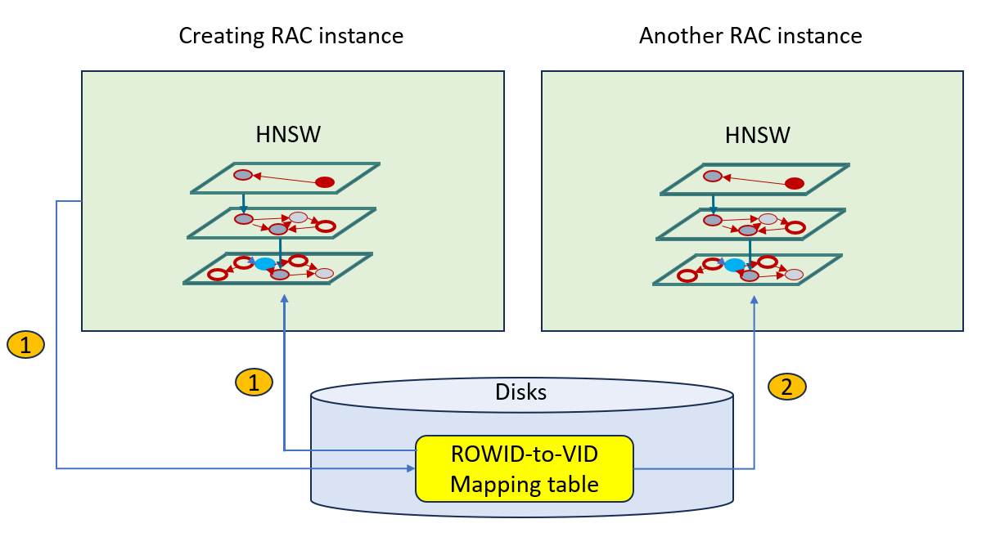
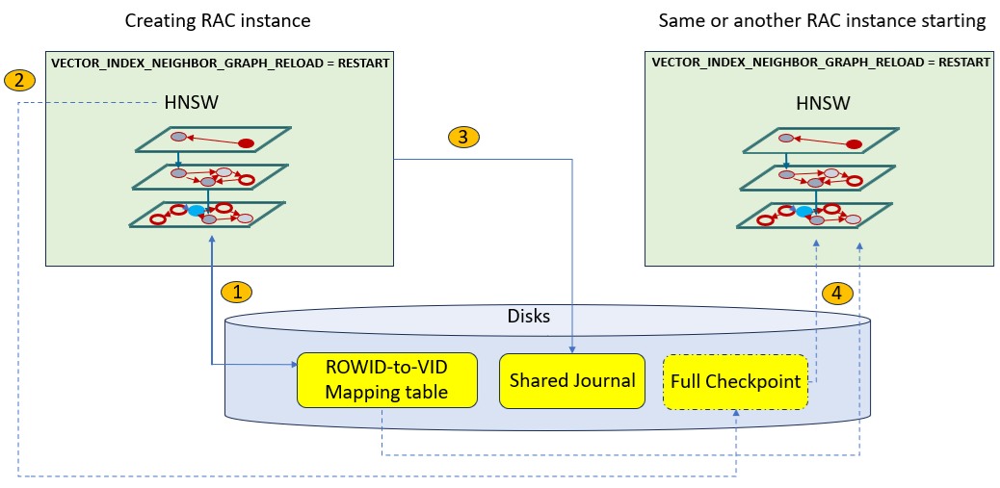

## Understand HNSW Index Population Mechanisms in Oracle RAC or Single Instance {#GUID-8604A7A5-3C96-4B55-85BC-BCF44562BDBB}

Learn how Hierarchical Navigable Small World (HNSW) indexes are populated during index creation, index repopulation, or instance startup in an Oracle Real Application Clusters (Oracle RAC) or a non-RAC environment.

HNSW Index Creation and Repopulation

The following diagram summarizes what happens when you create the HNSW index in an Oracle RAC environment:

  1. The RAC instance that creates the HNSW index is responsible for creating the HNSW ROWID-to-VID mapping table on the disk. As explained in [Optimizer Plans for HNSW Vector Indexes](optimizer-plans-hnsw-vector-indexes.md#GUID-7D6B60D4-5A0C-4E9F-963E-81E244F2847A), this table is needed by the optimizer to run certain optimization plans. 

  2. By default, once the first HNSW graph is created, all other RAC instances are informed to start their own HNSW In-Memory Graph creation concurrently. This operation is called an **HNSW duplication** operation. The duplication mechanism is using the HNSW ROWID-to-VID mapping table on disk to avoid many recalculations and benefit from the existence of the HNSW ROWID-to-VID mapping table. 


  


> **note:** Instances that do not have enough vector memory cannot participate in the parallel RAC-wide HNSW index population. 

> **note:** Although each RAC instance shares the same ROWID-to-VID mapping table, each instance may end up with a different HNSW In-Memory Graph. Therefore, you may get different results depending on which RAC instance the query lands on. 

In addition to this initial index creation case, the same duplication mechanism is also used when the HNSW index needs to be fully repopulated. See [Understand Transaction Support for Tables with HNSW Indexes](understand-transaction-support-tables-hnsw-indexes.md#GUID-C53ACBCF-8FE3-445E-919C-5F75CF74D770) for more information about why and when HNSW index full repopulation operation is triggered. 

HNSW Full Checkpoints

A **full checkpoint** is a serialized version of the HNSW graph, stored on disk and containing all the vertices and edges of the HNSW multi-layered graph. A full checkpoint is self-contained and has roughly the same footprint as the corresponding HNSW in-memory graph. As explained in [Understand Transaction Support for Tables with HNSW Indexes](understand-transaction-support-tables-hnsw-indexes.md#GUID-C53ACBCF-8FE3-445E-919C-5F75CF74D770), a full checkpoint is created at both the index creation time and repopulation operation. 

HNSW full checkpoints are used to reduce the HNSW graph creation time when a new instance joins an Oracle RAC cluster or when an instance is restarted. The main advantage of using the full checkpoint over using the ROWID-to-VID mapping table or creating a new graph is that the neighbors for a particular vector have already been computed and persisted in the full checkpoint.

> **note:** Although an HNSW full checkpoint might not be completely up-to-date and missing some transactions (because it is not maintained for every DML), it will eventually catch up while read consistency is still ensured by reading the missing vectors from the on-disk shared journal. The shared journal is also automatically created by the HNSW index creating instance for transaction support on HNSW indexes. For more information on the shared journal, see [Understand Transaction Support for Tables with HNSW Indexes](understand-transaction-support-tables-hnsw-indexes.md#GUID-C53ACBCF-8FE3-445E-919C-5F75CF74D770). 

When you create an HNSW index, the full checkpoint creation and maintenance is enabled by default. 

> **note:** The HNSW full checkpoint can only be maintained provided there is adequate space in the user's tablespace. 

You can disable or re-enable full HNSW checkpoints by using the `DBMS_VECTOR` package: 

  * **Disable** means drop existing full checkpoint for a particular index and do not create new full checkpoints: 
```
    DBMS_VECTOR.DISABLE_CHECKPOINT( [, ])
```
    

  * **Enable** (default) means the next HNSW graph repopulation will create a full checkpoint for a particular HNSW index: 
```
    DBMS_VECTOR.ENABLE_CHECKPOINT( [, ] [, ])
```
    


For more information, see the `ENABLE_CHECKPOINT` and `DISABLE_CHECKPOINT` procedures in [Vector Index Status, Checkpoint, and Advisor Procedures](vector-index-status-checkpoint-and-advisor-procedures.md#GUID-5F1D700B-ACF0-4E3A-A9E5-00B65B4CCF3C). 

You can query the catalog table `VECSYS.VECTOR$INDEX$CHECKPOINTS` to track information about full checkpoints at the database level. See [VECSYS.VECTOR$INDEX$CHECKPOINTS](vecsys-vectorindexcheckpoints.md#GUID-08AEA2D0-663A-4152-B6B9-750120EC6F87). 

HNSW Index Reload at Instance Restart or New Node Joining Cluster

Because HNSW indexes are created in memory, if the Oracle Database instance goes down, then you lose the corresponding in-memory graphs representing your HNSW indexes. By default, when the instance starts again, a **reload** mechanism is triggered to recreate the HNSW graph in memory as quickly as possible. This reload mechanism is enabled by default for both Oracle RAC and non-RAC environments. 

The way the reload mechanism is processed depends on the existence, or not, of a full HNSW graph checkpoint on disk.

The following diagram summarizes reload mechanism in a RAC environment: 

  1. At index creation time, the in-memory HNSW graph and the ROWID-to-VID mapping table on disks are created. 

  2. If enabled, a full checkpoint is also created on disks. 

  3. The shared journal structure is also created and used to handle transaction consistency for HNSW indexes. 

  4. If the `VECTOR_INDEX_NEIGHBOR_GRAPH_RELOAD` instance parameter is set to `RESTART` (default setting) at the time the instance joins the cluster or when restarting, and if a full checkpoint exists and is not deemed too old compared to the current instance SCN, then it is used by the starting instance to create its HNSW graph in memory. If these two conditions are not met, then the starting instance uses the duplication mechanism to create the HNSW graph in memory from scratch. If the `VECTOR_INDEX_NEIGHBOR_GRAPH_RELOAD` instance parameter is set to `OFF` at the time the instance joins the cluster or when restarting, then the HNSW graph is not reloaded. 


  


> **note:** A full checkpoint is used to reload the HNSW graph in memory for an instance if its creation SCN is not too old as compared to the current instance's SCN. If the SCN is too old, then that instance does a full repopulation of the index using the duplication mechanism (as previously described). 

> **note:** The `VECTOR_INDEX_NEIGHBOR_GRAPH_RELOAD` initialization parameter value governs the automatic reload or not of the HNSW indexes in-memory graphs. 

**Parent topic:** [About In-Memory Neighbor Graph Vector Index](memory-neighbor-graph-vector-indexes.md)
