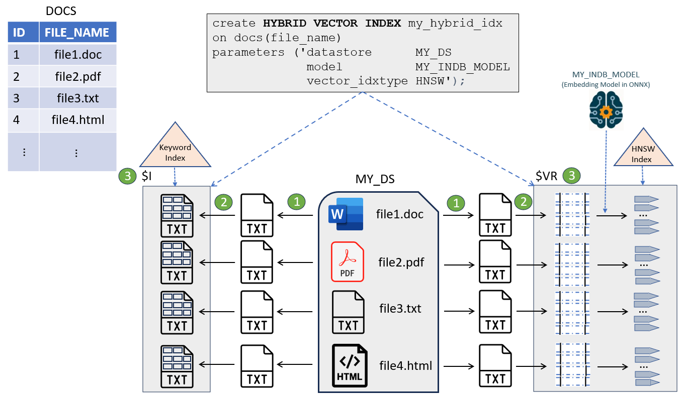

## Understand Hybrid Search {#GUID-310D2298-90F4-4AFE-AF03-F3B81E55F84C}

With hybrid search, you can search through your documents by performing a combination of full-text queries and vector-based similarity queries, using out-of-the-box or custom scoring techniques.

Here are the key points to note when using hybrid search:

  * Hybrid searches are run against hybrid vector indexes (as explained in [Manage Hybrid Vector Indexes](manage-hybrid-vector-indexes.md#GUID-F2493927-23F8-4231-862B-6EDFA5A12299)). You use the `DBMS_HYBRID_VECTOR.SEARCH` PL/SQL function to query a hybrid vector index. 

  * After you create a hybrid vector index, you have five possibilities to use the index by querying it in multiple **search modes** summarized here: 

    * [Pure Semantic in Document Mode](understand-hybrid-search.md#GUID-310D2298-90F4-4AFE-AF03-F3B81E55F84C__GUID-CA1E17B9-796C-4F54-B15B-71E9E9F5F9C2)

    * [Pure Semantic in Chunk Mode](understand-hybrid-search.md#GUID-310D2298-90F4-4AFE-AF03-F3B81E55F84C__GUID-0611B161-9E85-449A-8574-0ECD1D156C60)

    * [Pure Keyword in Document Mode](understand-hybrid-search.md#GUID-310D2298-90F4-4AFE-AF03-F3B81E55F84C__GUID-03905981-A6E9-4D2C-A0DC-0807A95AA3F3)

    * [Keyword and Semantic in Document Mode](understand-hybrid-search.md#GUID-310D2298-90F4-4AFE-AF03-F3B81E55F84C__GUID-7C48C489-FCB6-4838-918F-BA6C847032F4)

    * [Keyword and Semantic in Chunk Mode](understand-hybrid-search.md#GUID-310D2298-90F4-4AFE-AF03-F3B81E55F84C__GUID-CB359FD1-B5B0-484F-BDA9-79723ABEB52B)

  * When performing hybrid search by both keywords and vectors, the results are combined (or fused) into a single result set. The results of such a hybrid search are based on a scoring mechanism that is important to understand to be able to interpret the results.

Similarity search uses the notion of `VECTOR_DISTANCE` values to decide on the ranking of chunks, whereas the traditional Oracle Text search uses the notion of **keyword score** also known as `CONTAINS` score. These two metrics are very different and one cannot be used directly to compare to the other. Hence, similarity search distances are converted or normalized into a `CONTAINS`-score equivalent that is called **semantic score** so its value will range between 100 (best) to 0 (worse). That way, keyword score and semantic score are comparable when running a hybrid search. 


For the sake of the following explanations, we are using the same use case as seen in [Understand Hybrid Vector Indexes](understand-hybrid-vector-indexes.md#GUID-28C18166-43BB-4D2C-B8B3-8127D3485578): 

  


Pure Semantic in Document Mode

The pure semantic in document mode performs vector-only search to fetch document-level results.

The following SQL statement queries a hybrid vector index in this mode:
```
    select json_Serialize(
    DBMS_HYBRID_VECTOR.SEARCH(
    json(
    '{ "hybrid_index_name" : "my_hybrid_idx",
    "vector":
    {
    "search_text"   : "galaxies formation and massive black holes",
    "search_mode"   : "DOCUMENT",
    "aggregator"    : "AVG"
    },
    "return":
    {
    "values"        : [ "rowid", "score", "vector_score" ],
    "topN"          : 10
    }
    }'
    )
    ) RETURNING CLOB pretty);
```
    

The result of this query may look like the following, where you see the `ROWID`s of the `DOCS` table rows corresponding to documents as well as its vector score (`vector_score`). Here, the final score (`score`) is the same as the vector score because there is no keyword score in this case. 

Here is an excerpt from the results:
```
    [
    {
    "rowid"        : "AAASBEAAEAAAUpqAAB",
    "score"        : 71.04,
    "vector_score" : 71.04
    },
    {
    "rowid"        : "AAASBEAAEAAAWBKAAE",
    "score"        : 67.82,
    "vector_score" : 67.82
    },
    ]
```
    

Here is how to interpret this statement: 

  1. The system runs a similarity search on all the vectors and extracts the top k ones at most. The value k is internally calculated. Each is given a vector score.

  2. These k vectors (at most) are then grouped by document IDs and for each identified document, the semantic score of each associated vector found for that document is used to compute the average (in this example) of these scores for that particular document.

  3. The top 10 documents (at most) with the highest averages are returned.


This is illustrated here:

  


Pure Semantic in Chunk Mode

The pure semantic in chunk mode is the SQL semantic search equivalent. This mode performs a vector-only search to fetch chunk results.

The following SQL statement queries a hybrid vector index in this mode:
```
    select json_Serialize(
    dbms_hybrid_vector.search(
    json(
    '{ "hybrid_index_name" : "my_hybrid_idx",
    "vector":
    {
    "search_text"   : "galaxies formation and massive black holes",
    "search_mode"   : "CHUNK"
    },
    "return":
    {
    "values"        : [ "score", "chunk_text", "chunk_id" ],
    "topN"          : 3
    }
    }'
    )
    ) RETURNING CLOB pretty);
```
    

Here is how to interpret this statement:

  1. The system runs a similarity search on all the vectors and extracts the top k ones at most. The value k is internally calculated. Each is given a vector score.

  2. The top 3 chunks (at most) with the highest scores are returned.


The result of this query may look like the following, where you can see the chunks corresponding to their semantic scores:
```
    [
    {
    "score"      : 61,
    "chunk_text" : "Galaxies form through a complex process that begins with small fluctuations in the density of matter in the early
    universe. Massive black holes, typically found at the centers of galaxies, are believed to play a crucial role in their formation and evolution.",
    "chunk_id"   : "1"
    },
    {
    "score"      : 56.64,
    "chunk_text" : "The presence of massive black holes in galaxies is closely linked to their morphological characteristics and star formation rates.
    Observations suggest that as galaxies evolve, their central black holes grow in tandem with their host galaxy's mass.",
    "chunk_id"   : "3"
    },
    {
    "score"      : 55.75,
    "chunk_text" : "Black holes grow by accreting gas and merging with other black holes. Their gravitational influence can regulate star
    formation and drive powerful jets of energy, which can impact the surrounding galaxy.",
    "chunk_id"   : "2"
    }
    ]
```
    

Pure Keyword in Document Mode

The pure keyword search in document mode is equivalent to the traditional `CONTAINS` query using Oracle Text. This mode performs a text-only search to fetch document-level results. 

The following SQL statement queries a hybrid vector index in this mode:
```
    select json_Serialize(
    dbms_hybrid_vector.search(
    json(
    '{ "hybrid_index_name" : "my_hybrid_idx",
    "text":
    {
    "contains"      : "galaxies, black holes"
    },
    "return":
    {
    "values"        : [ "rowid", "score" ],
    "topN"          : 3
    }
    }'
    )
    ) RETURNING CLOB pretty);
```
    

Here is how to interpret this statement:

  1. The system runs a `CONTAINS` query that returns a maximum number of documents. This maximum number is internally calculated. Each document is given a keyword score. 

  2. The top 3 documents (at most) with the highest scores are returned.


The result of this query may look like the following, where you can see the `ROWID`s of the `DOCS` table rows corresponding to documents as well as their keyword scores: 
```
    [
    {
    "rowid" : "AAAR9jAABAAAQeaAAB",
    "score" : 68
    },
    {
    "rowid" : "AAAR9jAABAAAQeaAAA",
    "score" : 35
    },
    {
    "rowid" : "AAAR9jAABAAAQeaAAD",
    "score" : 2
    }
    ]
```
    

Keyword and Semantic in Document Mode

Let us examine a non-pure case of hybrid search where keyword scores and semantic scores are combined.

The following SQL statement performs a keyword and semantic search to fetch document-level results:
```
    select json_Serialize(
    DBMS_HYBRID_VECTOR.SEARCH(
    json(
    '{
    "hybrid_index_name" : "my_hybrid_idx",
    "search_scorer"     : "rsf",
    "search_fusion"     : "UNION",
    "vector":
    {
    "search_text"   : "How can I search with hybrid vector indexes?",
    "search_mode"   : "DOCUMENT",
    "aggregator"    : "MAX",
    "score_weight"  : 1,
    "rank_penalty"  : 5
    },
    "text":
    {
    "contains"      : "hybrid AND vector AND index"
    "score_weight"  : 10,
    "rank_penalty"  : 1
    },
    "return":
    {
    "values"        : [ "rowid", "score", "vector_score", "text_score" ],
    "topN"          : 10
    }
    }'
    )
    ) RETURNING CLOB pretty);
```
    

Here is how to interpret this statement: 

In document mode, the result of your search is a list of `ROWID`s from your base table corresponding to the list of best files identified. 

To get to this list, two searches are conducted:

  * **Keyword search**: During this search, the system uses the `CONTAINS` string representing the Oracle Text `CONTAINS` search expression for the searched keywords. The result of this operation is a list of document identifiers satisfying your `CONTAINS` expression. The numbers of document identifiers to retrieve, at max, is internally calculated. 

  * **Similarity search**: During this search, the system performs a similarity search with the query vector (created from the `SEARCH_TEXT` string) against the vector index of all the chunks of all your documents. The maximum number of chunks to retrieve is also internally calculated. It then assigns a vector score to each chunk retrieved. Because you want to run this search in `DOCUMENT SEARCH_MODE`, the result of this similarity search is first grouped by document identifier. The process now aggregates the vector scores for each document, identified using the `AGGREGATOR` function. The result of this similarity search is a list of document identifiers satisfying your `SEARCH_TEXT` similarity query string. 


After the searches complete, the system needs to merge the results and score them as illustrated here:

Figure 8-2 Scoring for Keyword and Semantic Search in Document Mode

  
[Description of "Figure 8-2 Scoring for Keyword and Semantic Search in Document Mode"](img_text/keyword_semantic_document_mode_query.md)

As outlined in the preceding diagram,

  * First, both search results are added using a `UNION ALL` operation. 

  * Before final scoring, you have the possibility to define what you want to retain from this intermediate result set by specifying the `SEARCH_FUSION` operation. 

  * Then comes the time where final scoring is computed using the defined `SEARCH_SCORER` algorithm such as Reciprocal Rank Fusion (RRF) or Relative Score Fusion (RSF). The final scoring can use the specified `SCORE_WEIGHT` and `RANK_PENALTY` values for each retrieved document identifier, depending from which sort operation they are coming from. 

  * Finally, the defined `topN` document identifiers are returned at most. 


The possible fuse operators are illustrated here:

Figure 8-3 Fusion Operation in Document Search Mode

  
[Description of "Figure 8-3 Fusion Operation in Document Search Mode"](img_text/fuse_operators_doc_mode.md)

Keyword and Semantic in Chunk Mode

Let us examine another non-pure case of hybrid search where keyword scores and semantic scores are combined to fetch chunk results.

The following SQL statement performs a keyword and semantic search in chunk mode:
```
    select json_Serialize(
    DBMS_HYBRID_VECTOR.SEARCH(
    json(
    '{
    "hybrid_index_name" : "my_hybrid_vector_idx",
    "search_scorer"     : "rsf",
    "search_fusion"     : "UNION",
    "vector":
    {
    "search_text"   : "How can I search with hybrid vector indexes?",
    "search_mode"   : "CHUNK",
    "score_weight"  : 1
    },
    "text":
    {
    "contains"       : "hybrid AND vector AND index",
    "score_weight"   : 1
    },
    "return":
    {
    "values"        : [ "chunk_id", "score", "vector_score", "text_score" ],
    "topN"          : 10
    }
    }'
    )
    ) RETURNING CLOB pretty);
```
    

Here is how to interpret this statement: 

In chunk mode, the result of your search is a list of best chunk identifiers from the files stored using your base table.

To get to this list, two searches are conducted:

  * **Keyword search**: During this search, the system uses the `CONTAINS` string representing the Oracle Text `CONTAINS` search expression for the searched keywords. The result of this operation is a list of document identifiers satisfying your `CONTAINS` expression. The numbers of document identifiers to retrieve, at max, is internally calculated. 

  * **Similarity search**: During this search, the system performs a similarity search with the query vector (created from the `SEARCH_TEXT` string) against the vector index of all the chunks of all your documents. The maximum number of chunks to retrieve is also internally calculated. It then assigns a vector score to each chunk retrieved. Because you want to do this search in `CHUNK SEARCH_MODE`, the result of this similarity search is ordered by chunk vector scores. The result of this similarity search is a list of chunk identifiers and associated document identifiers satisfying your `SEARCH_TEXT` similarity query string. 


After the searches complete, the system needs to merge the results and score them as illustrated here:

Figure 8-4 Scoring for Keyword and Semantic Search in Chunk Mode

  
[Description of "Figure 8-4 Scoring for Keyword and Semantic Search in Chunk Mode"](img_text/keyword_semantic_chunk_mode_query.md)

As outlined in the preceding diagram,

  * First, both search results are submitted to a `RIGHT OUTER JOIN` operation on the document identifiers. 

  * Before final scoring, you have the possibility to define what you want to retain from this intermediate result set by specifying the `SEARCH_FUSION` operation. 

  * Then comes the time where final scoring is computed using the defined `SEARCH_SCORER` algorithm such as Reciprocal Rank Fusion (RRF) or Relative Score Fusion (RSF). The final scoring can use the specified `SCORE_WEIGHT` and `RANK_PENALTY` values for each retrieved document identifier, depending from which sort operation they are coming from. 

  * Finally, the defined `topN` chunk identifiers are returned at most. 


The possible fuse operators are illustrated here:

Figure 8-5 Fusion Operation in Chunk Search Mode

  
[Description of "Figure 8-5 Fusion Operation in Chunk Search Mode"](img_text/fuse_operators_chunk_mode.md)

**Related Topics**

  * [Understand Hybrid Vector Indexes](understand-hybrid-vector-indexes.md#GUID-28C18166-43BB-4D2C-B8B3-8127D3485578)
  * [SEARCH](search.md#GUID-A386BDB0-35D0-41E1-8F41-49AEBEC13BFC)


**Parent topic:** [Perform Hybrid Search](perform-hybrid-search.md)
