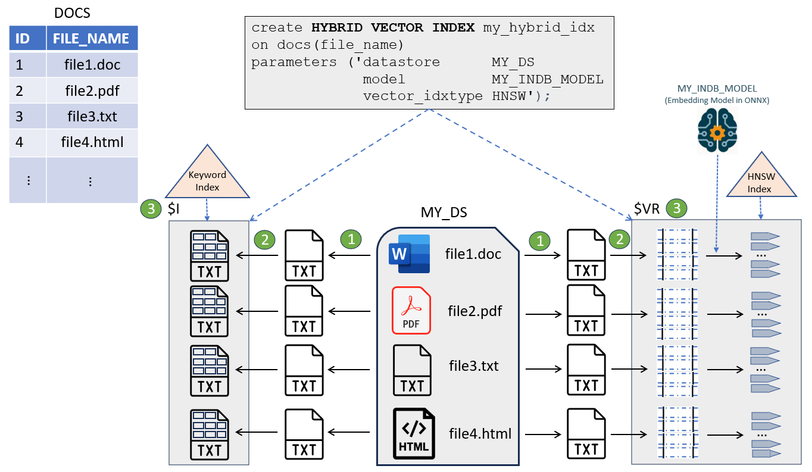

## Understand Hybrid Vector Indexes {#GUID-28C18166-43BB-4D2C-B8B3-8127D3485578}

A hybrid vector index inherits all the information retrieval capabilities of Oracle Text search indexes and leverages the semantic search capabilities of Oracle AI Vector Search vector indexes. 

Hybrid vector indexes allow you to index and query documents using a combination of full-text search and semantic vector search. A hybrid vector index is a class of specialized Domain Index that combines the existing Oracle Text indexing data structures and vector indexing data structures into *one unified structure*. A single index contains both textual and vector fields for a document, enabling you to perform a combination of keyword search and vector search simultaneously. 

The purpose of a hybrid vector index is to enhance search relevance of an Oracle Text index by allowing users to search by both *vectors* and *keywords* in various combinations, using out-of-the-box and custom scoring techniques. By integrating traditional keyword-based text search with vector-based similarity search, you can improve the overall search experience and provide users with more accurate information. 

When to Use a Hybrid Vector Index

Consider using a hybrid vector index for hybrid search scenarios where your query requires information that is semantically similar but pertains to a specific focus area, that is, involves a particular organization, user name, product code, technical term, date, or time. For example, a typical hybrid search query can be to find "`top 10 instances of stock fraud for ABC Corporation`". 

Such a query involves two separate components:

  * One where you want to identify the notion of "`stock fraud`" 

  * The second where you want to narrow the results to focus only on "`ABC Corporation`" 


Pure keyword search may return results that specifically contain the query words like "stock", "fraud", "ABC", or "Corporation" because it focuses on matching the exact keywords or surface-level representation of words or phrases with tokenized terms in a text index. Therefore, keyword search alone may not be suitable here because it can overlook the semantic meaning behind the words in our query, especially if the exact terms are not present in the content.

Pure vector search focuses on understanding the meaning and context of words or phrases rather than just matching keywords. Vector search considers semantic relationship between the query words, so it may include more contextually-relevant results like "corporate fraud", "stock market manipulation", "stock misconduct", "financial irregularities", or "lawsuits in the financial sector". Vector search also may not be suitable here because it can include results about the broader topic of stock fraud involving ABC or similar organizations, especially if the exact phrase "stock fraud for ABC Corporation" is not present in the content.

Hybrid search can address both components of such a query by running keyword search and vector search on the same data and then combining the two search results into a single result set. In this way, you can utilize the strengths of both text indexes and vector indexes to retrieve the most relevant results.

Why Choose a Hybrid Vector Index?

Let us summarize the advantages of a hybrid vector index.

  * Higher recall compared to pure vector search or keyword search:

As discussed earlier, hybrid search lets you combine the power of Oracle AI Vector Search and Oracle Text Search to provide more accurate and personalized information. Keyword search or vector search alone may not be relevant in complex search scenarios and may lead to a lot of spurious results.

  * Mitigates the downsides of chunking: 

Vector embedding models usually impose limits on the size of input text, which forces large documents to be split into smaller chunks of data for semantic search (as explained in [Understand the Stages of Data Transformations](understand-stages-data-transformations.md#GUID-D6F1E7B6-5642-46A2-B84D-B8E37E4C353E)). A chunk can lose broader context of the original document due to truncation, which may lead to missed results. A hybrid vector index helps to restore the entire context of each document by performing textual search at the document level. 

  * Simple to deploy and manage compared to maintaining independent indexes:

A hybrid vector index is a single domain index that can maintain text and vectors with DML. Both keyword search and vector search are performed on all documents, and then the two search results are combined and scored to return a unified result set. It provides an end-to-end indexing pipeline that automatically transforms your input data for vector search alongside keyword search, thereby enhancing the indexing performance. This index exposes optional preferences to configure indexing parameters, but it is not required.

Here is an example of the hybrid vector index DDL:
```
    CREATE HYBRID VECTOR INDEX **my_hybrid_idx** on
    DOCS(file_name)
    PARAMETERS ('MODEL MY_INDB_MODEL');
```
    

Here, a hybrid vector index named `my_hybrid_idx` is created on the `file_name` column of the `DOCS` table. The embedding model used for vector generation is an in-database ONNX format model named `MY_INDB_MODEL`. 

The preceding example shows the minimum input requirements for index creation. For complete syntax, see [CREATE HYBRID VECTOR INDEX](create-hybrid-vector-index.md#GUID-22B07106-419E-4C55-B4E1-3FD691E033BC). 

  * Unified query API to search by vectors and keywords:

A single `SEARCH` API (available with the `DBMS_HYBRID_VECTOR` PL/SQL package) lets you specify both a traditional `CONTAINS` query on document text indexes and a `VECTOR_DISTANCE` query on vectorized chunk indexes. You can switch between keyword-only, vector-only, and hybrid search modes to retrieve the best documents or chunks. 

Here is an example of hybrid search using the `SEARCH` API for our earlier "`top 10 instances of stock fraud for ABC Corporation`" scenario: 
```
    select DBMS_HYBRID_VECTOR.SEARCH(
    json('{ "hybrid_index_name"     : "my_hybrid_idx",
    "**vector**":
    { "search_text" : "**stock fraud**" },
    "**text**"  :
    { "contains"    : "**$ABC AND $Corporation**" },
    "**return**":
    { "topN"        : **10** }
    }'))
    from dual;
```
    

This query specifies the search text for vector search (using the vector distance function) as `stock fraud`, the search text for keyword search (using the `CONTAINS` Oracle Text index operator) as `$ABC AND $Corporation`, and the maximum number of rows to return as the top 10. To understand how to use stem (`$`) and other `CONTAINS` operators, see [*Oracle Text Reference*](https://docs.oracle.com/pls/topic/lookup?ctx=en/database/oracle/oracle-database/23/vecse&id=CCREF-GUID-42F7E320-D239-47E1-8F6A-C88058201ED1). 

For complete syntax, see [Understand Hybrid Search](understand-hybrid-search.md#GUID-310D2298-90F4-4AFE-AF03-F3B81E55F84C). 


Use Case Examples of a Hybrid Vector Index

Here are some use case scenarios to understand how you can implement a hybrid vector index.

  * Fraud detection:

You can identify fraudulent transactions that do not follow the exact patterns of known fraud cases but are similar in behavior or context. In this case, a hybrid vector index can combine traditional rule-based filters (such as transactions above a certain threshold or in specific locations) with a vector index that compares transaction embeddings (which capture features like timing, merchant type, and transaction history) to identify semantically similar but not identical fraudulent patterns.

  * Legal document analysis:

You need to search large volumes of legal documents for relevant cases and precedents. You might first filter documents using traditional legal jargon and keyword searches. Then, a vector index built from document embeddings can further filter previously identified documents that are semantically similar, even if they use different terminology or legal reasoning, ensuring comprehensive research.

You can perform the search in a different order if, for example, you are looking for cases that are contextually similar to a landmark case but need to ensure that the cases also include specific legal terminologies or citations. Here, the search can start with vector-based search to retrieve cases that are semantically similar to the landmark case using embeddings. Then, you can apply a traditional keyword-based filter to ensure that the results include specific legal terms, statutes, or citations.

  * Medical document analysis:

Medical research papers or articles either directly reference the terms of interest or do not mention those keywords at all because these documents are written by researchers or scientists in a distinct field of specialization. Here, you can switch between keyword-only and vector-only searches to quickly locate documents that mention specific medical terms of interest and specialization areas, respectively. You can also combine semantic search with keyword search in a different order, starting with a vector-based semantic search using embeddings to first identify papers that are contextually similar to your research area. Then, apply a keyword-based filter to further refine the results to include only specific references or medical terms that are critical to your research.

  * HR recruitment:

You want to recruit new employees with strong technical skills in programming languages but who also display certain personality and interpersonal traits. Here, you can first apply a keyword-based filter to best match the technical skills (such as "Java" and "Database"). Then, you can perform a semantic search to identify the personality and interpersonal traits (such as "team work" and "leadership experience"). A hybrid search approach can help recruiters to effectively shortlist candidates by scanning and comparing resumes or portfolios with a dual focus.


Hybrid Vector Index Creation Overview

You create a hybrid vector index by simply specifying on which table and column to create it along with some details, such as the local or remote location where all source documents are stored (datastore), the ONNX in-database embedding model to use for generating embeddings, and the type of vector index to create. You can specify additional parameters that are discussed later in this chapter. 

As illustrated in the following diagram, the hybrid vector index DDL creates a single index that contains both textual fields (with derived text tokens) and vector fields (with extracted chunks and corresponding embeddings) for each indexed document. 

  


As you can see, the implementation of a hybrid vector index leverages the existing capabilities of the Oracle Text search index and the Oracle AI Vector Search vector index. You can define PL/SQL preferences to customize all these indexing pipeline stages for both the index types. 

A document table `DOCS` contains IDs and corresponding document names or file names stored in a location called `MY_DS` datastore. 

The indexing pipeline starts with reading the documents from `MY_DS` (datastore), and then passes the documents through a series of processing stages: 

  1. Filter (conversion of binary documents such as PDF, Word, or Excel to plain text)

  2. Tokenizer (tokenization of data for keyword search) and Vectorizer (chunking and embedding generation for vector search)

  3. Indexing Engine (creation of secondary tables)

As the system passes documents through this indexing engine, it populates and indexes a set of secondary tables that are collectively part of a hybrid vector index.

The two main secondary tables created are:

     * `$I` is the same structure as the existing Oracle Text index, which contains the inverted indexed data with tokenized terms. 

An Oracle Text index is created over a textual column based on your specifications. For a deeper understanding of the Oracle Text indexing process, see [*Oracle Text Application Developer's Guide*](https://docs.oracle.com/pls/topic/lookup?ctx=en/database/oracle/oracle-database/23/vecse&id=CCAPP-GUID-63BD819E-5167-48B7-B320-ECEB55C9B5CF). 

     * `$VR` contains the indexed data with generated chunks and corresponding embeddings. 

A vector index is also created over the `VECTOR` column based on your specifications. `$VR` also contains a `ROWID` column that maps back to the document table's row IDs, and a `DOCID` column that links back to Oracle Text document-level IDs. This creates a link between chunks, tokens, and documents. 

You can directly examine the `$VR` table using the dictionary view `*``*$VECTORS`, which lets you query all row ids, chunks, and embeddings. See [$VECTORS](indexnamevectors.md#GUID-2B53FFD8-D2A4-469D-83B1-C653602FFAEE). 

Temporarily, the `$D` secondary table (not shown in the diagram) is also created to save a copy of the document if the original document is not already in the database or needs filtering. This table gets truncated after chunks are obtained. 


Hybrid Vector Index Maintenance Operations

A hybrid vector index supports mostly all the traditional operations of an Oracle Text index, such as `MAINTENANCE AUTO` , `SYNC`, or `OPTIMIZE`. For details, see [Guidelines and Restrictions for Hybrid Vector Indexes](guidelines-and-restrictions-hybrid-vector-indexes.md#GUID-8CFB2031-695D-4C9F-92AF-6628124DE82A). 

**Related Topics**

  * [Creating and Querying Oracle Text Indexes](https://www.oracle.com/webfolder/technetwork/tutorials/obe/db/12c/r1/appdev/text/CreateIndexes/CreatingTextIndexes.md)  * [Perform Hybrid Search](perform-hybrid-search.md#GUID-531F9E71-2CEF-46A8-AA53-7C161E801E3A "Hybrid search is an advanced information retrieval technique that lets you search documents by keywords and vectors, to achieve more relevant search results."


**Parent topic:** [Manage Hybrid Vector Indexes](manage-hybrid-vector-indexes.md)
