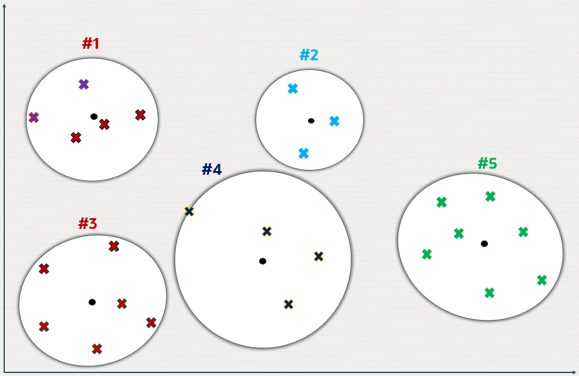
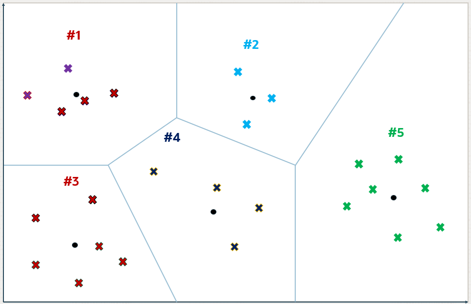
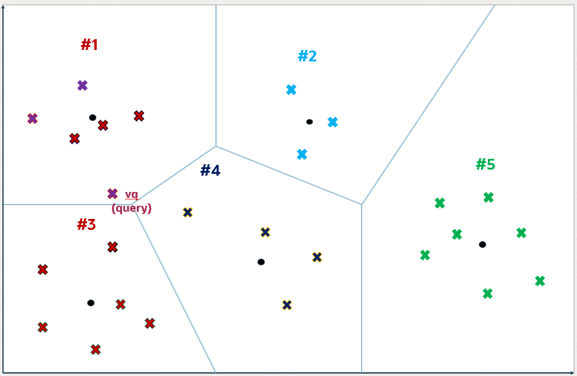
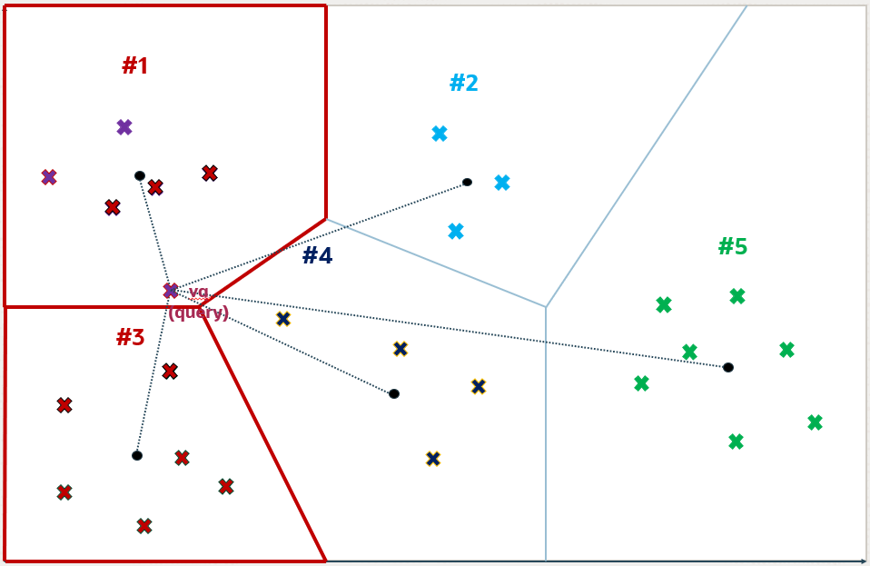
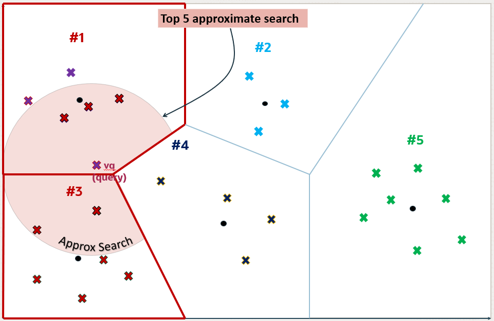
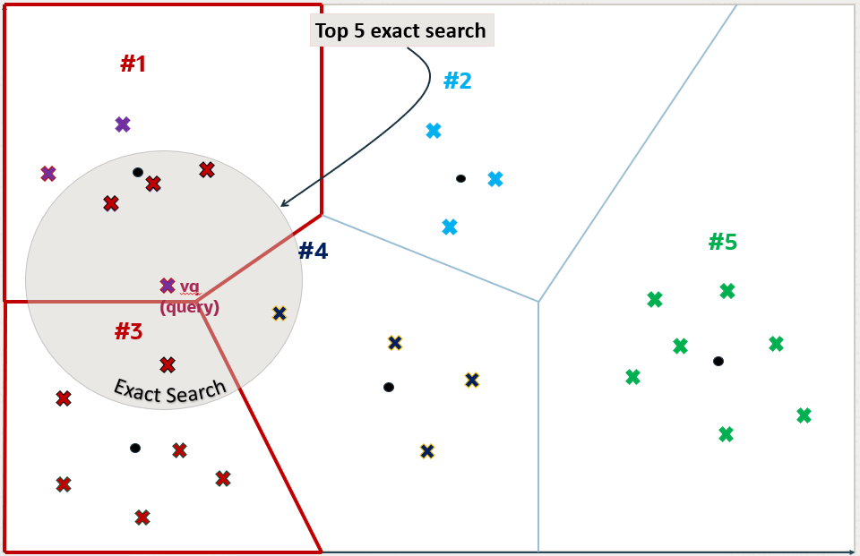
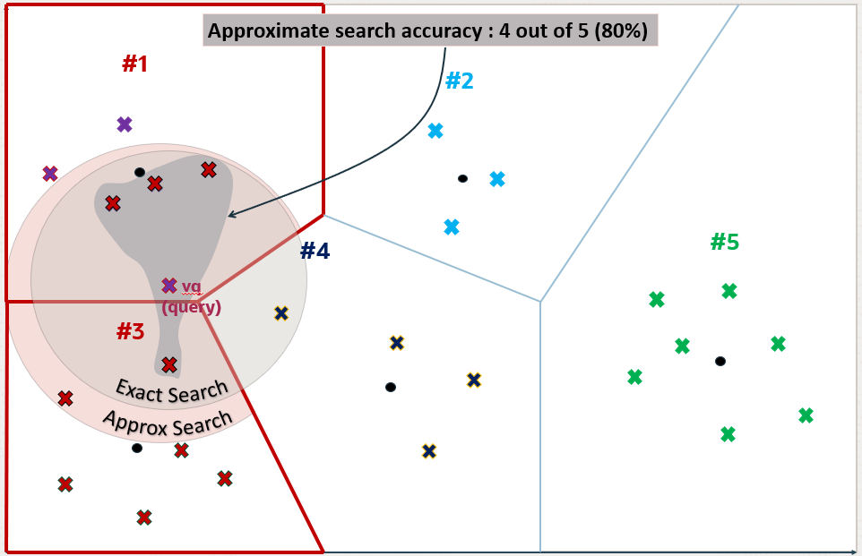

## Understand Inverted File Flat Vector Indexes {#GUID-332E5EA7-6CE9-4392-AB2B-3124BF832C5E}

The Inverted File Flat vector index is a technique designed to enhance search efficiency by narrowing the search area through the use of neighbor partitions or clusters.

The following diagrams depict how partitions or clusters are created in an approximate search done using a 2D space representation. But this can be generalized to much higher dimensional spaces.

Figure 6-6 Inverted File Flat Index Using 2D

  

  
[Description of "Figure 6-6 Inverted File Flat Index Using 2D"](img_text/inverted-file-index_1.md)

  

Crosses represent the vector data points in this space.

New data points, shown as small plain circles, are added to identify `k` partition centroids, where the number of centroids (`k`) is determined by the size of the dataset (`n`). Typically `k` is set to the square root of `n`, though it can be adjusted by specifying the `NEIGHBOR PARTITIONS` parameter during index creation. 

Each centroid represents the average vector (center of gravity) of the corresponding partition.

The centroids are calculated by a training pass over the vectors whose goal is to minimize the total distance of each vector from the closest centroid.

The centroids ends up partitioning the vector space into `k` partitions. This division is conceptually illustrated as expanding circles from the centroids that stop growing as they meet, forming distinct partitions. 

Figure 6-7 Inverted File Flat Index

  

  
[Description of "Figure 6-7 Inverted File Flat Index"](img_text/inverted-file-index_5.md)

  

Except for those on the periphery, each vector falls within a specific partition associated with a centroid.

Figure 6-8 Inverted File Flat Index

  

  
[Description of "Figure 6-8 Inverted File Flat Index"](img_text/inverted-file-index_6.md)

  

For a query vector `vq`​, the search algorithm identifies the nearest `i` centroids, where `i` defaults to the square root of `k` but can be adjusted for a specific query by setting the `NEIGHBOR PARTITION PROBES` parameter. This adjustment allows for a trade-off between search speed and accuracy. 

Higher numbers for this parameter will result in higher accuracy. In this example, `i` is set to 2 and the two identified partitions are partitions number 1 and 3. 

Figure 6-9 Inverted File Flat Index

  

  
[Description of "Figure 6-9 Inverted File Flat Index"](img_text/inverted-file-index_7.md)

  

Once the `i` partitions are determined, they are fully scanned to identify, in this example, the top 5 nearest vectors. This number 5 can be different from `k` and you specify this number in your query. The five nearest vectors to `vq` found in partitions number 1 and 3 are highlighted in the following diagram. 

This method constitutes an approximate search as it limits the search to a subset of partitions, thereby accelerating the process but potentially missing closer vectors in unexamined partitions. This example illustrates that an approximate search might not yield the exact nearest vectors to `vq`​, demonstrating the inherent trade-off between search efficiency and accuracy. 

Figure 6-10 Inverted File Flat Index

  

  
[Description of "Figure 6-10 Inverted File Flat Index"](img_text/inverted-file-index_10.md)

  

However, the five exact nearest vectors from `vq` are not the ones found by the approximate search. You can see that one of the vectors in partition number 4 is closer to `vq` than one of the retrieved vectors in partition number 3. 

Figure 6-11 Inverted File Flat Index

  

  
[Description of "Figure 6-11 Inverted File Flat Index"](img_text/inverted-file-index_11.md)

  

You can now see why using vector index searches is not always an exact search and is called an approximate search instead. In this example, the approximate search accuracy is only 80% as it has retrieved only 4 out of 5 of the exact search vectors' result.

Figure 6-12 Inverted File Flat Index

  

  
[Description of "Figure 6-12 Inverted File Flat Index"](img_text/inverted-file-index_12.md)

  

When using Oracle AI Vector Search to run an approximate search query using vector indexes, you have the possibility to specify a target accuracy at which the approximate search should be performed. 

In the case of an IVF approximate search, you can specify a target accuracy percentage value to influence the number of partitions used to probe the search. This is automatically calculated by the algorithm. A value of 100 will tend to impose an exact search, although the system may still use the index and will not perform an exact search. The optimizer may choose to still use an index as it may be faster to do so given the predicates in the query. Instead of specifying a target accuracy percentage value, you can specify the `NEIGHBOR PARTITION PROBES` parameter to impose a certain maximum number of partitions to be probed by the search. The higher that number, the higher the accuracy. 

> **note:** 

  * If you do not specify any target accuracy in your approximate search query, then you will inherit the one set when the index was created. You will see that at index creation time, you can specify a target accuracy either using a percentage value or parameters values depending on the type of index you are creating.
  * It is possible to specify a different target accuracy at index search, compared to the one set at index creation. For IVF indexes, you may probe more centroid partitions using the `NEIGHBOR PARTITION PROBES` parameter to get more accurate results. The target accuracy that you provide during index creation decides the index creation parameters and also acts as the default accuracy value for vector index searches. 

**Parent topic:** [About Neighbor Partition Vector Index](neighbor-partition-vector-indexes.md)
