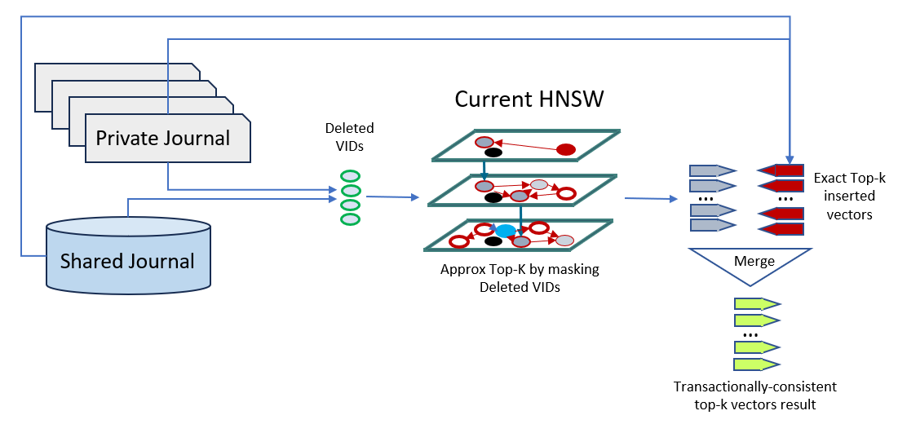
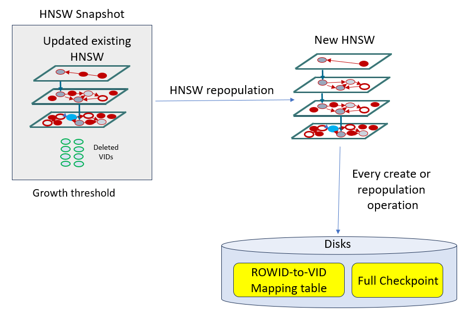

## Understand Transaction Support for Tables with HNSW Indexes {#GUID-C53ACBCF-8FE3-445E-919C-5F75CF74D770}

Hierarchical Navigable Small World (HNSW) index graphs are static memory-only structures. Transaction maintenance on tables with HNSW indexes is done by using two main structures: private journal and shared journal.

A **private journal** is a per-transaction in-memory data structure that tracks vectors, added or deleted by a transaction (updates are in fact a delete followed by an insert). This is comparable to transaction journals that are used to maintain the in-memory column store data (explained in [*Oracle Database In-Memory Guide*](https://docs.oracle.com/pls/topic/lookup?ctx=en/database/oracle/oracle-database/23/vecse&id=INMEM-GUID-EEA265EE-8FBA-4457-8C3F-315B9EEA2224)). These memory structures come out of the Vector Memory Pool and are used for read consistency purposes. 

A **shared journal** contains the commit system change numbers (SCNs) and corresponding modified rows. This structure is an on-disk structure created at the time of vector index creation. At commit time, the changes recorded into a private journal are converted to rows and flushed into the shared journal. This structure is also used for read consistency purposes. 

> **note:** 

  * For bulk DMLs (direct load using `INSERT /*+ APPEND */`), changes are tracked directly in the shared journal to avoid pressure on the vector memory pool. 

  * At the time of full repopulation (until a new HNSW graph becomes available), if a query tries to access an older version of the HNSW graph that no longer exists, then the read consistency error `ORA 51815 "INMEMORY NEIGHBOR GRAPH HNSW vector index snapshot is too old."` is triggered. 

For example, assume that an old HNSW graph exists at SCN 100. While a full repopulation builds a new graph at SCN 200 (which will create a new ROWID-to-VID mapping table), a query arriving at SCN 150 cannot access the new graph at SCN 200. This is because the query's execution plan is compiled with the old ROWID-to-VID mapping table corresponding to the old graph at SCN 100.

In addition to the previously defined structures used mostly for transaction consistency, a full checkpoint on-disk structure can also be maintained, if enabled, for faster reload of HNSW indexes after instance restart. A full checkpoint is automatically created upon index creation and full repopulation of the HNSW graph. HNSW checkpointing is enabled by default. To disable or re-enable checkpoints, see [Vector Index Status, Checkpoint, and Advisor Procedures](vector-index-status-checkpoint-and-advisor-procedures.md#GUID-5F1D700B-ACF0-4E3A-A9E5-00B65B4CCF3C). 

Let us see how the previously defined structures are used in conjunction of each other to achieve overall better performance for transaction maintenance and read consistency on tables with HNSW indexes: 

  1. Following DMLs, read consistency is achieved by taking into account both the existing HNSW graph in memory as well as the query's private journal and shared journal to determine the list of transactionally-consistent set of deleted and inserted vectors. This consists of identifying exact lists of deleted vectors from the journals, running an approximate top-K search through the current version of the HNSW index by augmenting the filter to ignore deleted vectors, running an exact top-k search of newly inserted vectors in the journals, and merging the results of the two searches.

This is illustrated by the following diagram:

  

  2. As DMLs accumulate in the shared journal, exact searches for deleted and inserted vectors in the on-disk journal see their performance deteriorating. To minimize this impact, a full repopulation of the index is automatically triggered. The decision to repopulate the HNSW index in the background is based on a default threshold representing a certain percentage of the number of DMLs run against the index. In addition, each time the HNSW index is created or repopulated, a full checkpoint of the newly created graph and the new ROWID-to-VID mapping table are recreated on disks.

This is illustrated by the following diagram: 

  

> **note:** During full repopulation, two copies of the graph are needed in memory. For example, if we have 10% new inserts, then the vector memory requirement for the repopulated graph will be approximately 10% more than the original HNSW graph size in memory. So at peak vector memory requirement during repopulation, the memory need will be 2.1 times before going down to 1.1 times after repopulation is finalized. This is done to ensure that read consistency can still be done using the previous version of the graph while the new one is being created. 

**Parent topic:** [About In-Memory Neighbor Graph Vector Index](memory-neighbor-graph-vector-indexes.md)
