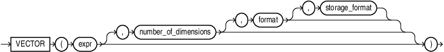

## VECTOR {#GUID-0419AA8D-E861-4B04-8FC4-B6E56E59AC6C}

`VECTOR` is synonymous with `TO_VECTOR`. 

Syntax

  


  


  


Purpose

See [TO_VECTOR](to_vector-vecse.md#GUID-674F2B03-90D7-4686-B026-1A96C0F0DC37) for semantics and examples. 

> **note:** 

Applications using Oracle Client 23ai libraries or Thin mode drivers can insert vector data directly as a string or a `CLOB`. For example: 
```
    INSERT INTO vecTab VALUES ('[1.1, 2.9, 3.14]');
```
    

Examples
```
    SELECT VECTOR('[34.6, 77.8]');
    
    VECTOR('[34.6,77.8]')
    ---------------------------------------------------------
    [3.45999985E+001,7.78000031E+001]
    
    
    
    SELECT VECTOR('[34.6, 77.8]', 2, FLOAT32);
    
    VECTOR('[34.6,77.8]',2,FLOAT32)
    ---------------------------------------------------------
    [3.45999985E+001,7.78000031E+001]
    
    
    
    SELECT VECTOR('[34.6, 77.8, -89.34]', 3, FLOAT32);
    
    VECTOR('[34.6,77.8,-89.34]',3,FLOAT32)
    -----------------------------------------------------------
    [3.45999985E+001,7.78000031E+001,-8.93399963E+001]
```
    

**Parent topic:** [Vector Constructors](vector-constructors.md)
