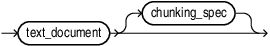
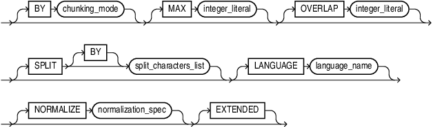
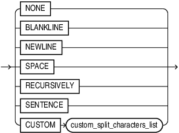
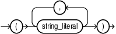
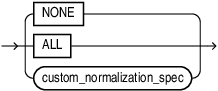
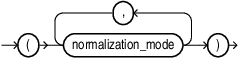
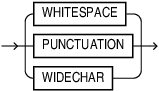
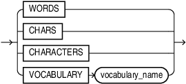

## VECTOR_CHUNKS {#GUID-5927E2FA-6419-4744-A7CB-3E62DBB027AD}

Use `VECTOR_CHUNKS` to split plain text into smaller chunks to generate vector embeddings that can be used with vector indexes or hybrid vector indexes. 

Syntax

  


  


  


*chunks_table_arguments*::= 

  


  


  


*chunking_spec*::= 

  


  


  


*split_characters_list*::= 

  


  


  


*custom_split_characters_list*

  


  


  


*normalization_spec*

  


  


  


*custom_normalization_spec*

  


  


  


*normalization_mode*

  


  


  


*chunking_mode*::= 

  


  


  


Purpose

`VECTOR_CHUNKS` takes a character value as the *text_document* argument and splits it into chunks using a process controlled by the chunking parameters given in the optional *chunking_spec*. The chunks are returned as rows of a virtual relational table. Therefore, `VECTOR_CHUNKS` can only appear in the `FROM` clause of a subquery. 

The returned virtual table has the following columns:

  * `CHUNK_OFFSET` of data type `NUMBER` is the position of each chunk in the source document, relative to the start of the document, which has a position of 1. 

  * `CHUNK_LENGTH` of data type `NUMBER` is the length of each chunk. 

  * `CHUNK_TEXT` is a segment of text that has been split off from *text_document*. 


The data type of the `CHUNK_TEXT` column and the length unit used by the values of `CHUNK_OFFSET` and `CHUNK_LENGTH` depend on the data type of *text_document* as listed in the following table: 

**Table: Input and Output Data Type Details**

Input Data Type | Output Data Type | Offset and Length Unit  
---|---|---  
`VARCHAR2` |  `VARCHAR2` |  `byte`  
`CHAR` |  `VARCHAR2` | `byte`  
`CLOB` |  `VARCHAR2` |  `character`  
`NVARCHAR2` |  `NVARCHAR2` |  `byte`  
`NCHAR` |  `NVARCHAR2` |  `byte`  
`NCLOB` |  `NVARCHAR2` |  `character`  
  
> **note:** 

  * For more information about data types, see *Data Types* in the SQL Reference Manual. 

  * The `VARCHAR2` input data type is limited to `4000` bytes unless the `MAX_STRING_SIZE` parameter is set to `EXTENDED`, which increases the limit to `32767`. 


Parameters

All chunking parameters are optional, and the default chunking specifications are automatically applied to your chunk data.

When specifying chunking parameters for this API, ensure that you provide these parameters only in the listed order. 

**Table: Chunking Parameters Table**

Parameter | Description and Acceptable Values  
---|---  
`BY` |  Specifies the mode for splitting your data, that is, to split by counting the number of characters, words, or vocabulary tokens.<br>**Valid values**: <br>* `CHARACTERS` (or `CHARS`): <br>Splits by counting the number of characters. <br>`WORDS`: <br>Splits by counting the number of words.<br>Words are defined as sequences of alphabetic characters, sequences of digits, individual punctuation marks, or symbols. For segmented languages without whitespace word boundaries (such as Chinese, Japanese, or Thai), each native character is considered a word (that is, unigram). <br>`VOCABULARY`: <br>Splits by counting the number of vocabulary tokens.<br>Vocabulary tokens are words or word pieces, recognized by the vocabulary of the tokenizer that your embedding model uses. You can load your vocabulary file using the `VECTOR_CHUNKS` helper API `DBMS_VECTOR_CHAIN.CREATE_VOCABULARY`. <br>**Note**: <br>For accurate results, ensure that the chosen model matches the vocabulary file used for chunking. If you are not using a vocabulary file, then ensure that the input length is defined within the token limits of your model. 
<br>**Default value**: <br>`WORDS`  
`MAX` |  Specifies a limit on the maximum size of each chunk. This setting splits the input text at a fixed point where the maximum limit occurs in the larger text. The units of `MAX` correspond to the `BY` mode, that is, to split data when it reaches the maximum size limit of a certain number of characters, words, numbers, punctuation marks, or vocabulary tokens. <br>**Valid values**: <br>* `BY CHARACTERS`: <br>`50` to `4000` characters  <br>`BY WORDS`: <br>`10` to `1000` words  <br>`BY VOCABULARY`: <br>`10` to `1000` tokens 
<br>**Default value**: <br>`100`  
`SPLIT [BY]` |  Specifies where to split the input text when it reaches the maximum size limit. This helps to keep related data together by defining appropriate boundaries for chunks. <br>**Valid values**: <br>* `NONE`: <br>Splits at the `MAX` limit of characters, words, or vocabulary tokens.  <br>`NEWLINE`, `BLANKLINE`, and `SPACE`: <br>These are single-split character conditions that split at the last split character before the `MAX` value. <br>Use `NEWLINE` to split at the end of a line of text. Use `BLANKLINE` to split at the end of a blank line (sequence of characters, such as two newlines). Use `SPACE` to split at the end of a blank space.  <br>`RECURSIVELY`: <br>This is a multiple-split character condition that breaks the input text using an ordered list of characters (or sequences). <br>`RECURSIVELY` is predefined as `BLANKLINE`, `NEWLINE`, `SPACE`, `NONE` in this order: <br>1\. If the input text is more than the `MAX` value, then split by the first split character. <br>2\. If that fails, then split by the second split character. <br>3\. And so on. <br>4\. If no split characters exist, then split by `MAX` wherever it appears in the text.  <br>`SENTENCE`: <br>This is an end-of-sentence split condition that breaks the input text at a sentence boundary.<br>This condition automatically determines sentence boundaries by using knowledge of the input language's sentence punctuation and contextual rules. This language-specific condition relies mostly on end-of-sentence (EOS) punctuations and common abbreviations. <br>Contextual rules are based on word information, so this condition is only valid when splitting the text by words or vocabulary (not by characters). <br>**Note**: <br>This condition obeys the `BY WORD` and `MAX` settings, and thus may not determine accurate sentence boundaries in some cases. For example, when a sentence is larger than the `MAX` value, it splits the sentence at `MAX`. Similarly, it includes multiple sentences in the text only when they fit within the `MAX` limit.  <br>`CUSTOM`: <br>Splits based on a custom list of characters strings, for example, markup tags. You can provide custom sequences up to a limit of 16 split character strings, with a maximum length of 10 bytes each.  Provide valid text literals as follows: <br>```VECTOR_CHUNKS(c. doc, BY character SPLIT CUSTOM ('' , '```<br>')) vc 

**Default value**: `RECURSIVELY`

`OVERLAP` |  Specifies the amount (as a positive integer literal or zero) of the preceding text that the chunk should contain, if any. This helps in logically splitting up related text (such as a sentence) by including some amount of the preceding chunk text.  The amount of overlap depends on how the maximum size of the chunk is measured (in characters, words, or vocabulary tokens). The overlap begins at the specified `SPLIT` condition (for example, at `NEWLINE`).  **Valid value**: `5%` to `20%` of `MAX` **Default value**: `0`  
`LANGUAGE` |  Specifies the language of your input data. This clause is important, especially when your text contains certain characters (for example, punctuations or abbreviations) that may be interpreted differently in another language. **Valid values**: 

  * NLS-supported language name or its abbreviation, as listed in [*Oracle Database Globalization Support Guide*](https://docs.oracle.com/pls/topic/lookup?ctx=en/database/oracle/oracle-database/23/vecse&id=NLSPG-GUID-D2FCFD55-EDC3-473F-9832-AAB564457830). 
  * Custom language name or its abbreviation, as listed in [Supported Languages and Data File Locations](https://docs.oracle.com/pls/topic/lookup?ctx=en/database/oracle/oracle-database/23/vecse&id=VECSE-GUID-8C8AAE2F-E64A-470F-B109-BE1AC2D6E498). You use the `DBMS_VECTOR_CHAIN.CREATE_LANG_DATA` chunker helper API to load language-specific data (abbreviation tokens) into the database, for your specified language. 

You must use double quotation marks (`"`) for any language name with spaces. For example:  `LANGUAGE "simplified chinese"` For one-word language names, quotation marks are not needed. For example:  `LANGUAGE american` **Default value**: `NLS_LANGUAGE` from session   
`NORMALIZE` |  Automatically pre-processes or post-processes issues (such as multiple consecutive spaces and smart quotes) that may arise when documents are converted into text. Oracle recommends you to use a normalization mode to extract high-quality chunks. **Valid values**: 

  * `NONE`:  Applies no normalization.
  * `ALL`:  Normalizes multi-byte (Unicode) punctuation to standard single-byte.
  * Applies all supported normalization modes: `PUNCTUATION`, `WHITESPACE`, and `WIDECHAR`. 
    * `PUNCTUATION`:  Converts quotes, dashes, and other punctuation characters supported in the character set of the text to their common ASCII form. For example:
      * U+2013 (En Dash) maps to U+002D (Hyphen-Minus) 
      * U+2018 (Left Single Quotation Mark) maps to U+0027 (Apostrophe) 
      * U+2019 (Right Single Quotation Mark) maps to U+0027 (Apostrophe) 
      * U+201B (Single High-Reversed-9 Quotation Mark) maps to U+0027 (Apostrophe)
    * `WHITESPACE`:  Minimizes whitespace by eliminating unnecessary characters.  For example, retain blanklines, but remove any extra newlines and interspersed spaces or tabs: `" \n \n " => "\n\n"`
    * `WIDECHAR`:  Normalizes wide, multi-byte digits and (a-z) letters to single-byte. These are multi-byte equivalents for `0-9` and `a-z A-Z`, which can show up in Chinese, Japanese, or Korean text. 

**Default value**: `NONE`  
`EXTENDED` |  Increases the output limit of a `VARCHAR2` string to `32767` bytes, without requiring you to set the `MAX_STRING_SIZE` parameter to `EXTENDED`.  If `EXTENDED` is present in *chunking_spec*, the maximum length of a `CHUNK_TEXT` column value is `32767` bytes. If it is absent, the maximum length is `4000` bytes if `MAX_STRING_SIZE` is set to `STANDARD` and `32767` bytes if `MAX_STRING_SIZE` is set to `EXTENDED`.   
  
Examples

`VECTOR_CHUNKS` can be called for a single character value provided in a character literal or a bind variable as shown in the following example: 
```
    COLUMN chunk_offset HEADING Offset FORMAT 999
    COLUMN chunk_length HEADING Len    FORMAT 999
    COLUMN chunk_text   HEADING Text   FORMAT a60
    
    VARIABLE txt VARCHAR2(4000)
    EXECUTE :txt := 'An example text value to split with VECTOR_CHUNKS, having over 10 words because the minimum MAX value is 10';
    
    SELECT * FROM VECTOR_CHUNKS(:txt BY WORDS MAX 10);
    
    SELECT * FROM VECTOR_CHUNKS('Another example text value to split with VECTOR_CHUNKS, having over 10 words because the minimum MAX value is 10' BY WORDS MAX 10);
```
    

To chunk values of a table column, the table needs to be joined with the `VECTOR_CHUNKS` call using left correlation as shown in the following example: 
```
    CREATE TABLE documentation_tab (
    id   NUMBER,
    text VARCHAR2(2000));
    
    INSERT INTO documentation_tab
    VALUES(1, 'sample');
    
    COMMIT;
    
    SET LINESIZE 100;
    SET PAGESIZE 20;
    COLUMN pos FORMAT 999;
    COLUMN siz FORMAT 999;
    COLUMN txt FORMAT a60;
    
    PROMPT SQL VECTOR_CHUNKS
    SELECT D.id id, C.chunk_offset pos, C.chunk_length siz, C.chunk_text txt
    FROM documentation_tab D, VECTOR_CHUNKS(D.text
    BY words
    MAX 200
    OVERLAP 10
    SPLIT BY recursively
    LANGUAGE american
    NORMALIZE all) C;
```
    

> **note:** See Also: 

  * For a complete set of examples on each of the chunking parameters listed in the preceding table, see *Explore Chunking Techniques and Examplesof the AI Vector Search User's Guide.* 

  * To run an end-to-end example scenario using this function, see *Convert Text to Chunks With Custom Chunking Specificationsof the AI Vector Search User's Guide.* 


**Parent topic:** [Chunking and Vector Generation Functions](chunking-and-vector-generation-functions.md)
