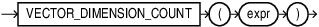

## VECTOR_DIMENSION_COUNT {#GUID-1506357D-AE4E-41F1-8476-BED1BC824230}

`VECTOR_DIMENSION_COUNT` returns the number of dimensions of a vector as a `NUMBER`. 

Syntax

  


  


  


Purpose

`VECTOR_DIMENSION_COUNT` is synonymous with [VECTOR_DIMS](vector_dims-vecse.md#GUID-73D916C1-5ABE-4ED2-9BB6-018AF4540C62). 

Parameters

*expr* must evaluate to a vector. 

If *expr* is NULL, NULL is returned. 

Example
```
    SELECT VECTOR_DIMENSION_COUNT( TO_VECTOR('[34.6, 77.8]', 2, FLOAT64) );
    
    VECTOR_DIMENSION_COUNT(TO_VECTOR('[34.6,77.8]',2,FLOAT64))
    ----------------------------------------------------------
    2
```
    

**Parent topic:** [Constructors, Converters, Descriptors, and Arithmetic Operators](constructors-converters-descriptors-and-arithmetic-operators.md)
