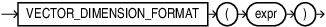

## VECTOR_DIMENSION_FORMAT {#GUID-B988D198-ED4C-45DE-88DA-274D8CCAA18C}

`VECTOR_DIMENSION_FORMAT` returns the storage format of the vector. It returns a `VARCHAR2`, which can be one of the following values: `INT8`, `FLOAT32`, or `FLOAT64`. 

Syntax

  


  


  


Parameters

*expr* must evaluate to a vector. 

If *expr* is NULL, NULL is returned. 

Examples
```
    SELECT VECTOR_DIMENSION_FORMAT(TO_VECTOR('[34.6, 77.8]', 2, FLOAT64));
    FLOAT64
    
    SELECT VECTOR_DIMENSION_FORMAT(TO_VECTOR('[34.6, 77.8, 9]', 3, FLOAT32));
    FLOAT32
    
    SELECT VECTOR_DIMENSION_FORMAT(TO_VECTOR('[34.6, 77.8, 9, 10]', 3, INT8));
    SELECT VECTOR_DIMENSION_FORMAT(TO_VECTOR('[34.6, 77.8, 9, 10]', 3, INT8))
    *
    ERROR at line 1:
    ORA-51803: Vector dimension count must match the dimension count specified inthe column definition (actual: 4, required: 3).
    
    SELECT VECTOR_DIMENSION_FORMAT(TO_VECTOR('[34.6, 77.8, 9.10]', 3, INT8));
    VECTOR_DIMENSION_FORMAT(TO_VECTOR('[34.6,77.8,9.10
    --------------------------------------------------
    INT8
    
    SELECT TO_VECTOR('[34.6, 77.8, 9.10]', 3, INT8);
    TO_VECTOR('[34.6,77.8,9.10]',3,INT8)
    ---------------------------------------------------
    [3.5E+001,7.8E+001,9.0E+000]
```
    

**Parent topic:** [Constructors, Converters, Descriptors, and Arithmetic Operators](constructors-converters-descriptors-and-arithmetic-operators.md)
