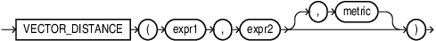

## VECTOR_DISTANCE {#GUID-BA4BCFB2-D905-43DC-87B0-E53522CF07B7}

`VECTOR_DISTANCE` is the main function that you can use to calculate the distance between two vectors. 

Syntax

  


  


  


Purpose

`VECTOR_DISTANCE` takes two vectors as parameters. You can optionally specify a distance metric to calculate the distance. If you do not specify a distance metric, then the default distance metric is cosine. If the input vectors are `BINARY` vectors, the default metric is hamming . 

You can optionally use the following shorthand vector distance functions: 

  * `L1_DISTANCE`

  * `L2_DISTANCE`

  * `COSINE_DISTANCE`

  * `INNER_PRODUCT`

  * `HAMMING_DISTANCE`

  * `JACCARD_DISTANCE`


All the vector distance functions take two vectors as input and return the distance between them as a `BINARY_DOUBLE`. 

Note the following caveats: 

  * If you specify a metric as the third argument, then that metric it is used .

  * If you do not specify a metric, then the following rules applies: 

    * If there is a single column referenced in *expr1* and *expr2* as in: `VECTOR_DISTANCE(vec1, :bind)`, if there is a vector index defined on *vec1*, then the metric used when defining the vector index is used. 

If no vector index is defined on *vec1*, then the `COSINE` metric is used. 

    * If there are multiple columns referenced in *expr1* and *expr2* as in: `VECTOR_DISTANCE(vec1, vec2)`, or `VECTOR_DISTANCE(vec1+vec2, :bind)`, then for all indexed columns, if their metrics used in the definitions of the indexes are the same, then that metric is used. 

On the other hand, if the indexed columns do not have a common metric, or none of the columns have an index defined, then the metric `COSINE` is used. 

  * In a similarity search query, if *expr1* or *expr2* reference an indexed column and you specify a distance metric that conflicts with the metric specified in the vector index, then the vector index is not used and the metric you specified is used to perform an exact search. 

  * Approximate (index-based) searches can be done if only one column is referenced by either *expr1* or *expr2*, and this column has a vector index defined, and the metric that is specified in the vector_distance matches the metric used in the definition of the vector index. 


Parameters

  * *expr1* and *expr2* must evaluate to vectors and have the same format and number of dimensions. 

If you use `JACCARD_DISTANCE` or the `JACCARD` metric, then *expr1* and *expr2* must evaluate to `BINARY` vectors. 

  * This function returns NULL if either *expr1* or *expr2* is NULL. 

  * *metric* must be one of the following tokens : 

    * `COSINE` metric is the default metric. It calculates the cosine distance between two vectors. 

    * `DOT` metric calculates the negated dot product of two vectors. The `INNER_PRODUCT` function calculates the dot product, as in the negation of this metric. 

    * `EUCLIDEAN` metric, also known as L2 distance, calculates the Euclidean distance between two vectors. 

    * `EUCLIDEAN_SQUARED` metric, also called `L2_SQUARED`, is the Euclidean distance without taking the square root. 

    * `HAMMING` metric calculates the hamming distance between two vectors by counting the number dimensions that differ between the two vectors. 

    * `MANHATTAN` metric, also known as L1 distance or taxicab distance, calculates the Manhattan distance between two vectors. 

    * `JACCARD` metric calculates the Jaccard distance. The two vectors used in the query must be `BINARY` vectors. 


Shorthand Operators for Distances

**Syntax**

  * `expr1 <-> expr2`

`<->` is the **Euclidean distance operator**: `expr1 <-> expr2` is equivalent to `L2_DISTANCE(expr1, expr2)` or `VECTOR_DISTANCE(expr1, expr2, EUCLIDEAN)`

  * `expr1 <=> expr2`

`<=>` is the **cosine distance operator**: `expr1 <=> expr2` is equivalent to`COSINE_DISTANCE(expr1, expr2)` or `VECTOR_DISTANCE(expr1, expr2, COSINE)`

  * `expr1 <#> expr2`

`<#>` is the **negative dot product operator**: `expr1 <#> expr2` is equivalent to `-1*INNER_PRODUCT(expr1, expr2)` or `VECTOR_DISTANCE(expr1, expr2, DOT)`


**Examples Using Shorthand Operators for Distances**
```
    '[1, 2]' <-> '[0,1]'
```
```
    v1 <-> '[' || '1,2,3' || ']' is equivalent to v1 <-> '[1, 2, 3]'
```
```
    v1 <-> '[1,2]' is equivalent to L2_DISTANCE(v1, '[1,2]')
```
```
    v1 <=> v2 is equivalent to COSINE_DISTANCE(v1, v2)
```
```
    v1 <#> v2 is equivalent to -1*INNER_PRODUCT(v1, v2)
```
    

Examples

`VECTOR_DISTANCE` with metric `EUCLIDEAN` is equivalent to `L2_DISTANCE`: 
```
    VECTOR_DISTANCE(expr1, expr2, EUCLIDEAN);
```
```
    L2_DISTANCE(expr1, expr2);
```
    

`VECTOR_DISTANCE` with metric `COSINE` is equivalent to `COSINE_DISTANCE`: 
```
    VECTOR_DISTANCE(expr1, expr2, COSINE);
```
```
    COSINE_DISTANCE(expr1, expr2);
```
    

`VECTOR_DISTANCE` with metric `DOT` is equivalent to -1 * `INNER_PRODUCT`: 
```
    VECTOR_DISTANCE(expr1, expr2, DOT);
```
```
    -1*INNER_PRODUCT(expr1, expr2);
```
    

`VECTOR_DISTANCE` with metric `MANHATTAN` is equivalent to `L1_DISTANCE`: 
```
    VECTOR_DISTANCE(expr1, expr2, MANHATTAN);
```
```
    L1_DISTANCE(expr1, expr2);
```
    

`VECTOR_DISTANCE` with metric `HAMMING` is equivalent to `HAMMING_DISTANCE`: 
```
    VECTOR_DISTANCE(expr1, expr2, HAMMING);
```
```
    HAMMING_DISTANCE(expr1, expr2);
```
    

`VECTOR_DISTANCE` with metric `JACCARD` is equivalent to `JACCARD_DISTANCE`: 
```
    VECTOR_DISTANCE(expr1, expr2, JACCARD);
```
```
    JACCARD_DISTANCE(expr1, expr2);
```
    

**Parent topic:** [Vector Distance Functions and Operators](vector-distance-functions-and-operators.md)
