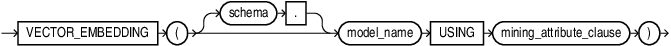
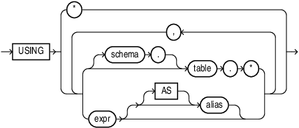

## VECTOR_EMBEDDING {#GUID-5ED78260-6D21-4B6B-86E0-A1E70EFA11CA}

Use `VECTOR_EMBEDDING` to generate a single vector embedding for different data types using embedding or feature extraction machine learning models. 

Syntax

  


  


  


*mining_attribute_clause*::= 

  


  


  


Purpose

The function accepts the following types as input:

`VARCHAR2` for text embedding models. Oracle automatically converts any other type to `VARCHAR2` except for `NCLOB`, which is automatically converted to `NVARCHAR2`. Oracle does not expect values whose textual representation exceeds the maximum size of a `VARCHAR2`, since embedding models support only text that translates to a couple of thousand tokens. An attribute with a type that has no conversion to `VARCHAR2` results in a SQL compilation error. 

For feature extraction models Oracle Machine Learning for SQL supports standard Oracle data types except `DATE`, `TIMESTAMP`, `RAW`, and `LONG`. Oracle Machine Learning supports date type (datetime, date, timestamp) for case_id, `CLOB`/`BLOB`/`FILE` that are interpreted as text columns, and the following collection types as well: 

  * `DM_NESTED_CATEGORICALS`

  * `DM_NESTED_NUMERICALS`

  * `DM_NESTED_BINARY_DOUBLES`

  * `DM_NESTED_BINARY_FLOATS`


The function always returns a `VECTOR` type, whose dimension is dictated by the model itself. The model stores the dimension information in metadata within the data dictionary. 

You can use `VECTOR_EMBEDDING` in `SELECT` clauses, in predicates, and as an operand for SQL operations accepting a `VECTOR` type. 

Parameters

*model_name* refers to the name of the imported embedding model that implements the embedding machine learning function. 

*mining_attribute_clause*

  * The *mining_attribute_clause* argument identifies the column attributes to use as predictors for scoring. This is used as a convenience, as the embedding operator only accepts single input value. 

  * `USING *` : all the relevant attributes present in the input (supplied in JSON metadata) are used. This is used as a convenience. For an embedding model, the operator only takes one input value as embedding models have only one column. 

  * `USING` *expr* [`AS` *alias*] [, *expr* [`AS` *alias*] ] : all the relevant attributes present in the comma-separated list of column expressions are used. This syntax is consistent with the syntax of other machine learning operators. You may specify more than one attribute, however, the embedding model only takes one relevant input. Therefore, you must specify a single mining attribute. 


Example

The following example generates vector embeddings with "hello" as the input, utilizing the pretrained ONNX format model `my_embedding_model.onnx` imported into the Database. For complete example, see [Import ONNX Models and Generate Embeddings](https://docs.oracle.com/pls/topic/lookup?ctx=en/database/oracle/oracle-database/23/vecse&id=DMCON-GUID-6AEA7A0E-78E0-4083-A126-4516EB98175A#GUID-6AEA7A0E-78E0-4083-A126-4516EB98175A)
```
    SELECT TO_VECTOR(VECTOR_EMBEDDING(model USING 'hello' as data)) AS embedding;
    --------------------------------------------------------------------------------
    [-9.76553112E-002,-9.89954844E-002,7.69771636E-003,-4.16760892E-003,-9.69305634E-002,
    -3.01141385E-002,-2.63396613E-002,-2.98553891E-002,5.96499592E-002,4.13885899E-002,
    5.32859489E-002,6.57707453E-002,-1.47056757E-002,-4.18472625E-002,4.1588001E-002,
    -2.86354572E-002,-7.56499246E-002,-4.16395674E-003,-1.52879998E-001,6.60010576E-002,
    -3.9013084E-002,3.15719917E-002,1.2428958E-002,-2.47651711E-002,-1.16851285E-001,
    -7.82847106E-002,3.34323719E-002,8.03267583E-002,1.70483496E-002,-5.42407483E-002,
    6.54291287E-002,-4.81935125E-003,6.11041225E-002,6.64106477E-003,-5.47
```
    

> **note:** See Also: 

  * *Data Requirements for Machine Learning*

  * *Vector Distance Metrics*


**Parent topic:** [Chunking and Vector Generation Functions](chunking-and-vector-generation-functions.md)
