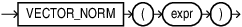

## VECTOR_NORM {#GUID-33B94F9E-03A4-4854-9BCD-285E98F141C9}

`VECTOR_NORM` returns the Euclidean norm of a vector `(SQRT(SUM((xi-yi)2)))` as a `BINARY_DOUBLE`. This value is also called magnitude or size and represents the Euclidean distance between the vector and the origin. 

Syntax

  


  


  


Parameters

*expr* must evaluate to a vector. 

If *expr* is NULL, NULL is returned. 

Example
```
    SELECT VECTOR_NORM( TO_VECTOR('[4, 3]', 2, FLOAT32) );
    
    VECTOR_NORM(TO_VECTOR('[4,3]',2,FLOAT32))
    ____________________________________________
    5.0
```
    

**Parent topic:** [Constructors, Converters, Descriptors, and Arithmetic Operators](constructors-converters-descriptors-and-arithmetic-operators.md)
