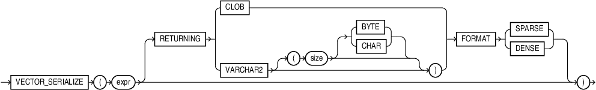

## VECTOR_SERIALIZE {#GUID-ED4CB13E-6482-4541-85A2-1D085B485A2F}

`VECTOR_SERIALIZE` is synonymous with `FROM_VECTOR.`

Syntax

  


  


  


Purpose

See [FROM_VECTOR](from_vector-vecse.md#GUID-DA483A01-340D-4D7C-BD07-7ECFB830B595) for semantics and examples. 

Examples
```
    SELECT VECTOR_SERIALIZE(VECTOR('[1.1,2.2,3.3]',3,FLOAT32));
    
    
    VECTOR_SERIALIZE(VECTOR('[1.1,2.2,3.3]',3,FLOAT32))
    ---------------------------------------------------------------
    [1.10000002E+000,2.20000005E+000,3.29999995E+000]
    
    1 row selected.
```
```
    SELECT VECTOR_SERIALIZE(VECTOR('[1.1, 2.2, 3.3]',3,FLOAT32) RETURNING VARCHAR2(1000));
    
    
    VECTOR_SERIALIZE(VECTOR('[...]',3,FLOAT32)RETURNINGVARCHAR2(1000))
    ------------------------------------------------------------------
    [1.10000002E+000,2.20000005E+000,3.29999995E+000]
    
    1 row selected.
```
```
    SELECT VECTOR_SERIALIZE(VECTOR('[1.1, 2.2, 3.3]',3,FLOAT32) RETURNING CLOB);
    
    
    VECTOR_SERIALIZE(VECTOR('[1.1, 2.2, 3.3]',3,FLOAT32)RETURNINGCLOB)
    --------------------------------------------------------
    [1.10000002E+000,2.20000005E+000,3.29999995E+000]
    
    1 row selected.
```
    

**Parent topic:** [Vector Serializers](vector-serializers.md)
